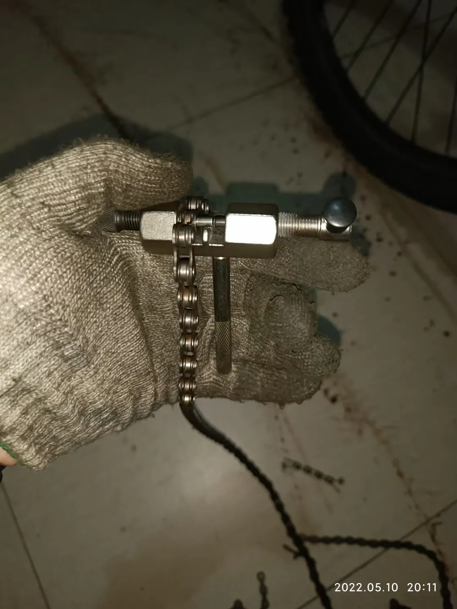
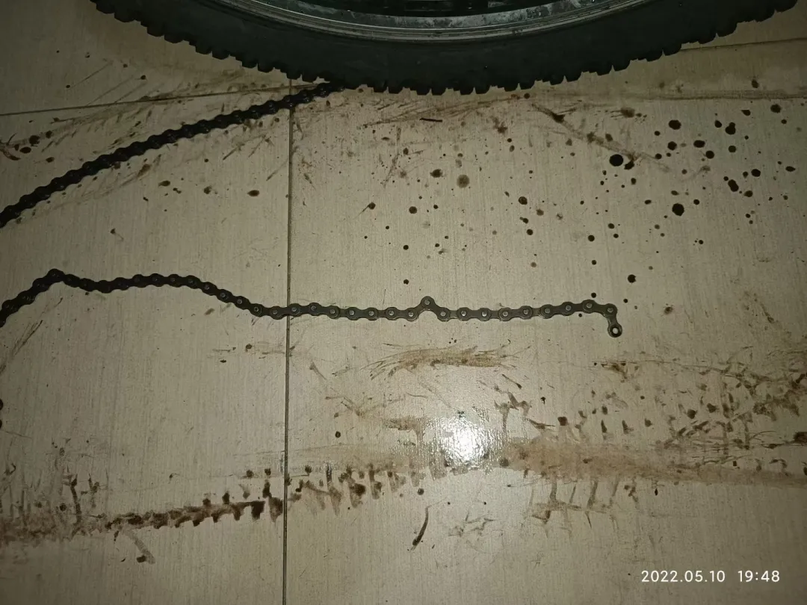
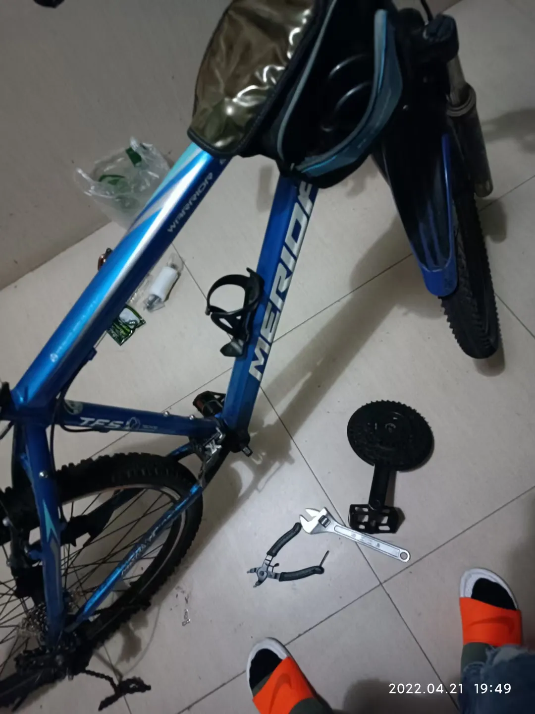
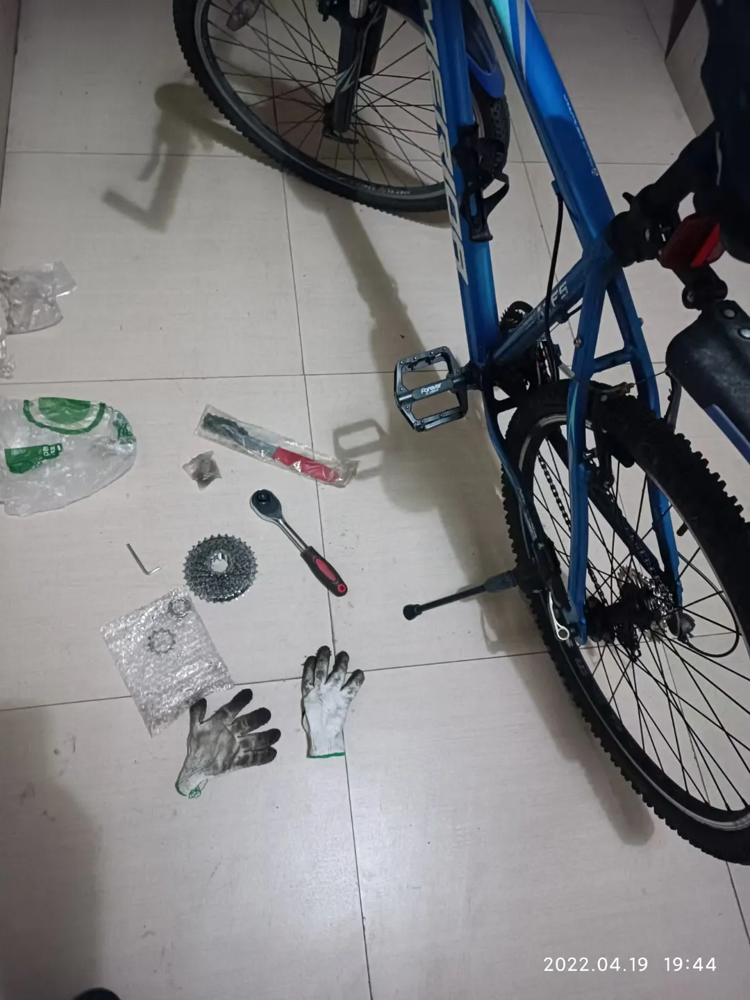
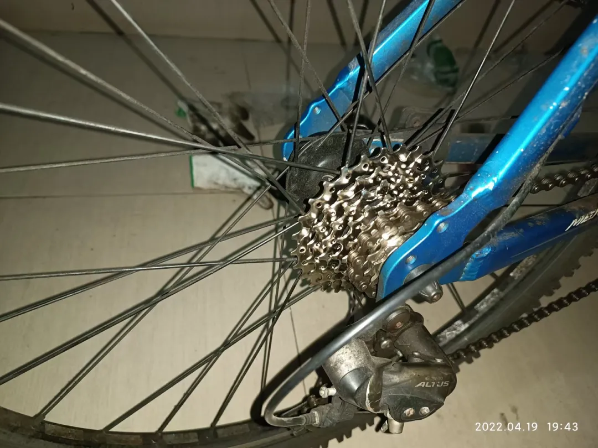
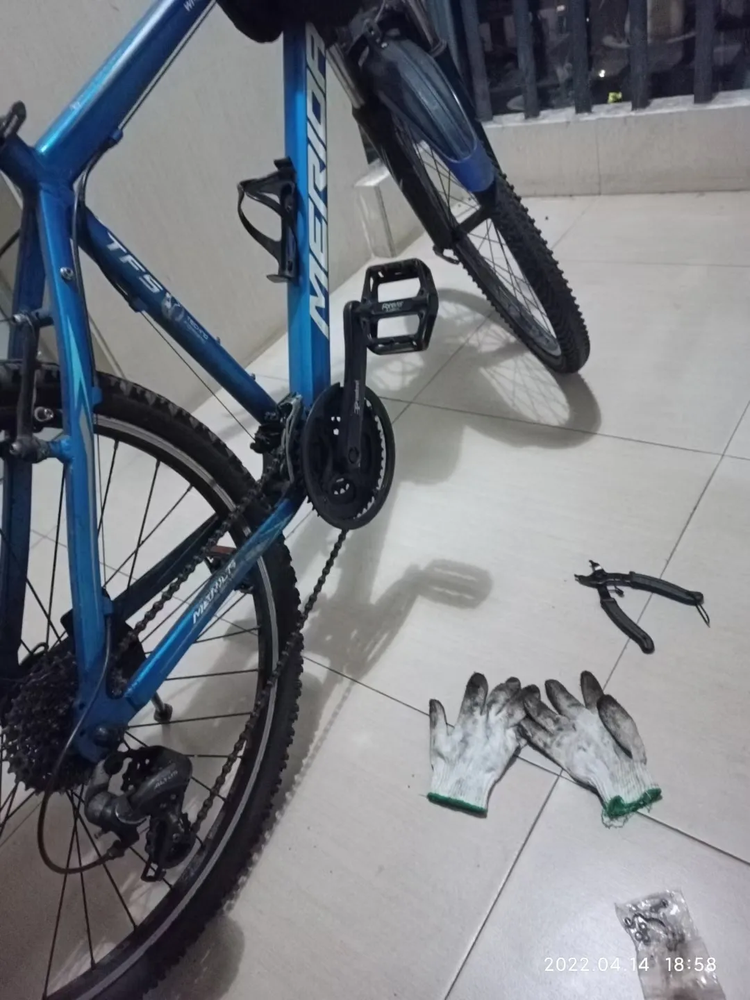

## 更换链条、飞轮、中轴
用普通的截链器就可以拆链条了，新链条一般都需要用截链器截掉几段，一般新的8速链条118节的较常见，直接拉开新链条和旧链条对比长度，截掉多余的。8速的链条我换的比较多，一般都是截4节左右。

拆中轴，工具就是拆卸方孔中轴需要使用的拉马那些专用拆卸中轴工具（参考：14-升级中轴），顺便把链条拆下来：

这是拆下来的原装旧中轴，景晔的。

接着拆装飞轮，工具就是图片中展示的那几件：

新飞轮是禧玛诺的8速，从图片可以看出，这款飞轮相邻齿盘之间大小差距不大，这种飞轮换档的体感会相对绵密一些。

换完完工。
