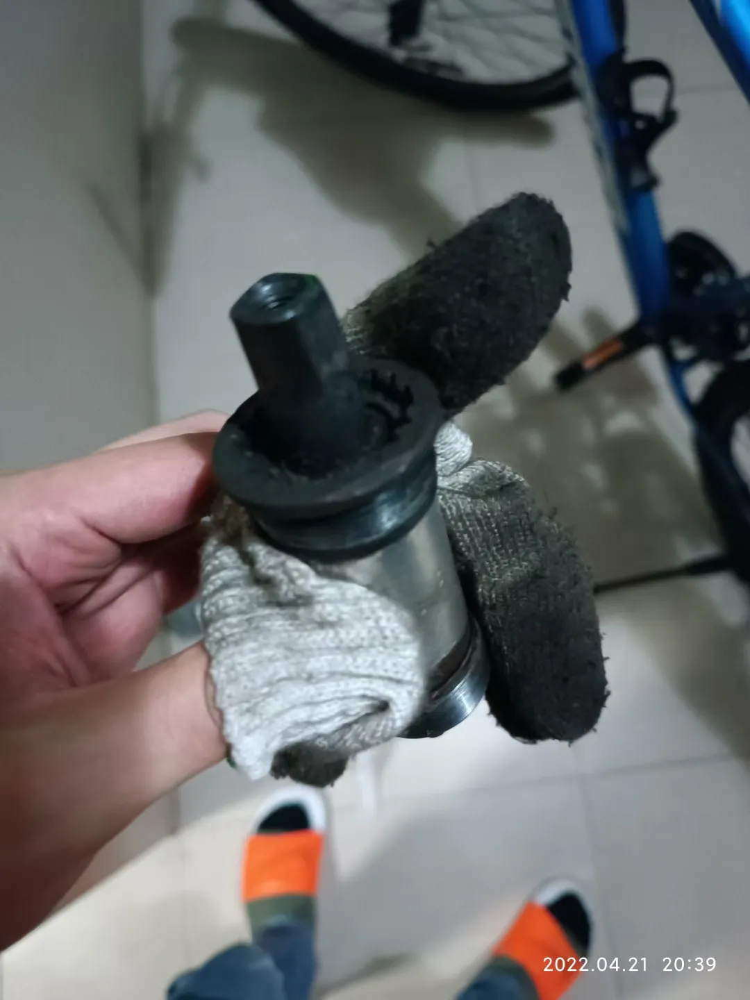

## 更换链条、飞轮、中轴
先拆中轴，工具就是拆卸方孔中轴需要使用的拉马那些专用拆卸中轴工具，顺便把链条拆下来。

用普通的截链器就可以拆链条了，新链条一般都需要用截链器截掉几段，一般新的8速链条118节的较常见，直接拉开新链条和旧链条对比长度，截掉多余的。8速的链条我换的比较多，一般都是截4节，114节比较合适。具体的适配链条长度主要和后拨和飞轮、牙盘都有关系。还是建议采用对比新老链条长度的方法，会更精确（这里的配图用的是另外一天拆链条时候拍的，所以会发现照片的光线不同，拆中轴那天拆链条的时候忘记拍照了）。

这是拆下来的原装旧中轴，景晔的。

接着拆装飞轮。

新飞轮是禧玛诺的8速，型号是41还是51，记不住了。从图片可以看出，飞轮相邻齿盘之间大小差距不大，这种飞轮换档的体感会相对绵密一些。

换完完工。
