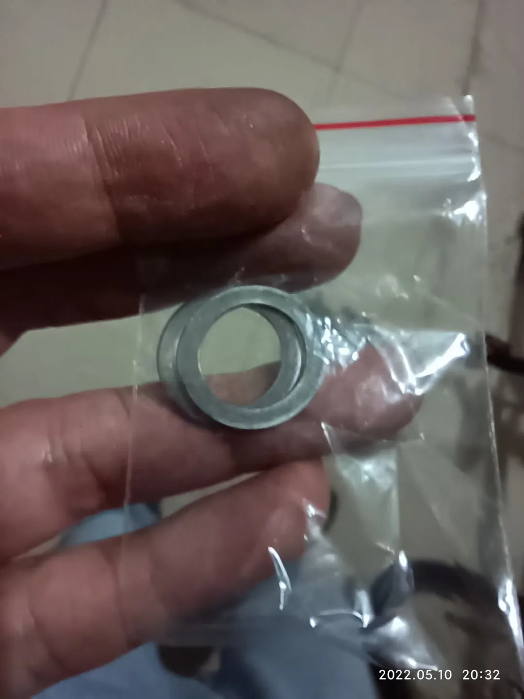
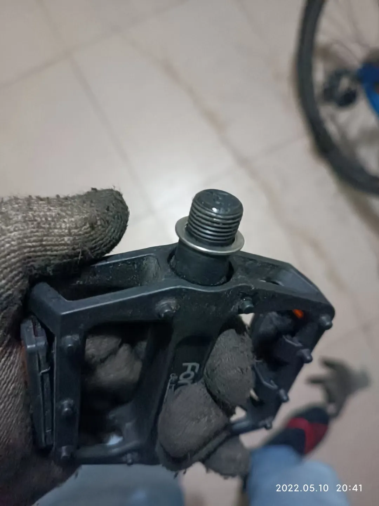
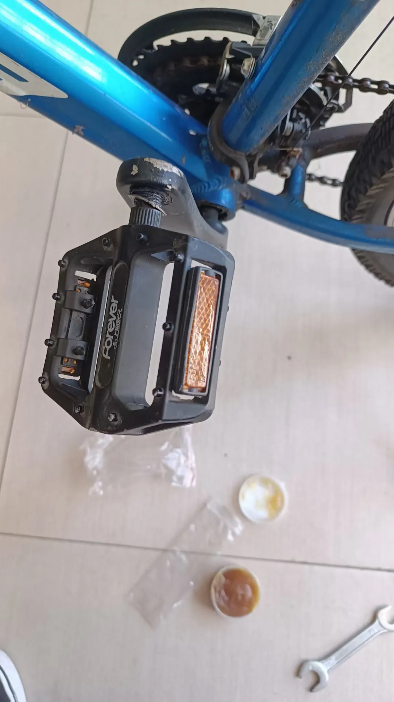
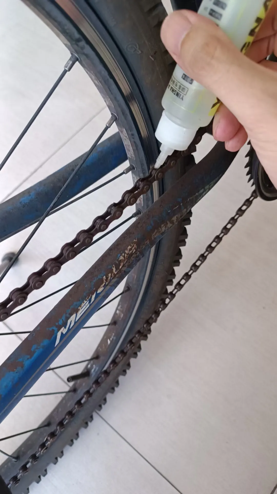
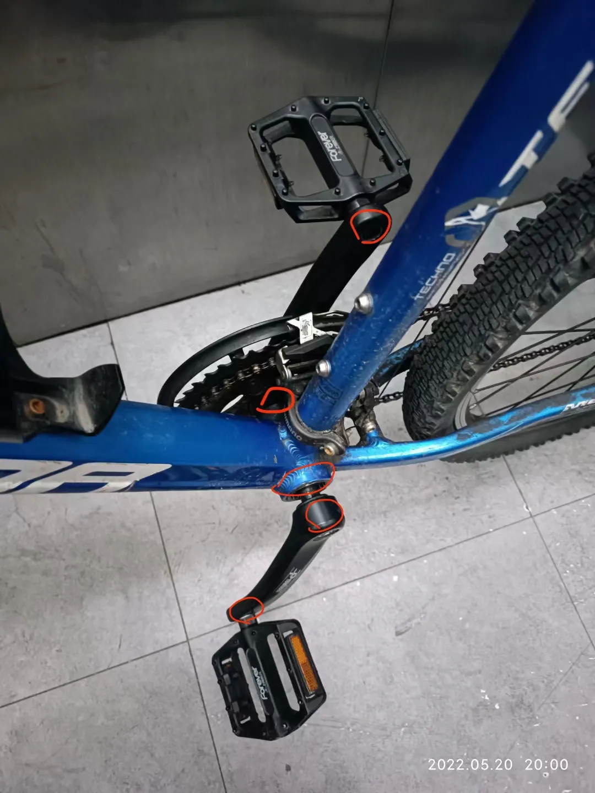

## 解决牙盘附近异响
本小节演示车型是美利达勇士600。

有一种定位异响的方法是逐步在各个连接处依次滴水，水会填充有空隙的地方，哪个连接处滴水后异响消失，基本就可以确定异响来源于这里了。但是当时我不知道这个方法，所以我把所有连接处都涂抹了润滑脂。

先给脚踏安装垫片和涂润滑脂，先装垫片：

然后涂一下润滑脂就可以安装上曲柄了：

接着给链条上链条油：

这里我用的是最便宜的买链条附赠的链条油，这种油非常差，不防水。如果下雨天要通勤的话，链条会全部生锈发黄。后续我发现用终点线（finish line）的湿性润滑油可以解决这个问题（[参考11-保养链条](11-保养链条.md)），买绿色那款可以防暴雨，当然这是后话了，当时我还不知道，所以处于链条一直生锈，一直除锈（WD40可以除一些锈）或者一直更换的状态。

中轴和牙盘、曲柄都拆卸下来，然后在所有红圈处涂润滑脂，用力拴到最紧，解决咔咔嘎嘎异响：
