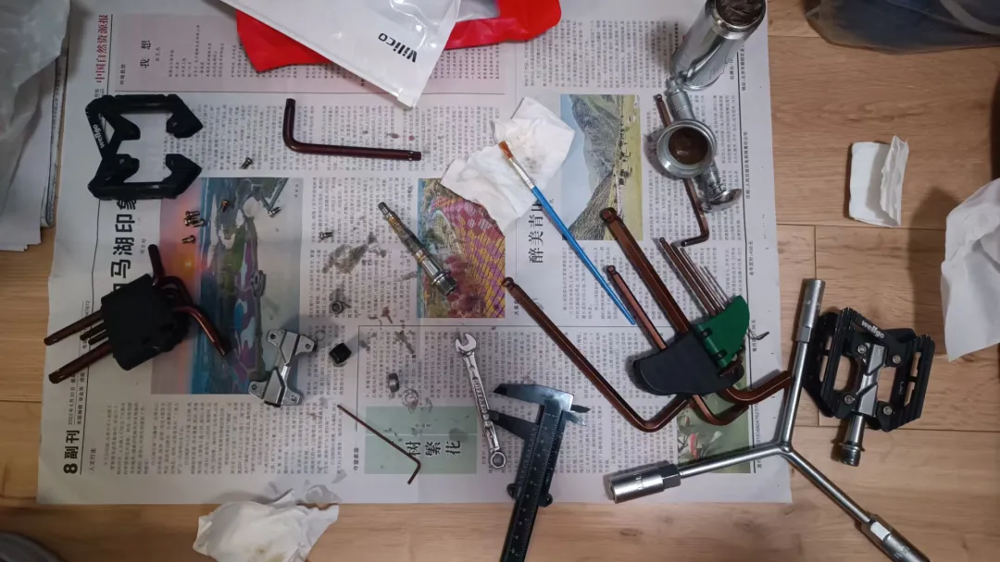
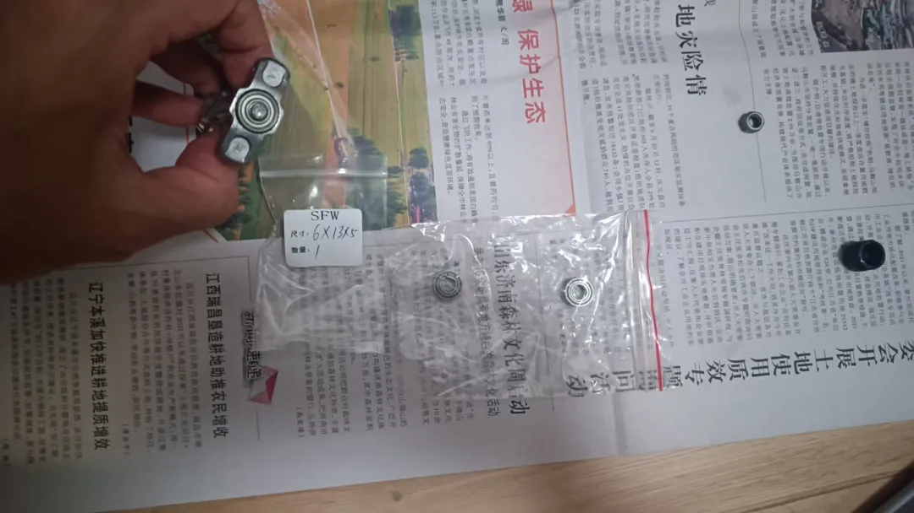

## 保养脚踏
脚踏的型号是维格的C305，出现的问题是发现骑行过程中其中的一只脚踏很卡涩，而另外一只不会，所以决定拆掉那只卡涩的，研究一下什么原因，并尝试解决一下问题：

先把整个脚踏拆解，由于脚踏上面的脚钉螺帽特别小的原因，专门买了特别小的呆扳手，为什么用呆扳手不用小的活动扳手，这是因为我之前先是用了家里已经有的小活动扳手，但是发现脚钉旋得特别紧，小活动扳手一发力，活动点就松，根本没法旋脚钉，所以迫于无奈只能买小码的双头呆扳手。为什么选双头，则是为了节省成本，另外一头为未来可能会碰见的近似小尺寸螺帽提前准备好工具。

另外，拆卸脚踏轴心的那颗螺母，需要用到套筒扳手，图片中显示我用的是三叉套筒扳手。

因为脚踏旋转卡涩，所以我定位到轴心螺母内侧的轴承进水生锈。一开始，我拼dd了一颗9毛钱的普通国产轴承（尺寸大小提前用上图里面展示的游标卡尺测量好）。新轴承到货后，我就涂好润滑脂，更换掉了那颗怀疑生锈的轴承，但是转动卡涩的问题还是存在，那这回肯定不是生锈导致的了，因为这是一颗新买的轴承。于是我继续拼dd，我发现日本的进口轴承似乎可以试一下，但是价格要贵5倍，然后我又发现还有一种国产的高速轴承，价格只要2倍。出于一贯以来国产替代的心态，我又买了一颗国产高速轴承，就是下图左边标记SFW袋子的这颗（我已经换上脚踏了）：

中间那颗是换下的原装轴承，右边那颗是9毛钱买的普通国产轴承。结果换上去非常地丝滑，说明问题确实是这颗轴承发生了问题，并且，同时发现国产的轴承也是很好用的了。