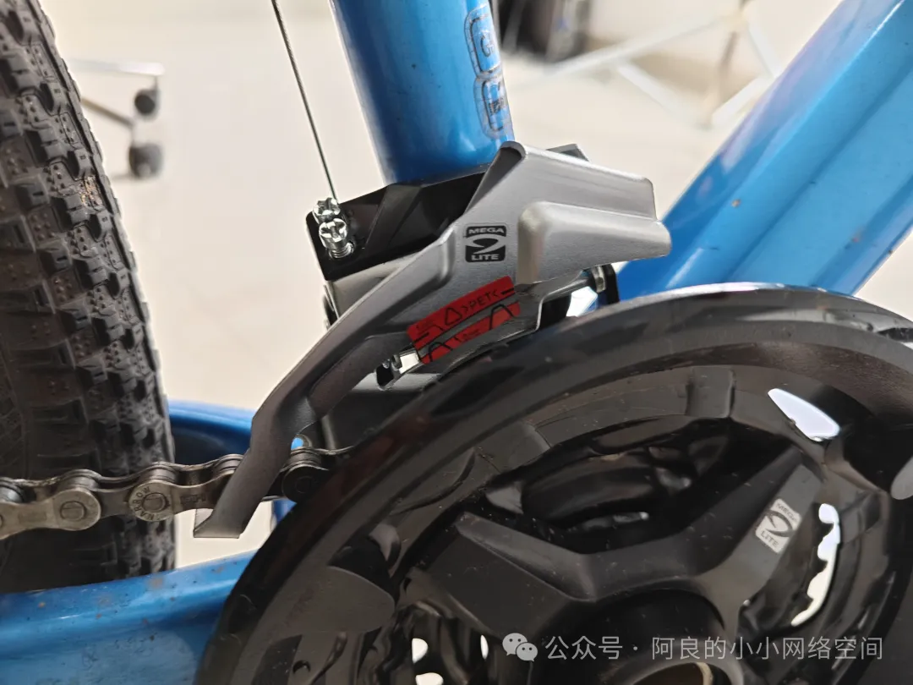
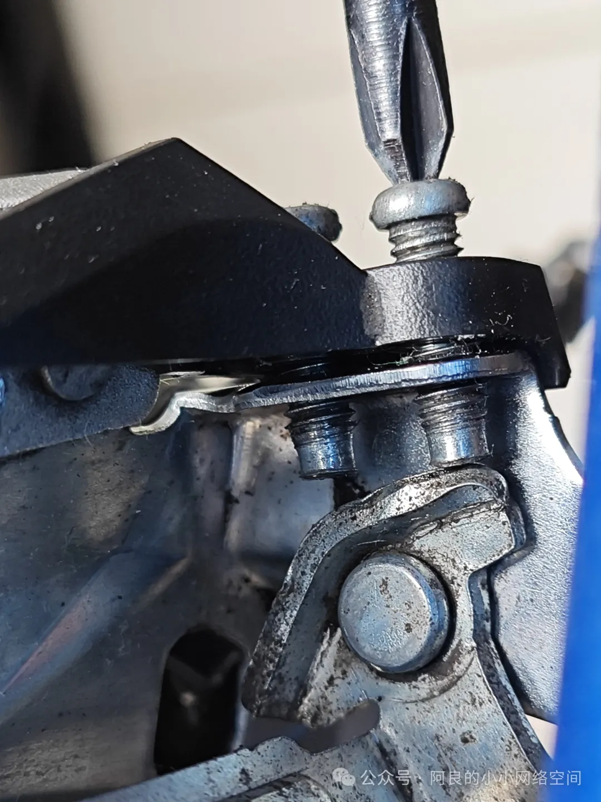
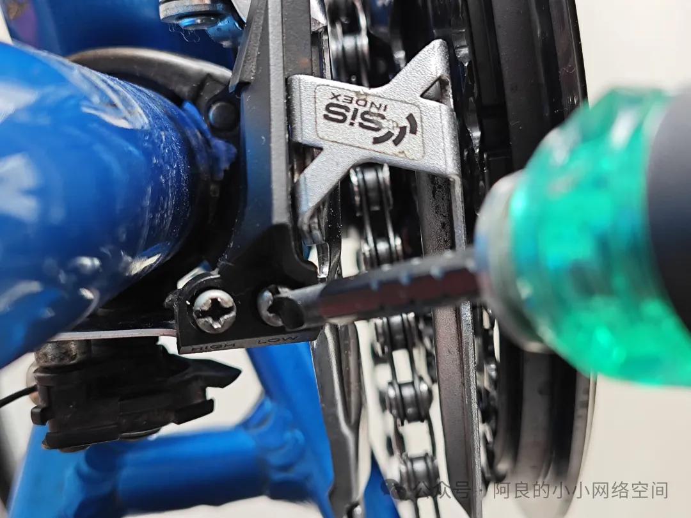
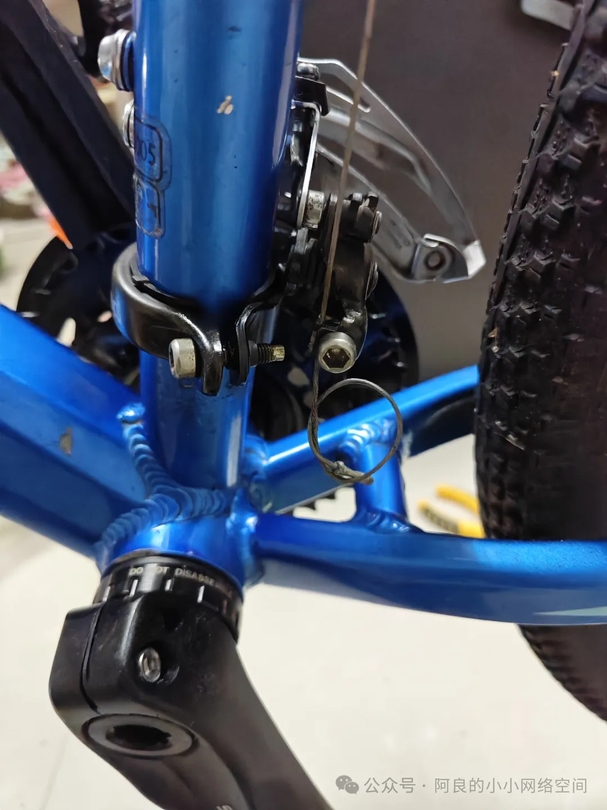

## 调试前拨
本小节演示车型是美利达勇士600。

前拨型号就是最普通的禧玛诺3*8速前拨。开始调试之前，所有限位螺丝全部调到最松。把前拨的外侧提示贴纸固定到和牙盘最大盘对应的位置（参考下图），就是前拨能下降的最低位，然后把平面方向稍微固定一下，就可以固定前拨的拉线了：

下图这个螺丝叫上限位螺丝，控制的是链条在牙盘最大盘位置的偏摆情况：

为什么叫上限位？参考下图：

左边那颗标记着high的螺丝就叫上限位螺丝，右边标记着low的就是下限位。这里解释一下如何区分这两颗螺丝控制的具体牙盘。上限位，顾名思义，控制着速度的最大上限，对应的就是最大盘。下限位，则是对应速度的下限，就是控制最小盘对应的前拨的平向移动状态。具体上紧还是旋松控制着前拨的内移和外移可以现场用螺丝刀试一下，不需要背。

具体的调试，就是让链条时刻保持在前拨的相对中间位置，然后从牙盘的最小盘开始调试，变后拨的档，一档一档变完，上紧或者旋松前拨的下限位螺丝。然后前拨调到2档（牙盘的中间那盘），因为中间档用上下限螺丝调整都不太有效，所以观察到中间档位前拨没有打链条现象后，继续调前拨到最大盘，变后拨的8个档位。调整前拨的上限位螺丝，争取所有档位都不会发生前拨打链条的现象，就完成前拨的调试了：

