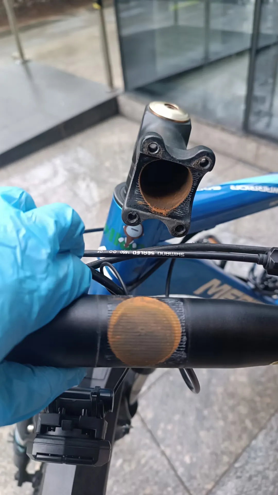
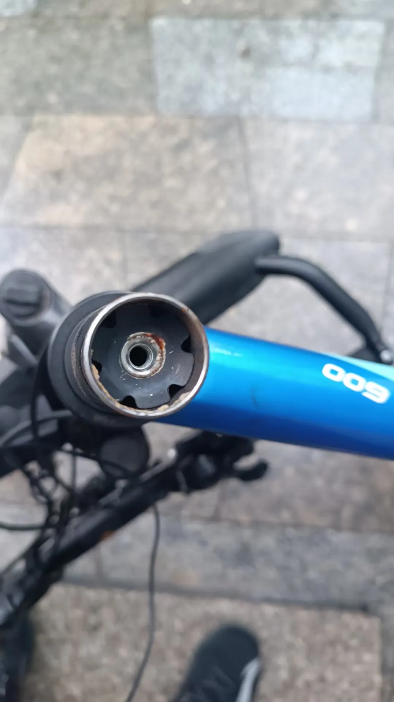
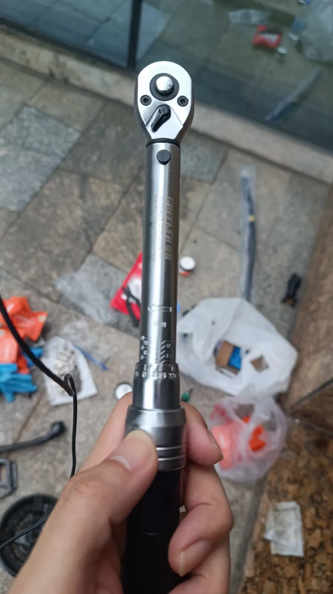
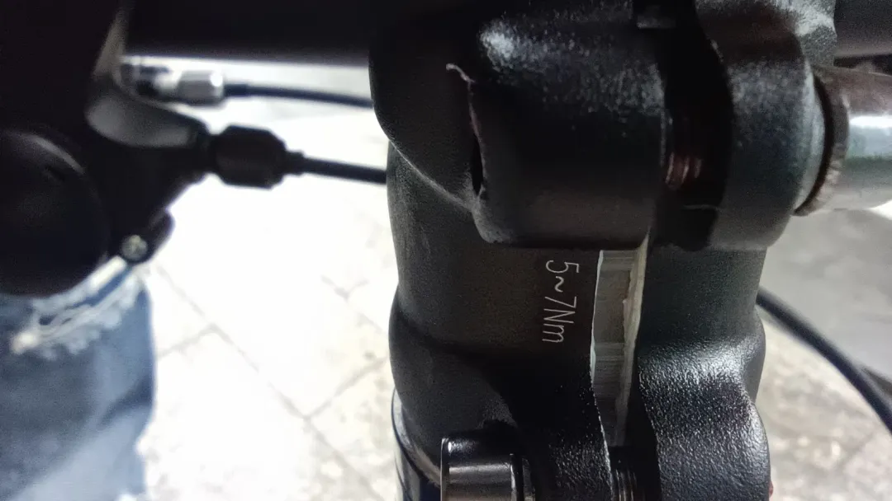
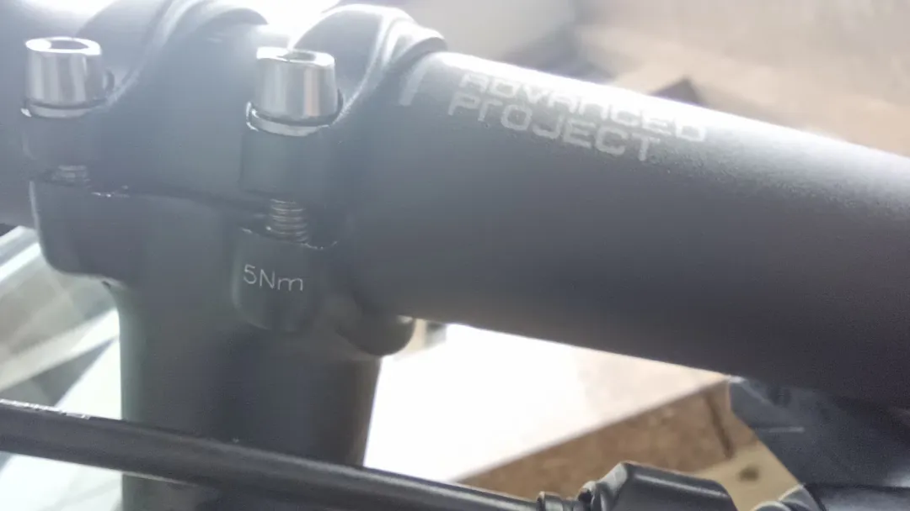
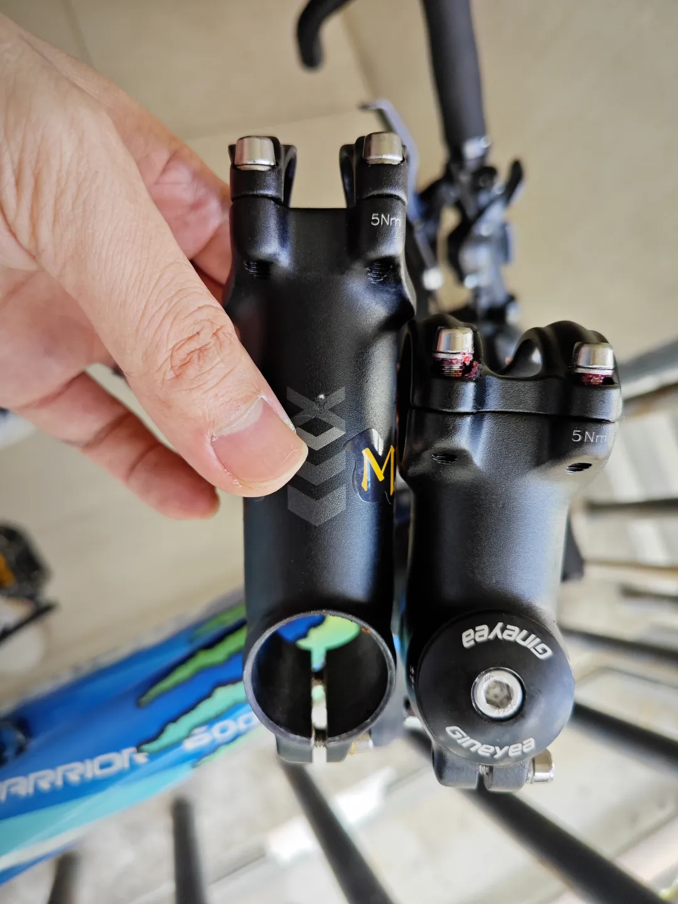
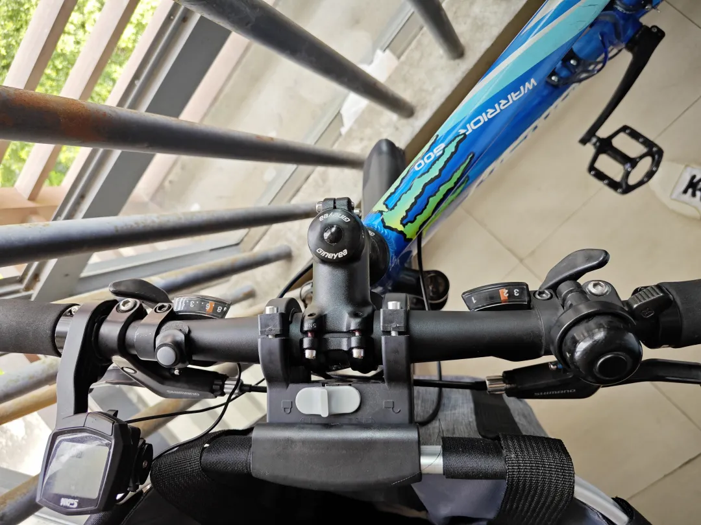

## 更换把横把立
展示的车型是美利达的勇士600。

### 更新把横把立
把横10年没动，都锈烂了：

太阳花还没锈：

扭力扳手：

UNO的全套把横把立副把都有标扭力值，根据扭力值用扭力扳手上内六角螺丝。把立的尾端扭力值范围是5-7Nm：

把立的头端扭力值范围是5Nm：

用扭力扳手按标记好的扭力值上适宜的扭力就可以了。

有这么一种说法，上扭力的时候可以多靠徒手操作，然后再用扭力扳手验证扭力值。这么做是为了保证在身边没有扭力扳手的时候，或者扭力扳手的扭力值出错的时候，自己有足够的手感直接判断扭力值，什么样的感觉大概对应多少Nm。

### 缩短把立长度
后续我有对该把立升级，换成了更短的把立，为的是缩短把横和座位之间的距离，方便身高不高的爸爸骑行：

短把立效果图：
