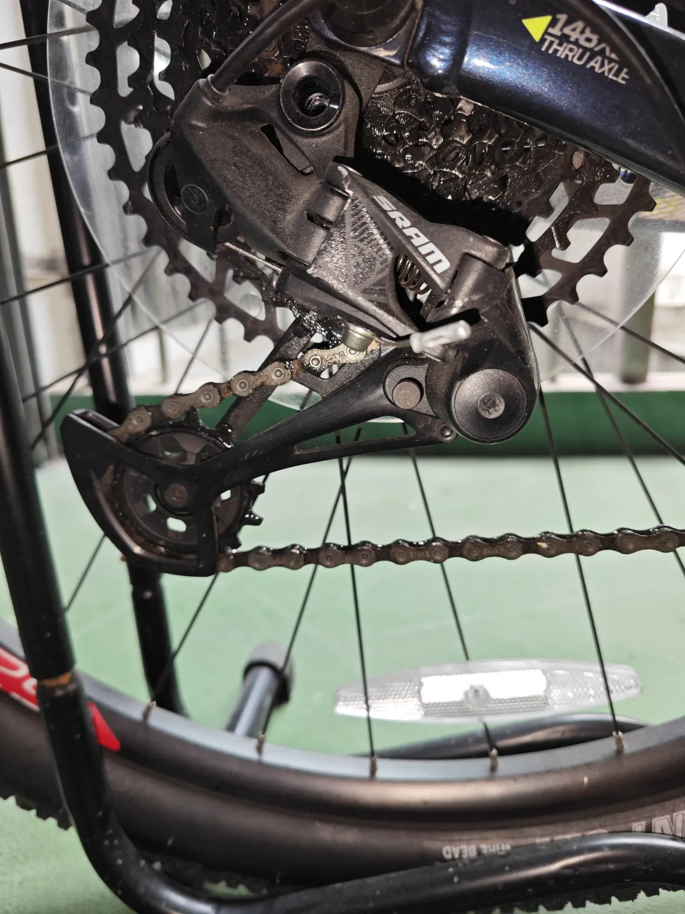
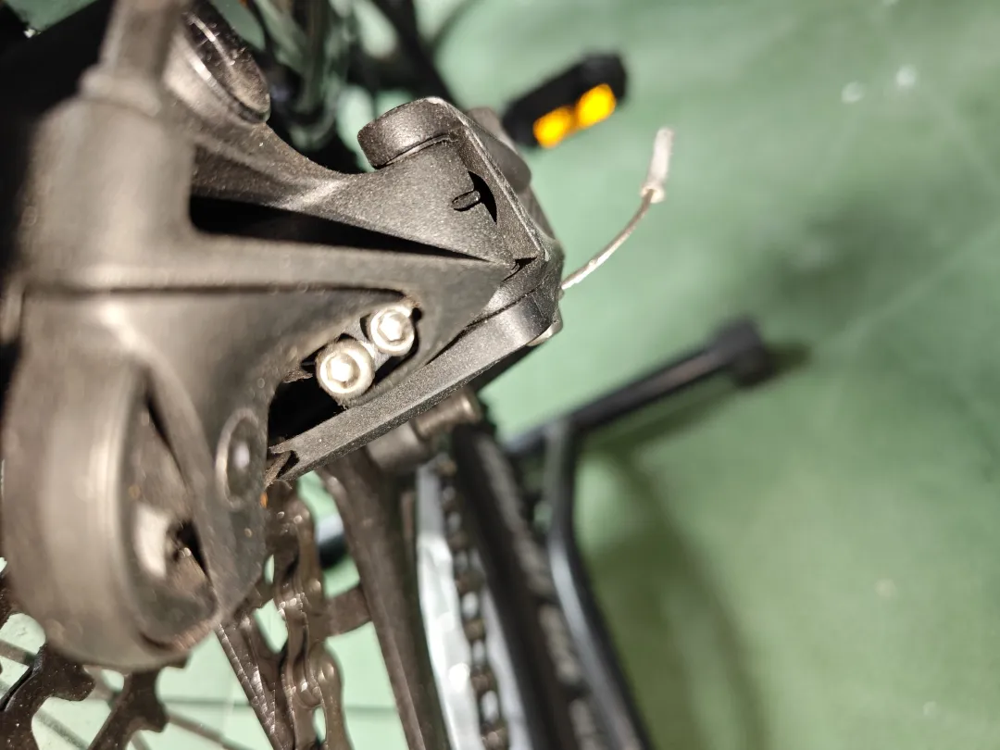
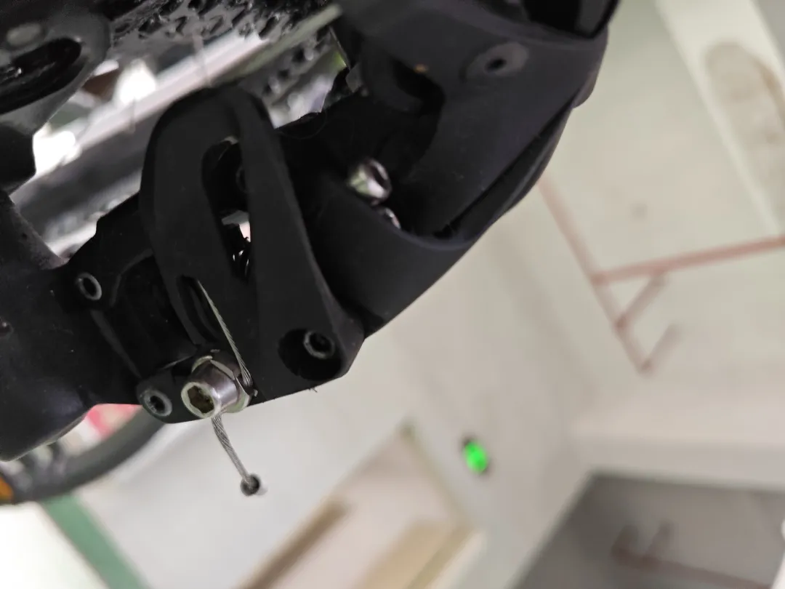
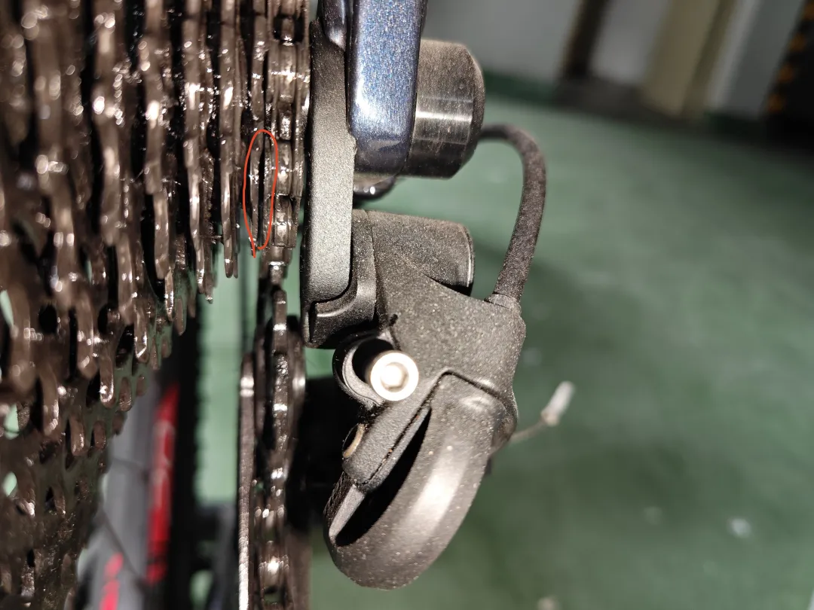
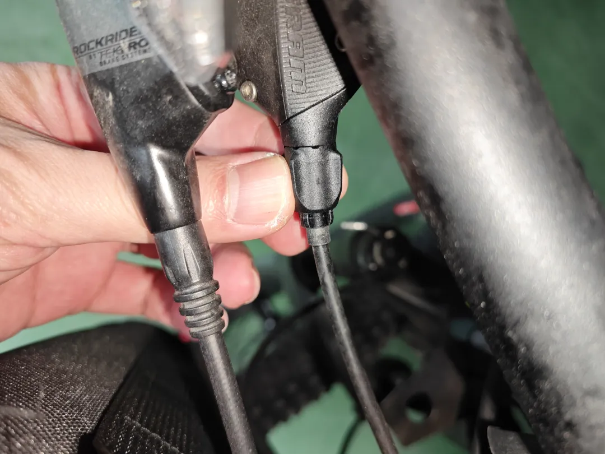

## 调试后拨
后拨型号是速联的SRAM SX Eagle12S。问题就是后拨变档的时候存在变档滞后的情况（指拨变档后，后拨在变档的中程停下，然后卡在两个档位中间，发生了滞后）。

这款速联的后拨和禧玛诺常见的8速后拨有一些不同，速联的上下限位螺丝都是内六角的，普通禧玛诺8速后拨的上下限位螺丝是十字的，内六角当然防锈是更胜一筹的。但是上下限位螺丝没有标识H和L，这点比不上禧玛诺的，禧玛诺都有标识，查完资料（也可以自己一个一个试）后确定左边是上限位（H)，右边是下限位。

具体的调节方法就是，在最大档位（最小齿），上紧上限位螺丝，使链条与第二档齿轮之间的间隙保持1毫米：

就上图那个红圈的间隙，1毫米就刚好，之后就是试骑，在出现变档滞后的档位处，拉紧（缩短）变速线，就是逆时针旋下方这个旋钮：

这个原理是这样的：顺时针就上紧了旋钮和指拨器，缩小了旋钮和指拨器之间的间隙，刹车线就变长了，所以是逆时针就缩短拉紧变速线，直到所有档位都不再有滞后的情况。