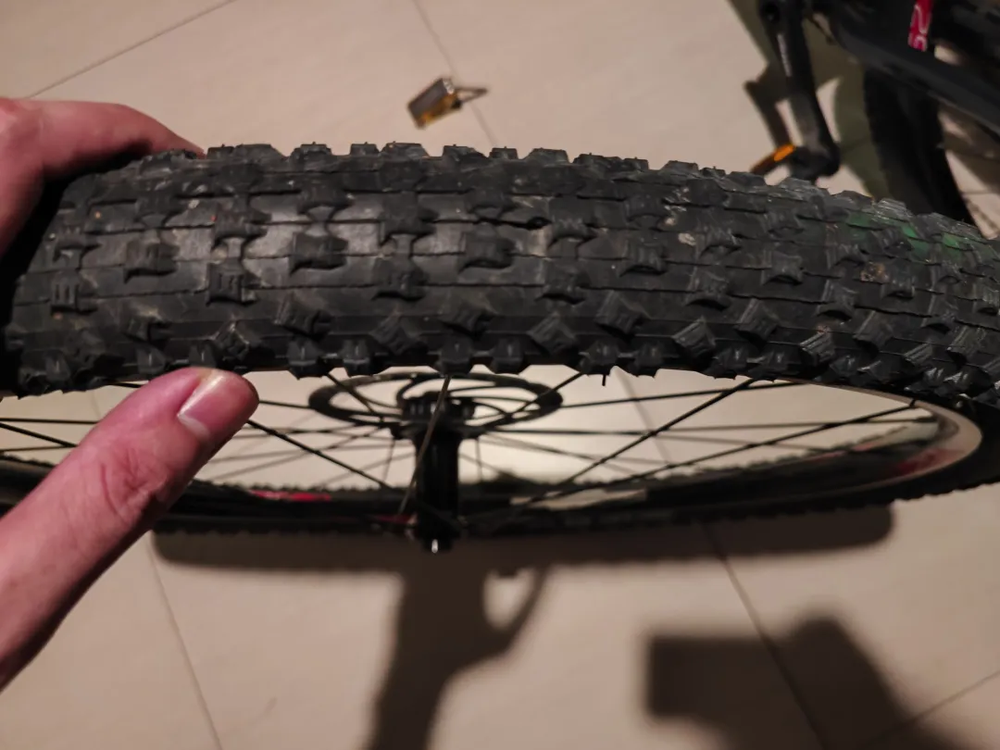
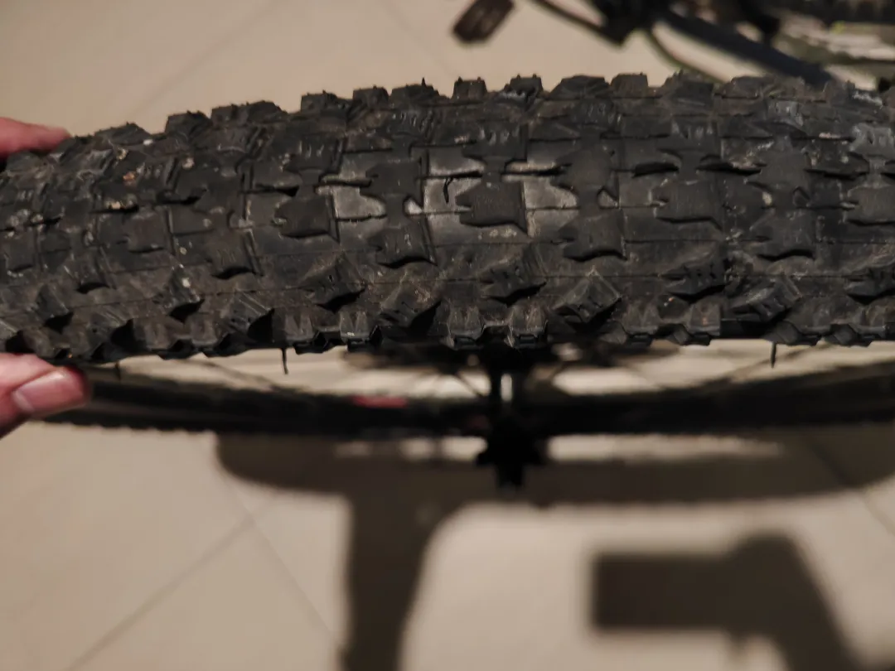
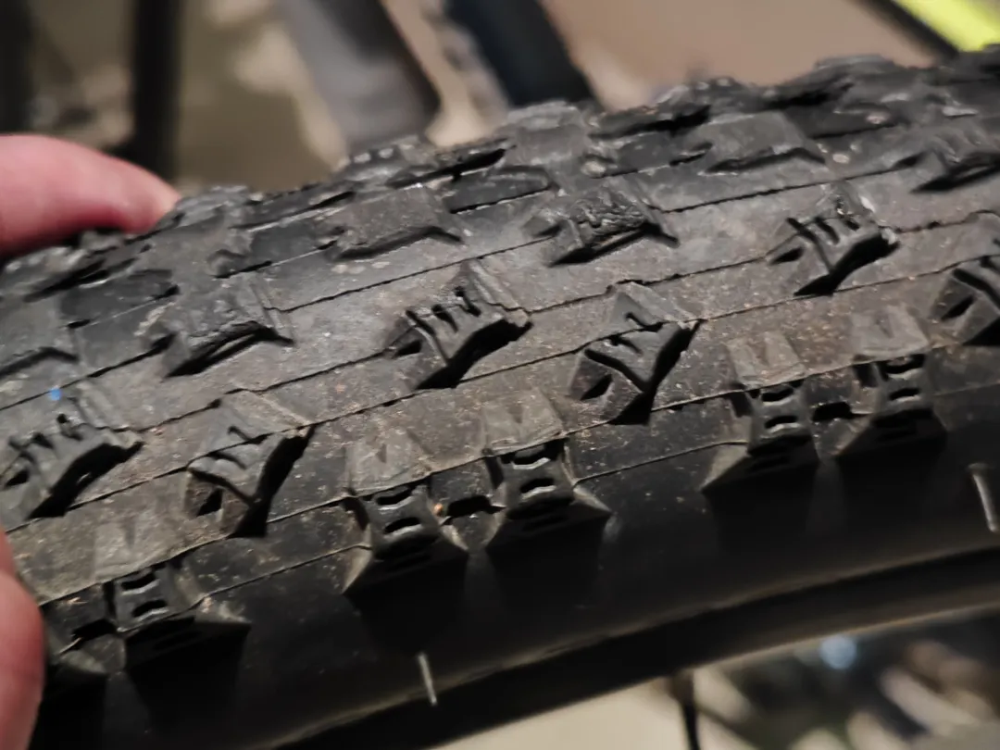
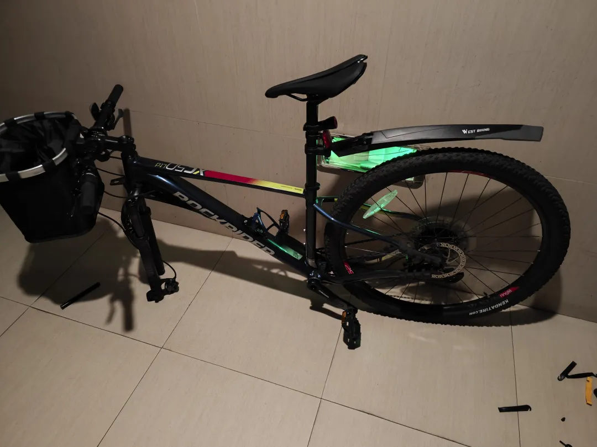
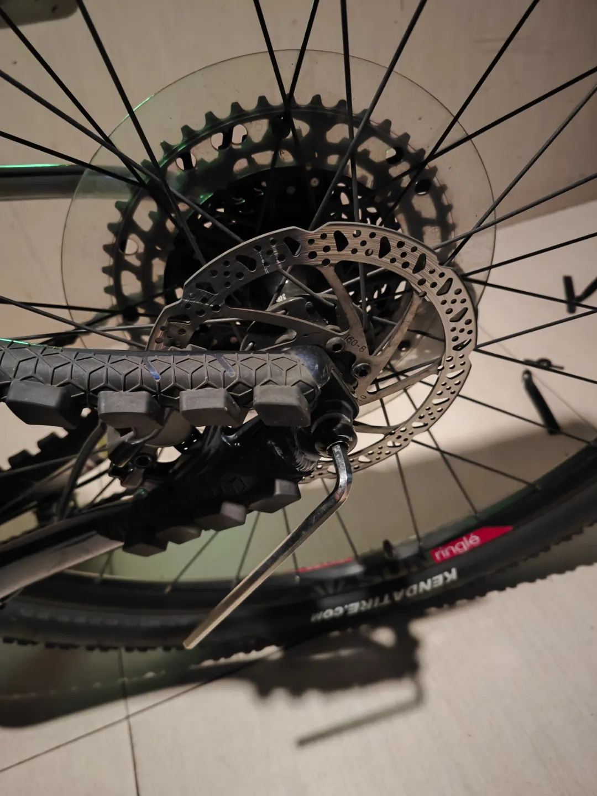
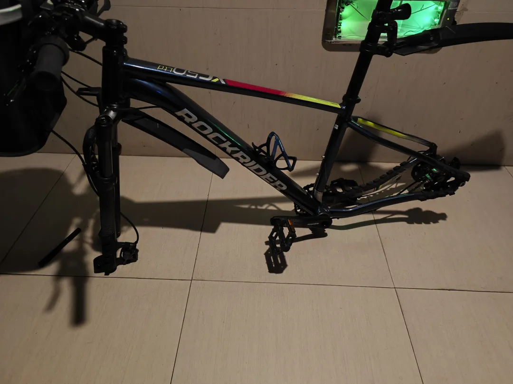
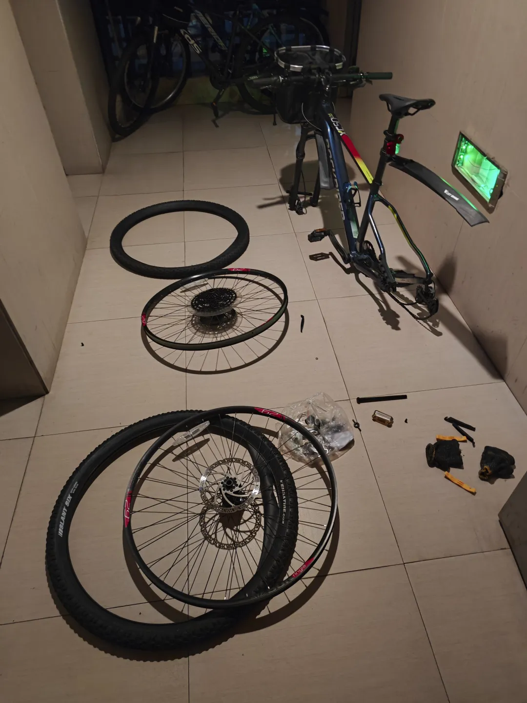
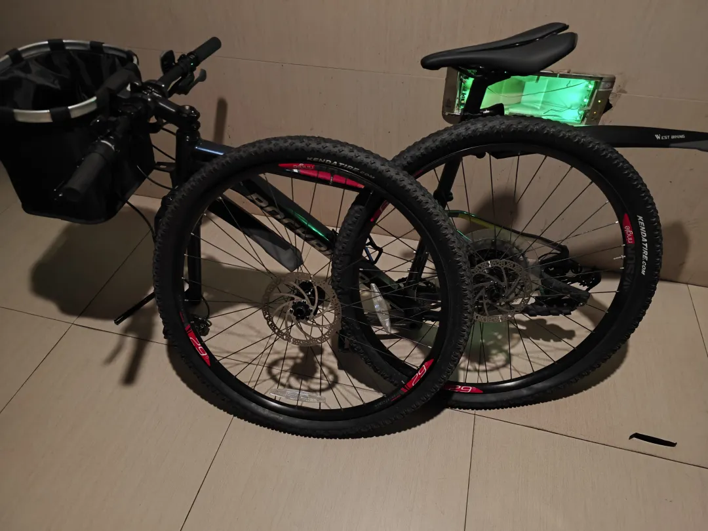
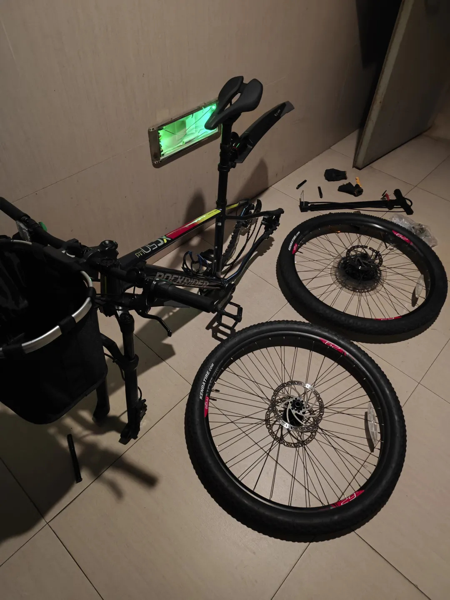
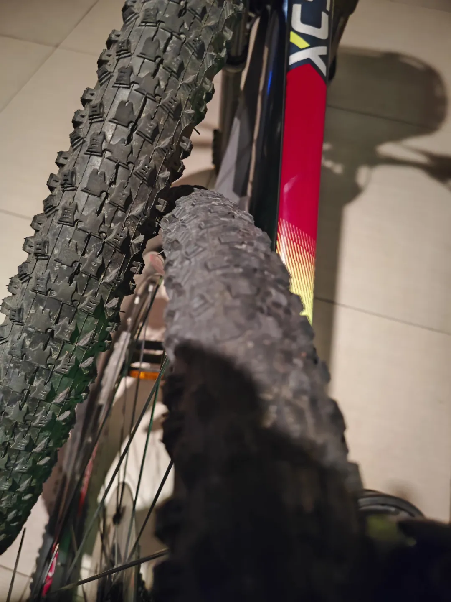

## 保养外胎
单车用的是迪卡侬的XC50。起因就是我的XC50已经骑了快一年了，很自然地，就会怀疑轮胎的耐久度，加上下雨天后轮刹车会抱死，最简单的办法就是换轮胎，但是我留了个心眼，提前问一下DeepSeek，DS告诉我可以考虑调换前后轮，于是我开始对调外胎。

这是前胎的纹路，基本没有磨损：

这是后胎的纹路：

接下来是拆轮子的过程：

拆完轮子之后是卸内外胎：

接着交换前后外胎：

接着给两个轮子打气：

完工：

最后把轮子安装到车架就OK了。这里分享一个小技巧：桶轴车架安装后轮的时候，后拨要按压（正面放置）或者拉提（倒置放置）一下，后轮的桶轴就会很容易穿进车架了。