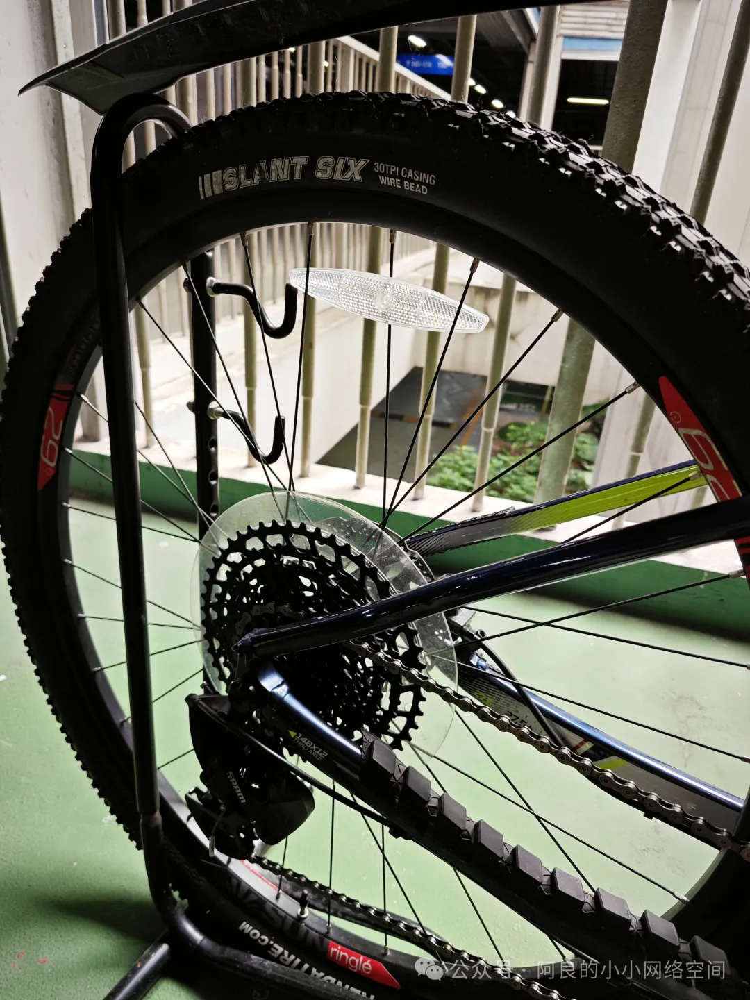
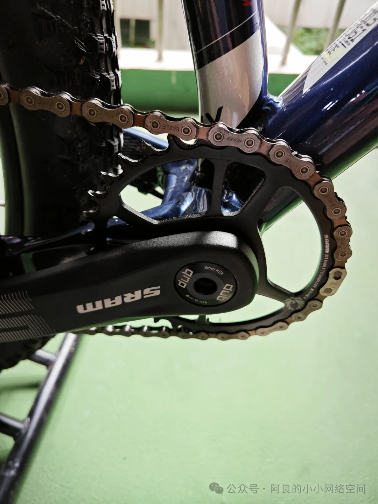
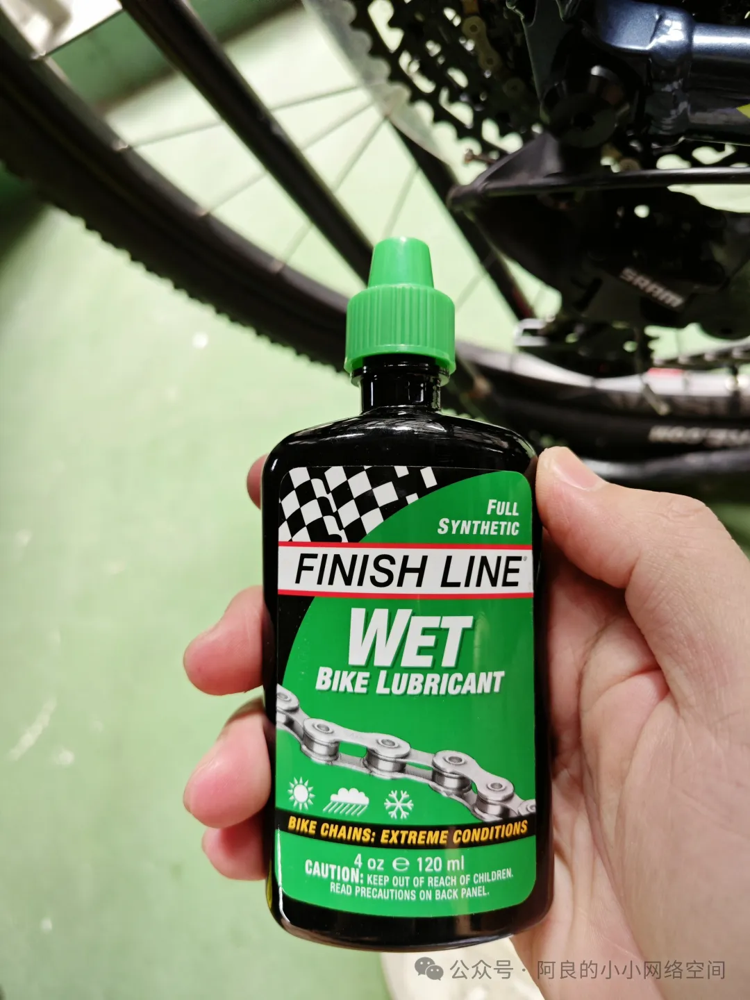
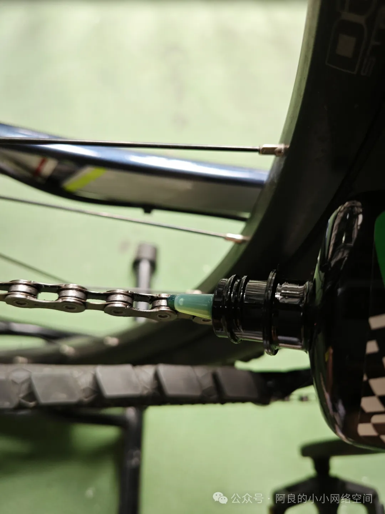

## 保养链条
展示的车型是迪卡侬的XC50。\

先擦拭链条，可以用各种废弃的布料，无纺布也可以：\

单盘的牙盘是非常好保养的，非常好擦拭。普通的3盘牙盘自行车，单用布完全无法清理干净，因为三盘距离太近，没有空间把手指插进去，单盘的四周空间非常充裕，可以弄得非常干净。\

最后清理完链条之后，上一些终点线，南方多雨的地方我觉得用这种潮湿配方的。去新西兰旅游的时候我发现皇后镇上自行车店里润滑油只卖终点线，因为皇后镇是速降天堂，所以终点线应该是比较通用的润滑油。油味道清香，是好润滑油：\

经过1年的时间实践验证，这款绿色包装的终点线能防大暴雨。就是说，把自行车放在大暴雨下面淋，雨后不做任何擦拭保养，链条都不会生锈。我是怎么验证的呢？我骑这辆单车通勤，因为单位车库空间不够，我就靠在花圃边缘。福建的雨量是非常大的（我在福州），保持1个季度保养1次链条的频率，1年之后，链条没有出现任何生锈现象。之后，我用同款润滑油给我的另外一辆自行车美利达勇士600上链条油，骑了1个月了，三伏天，各种下大雨，同样没有生锈，说明生锈现象和链条本身关系不大，主要是这款绿标终点线的防水性碉堡了。\
