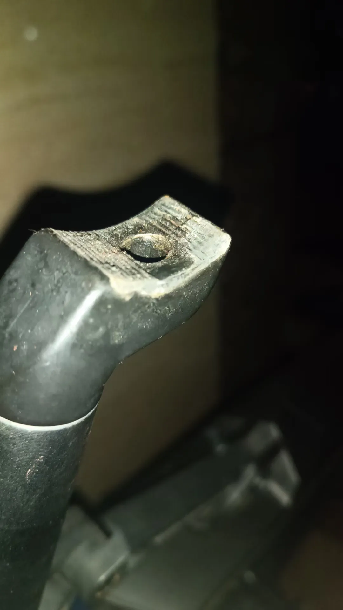
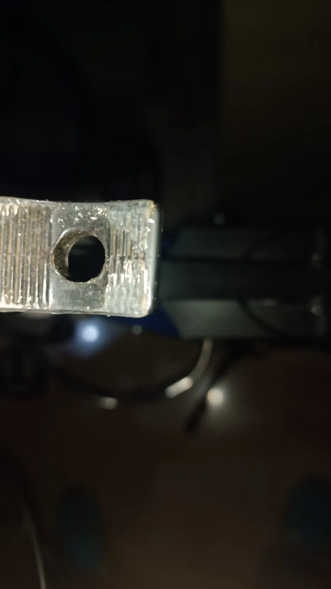
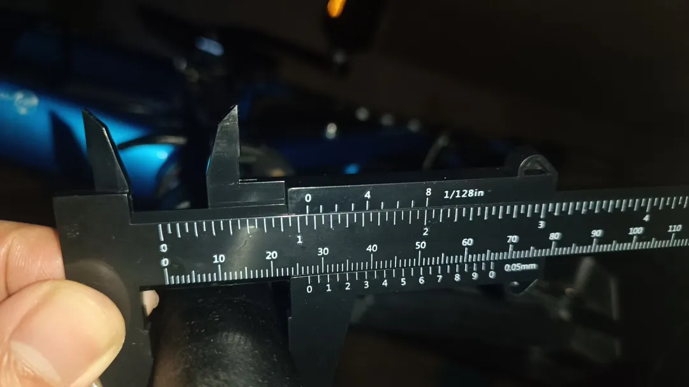
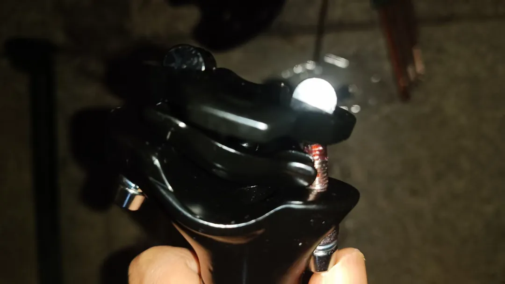
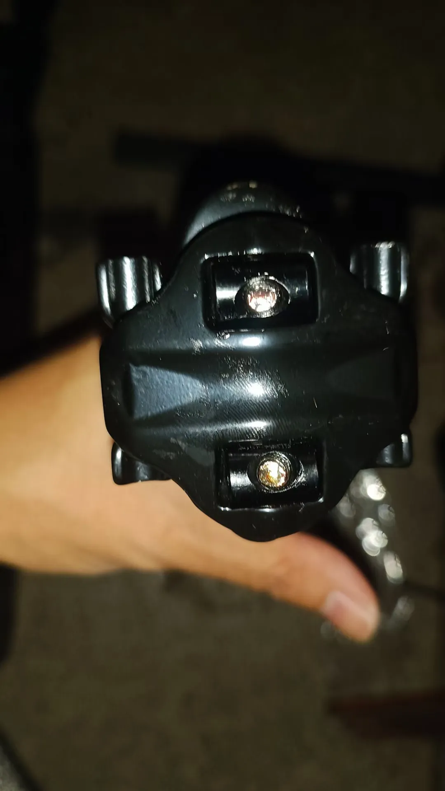
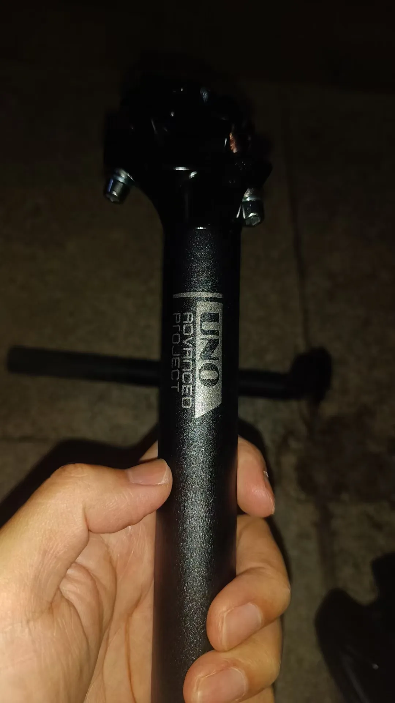
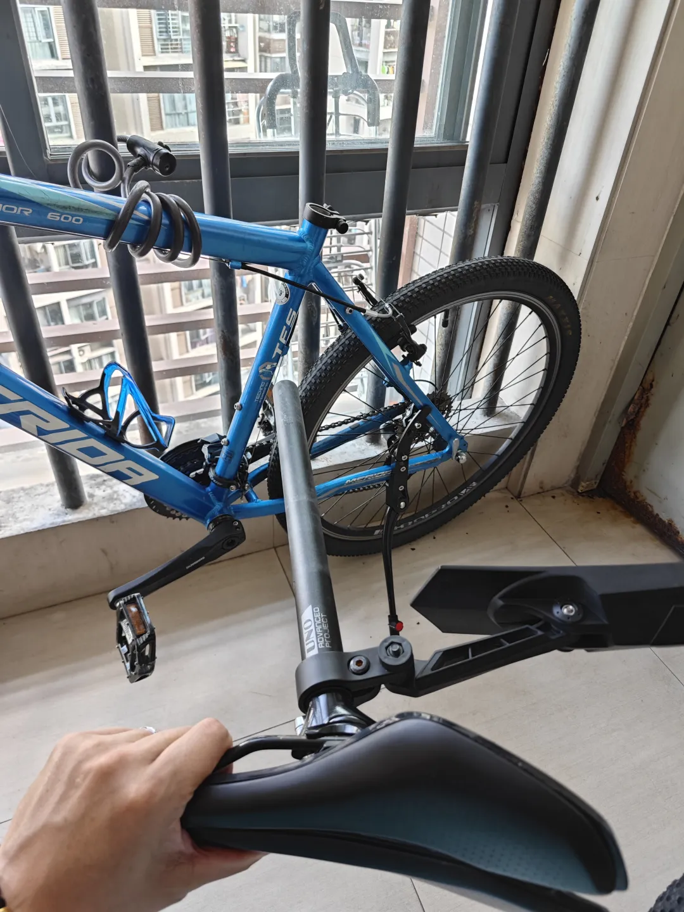
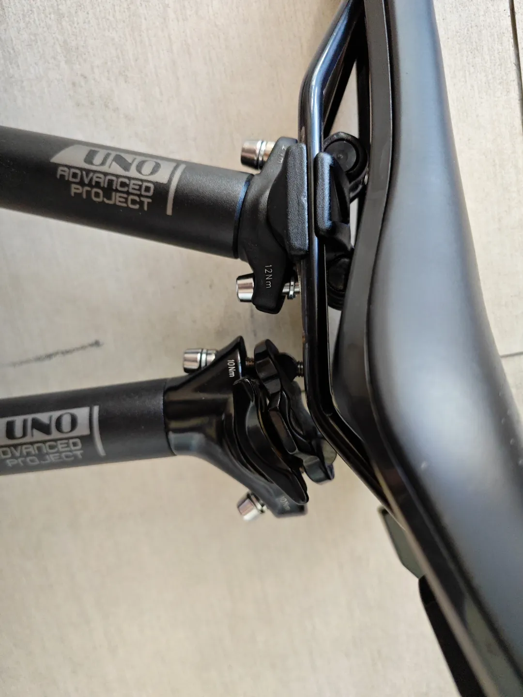
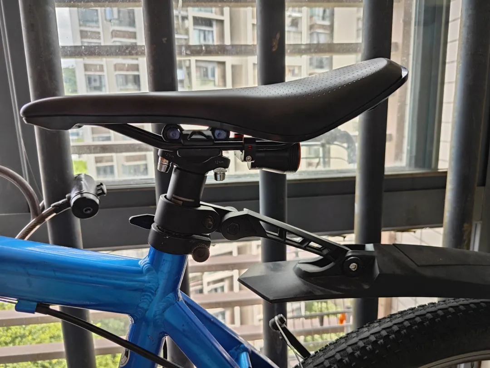

## 更换座管
本小节演示用车是美利达勇士600。
### 更新座管
这根座管是10年前买的美利达勇士600的原装座管，问题就是发现座椅的前端一直会下滑，然后我就把座管头拆了，从照片上看，接头处的卡齿都被磨平了：

下图看起来感觉金属都侵入齿纹的凹陷处了：

没办法，只能买新的座管来替换这根旧的了，毕竟用了10年，太久了。那首先就得确定座管的直径，好的牌子的座管上面都有标记尺寸，那我这里用一个更直接的方法，管它座管有没有标尺寸都无所谓，这个方法就是直接用游标卡尺手工测量：

如上图所示，这根座管的直径大约是27毫米多一点点，然后就上网淘宝，就会发现直径27毫米左右的座管只有27.2mm这一个尺寸，那么，说明直径就是27.2mm。

这里用的游标卡尺是淘宝里面最便宜的2块钱的塑料材质的游标卡尺，为什么买塑料材质的？不是因为便宜，而是因为钢质的卡尺边角会很锋利，非常容易把手划伤，同时，塑料材质也有轻便的好处。

这边再放一下我淘宝的UNO的新款的座管，感慨一下，10年过去了，技术真是完全不同了，整个座管头部的结构已经完全不一样了：

### 降低座管高度
后期，我又对座管进行了进一步改造，买了一根短了5cm的新座管，为的是降低座高的下限，方便身高不高的爸爸也能骑行。同时为了缩短车把和车座之间的距离，我用直管更换了上面那根后飘式的座管，先拆坐垫：

对比一下，直杠和后飘的结构还有点不一样：

后飘改直管，完工：

