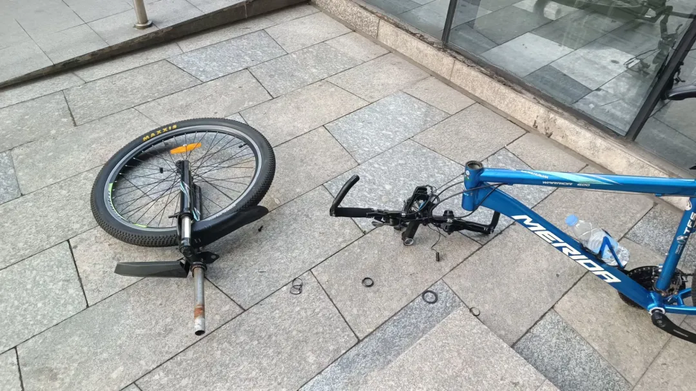
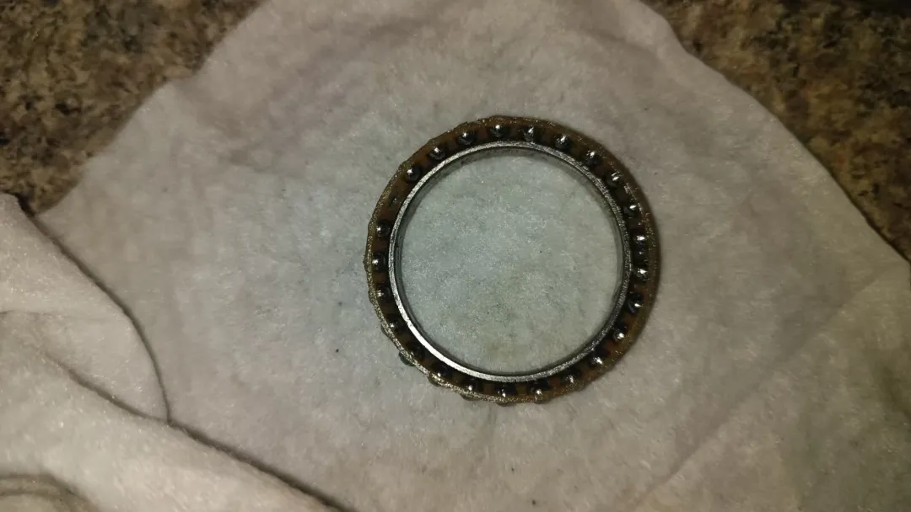
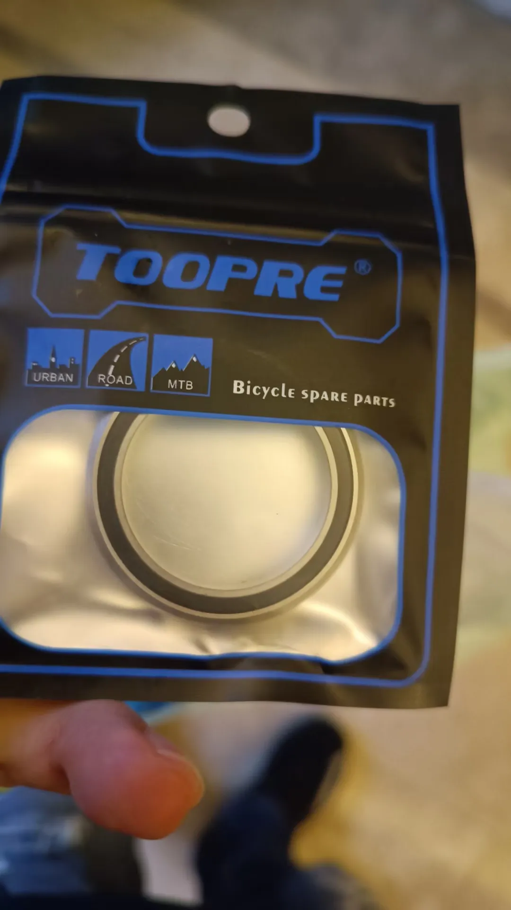
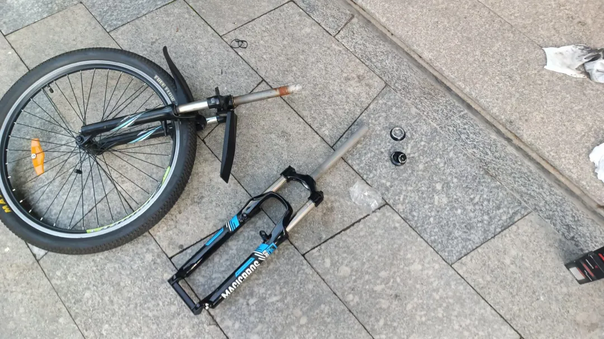
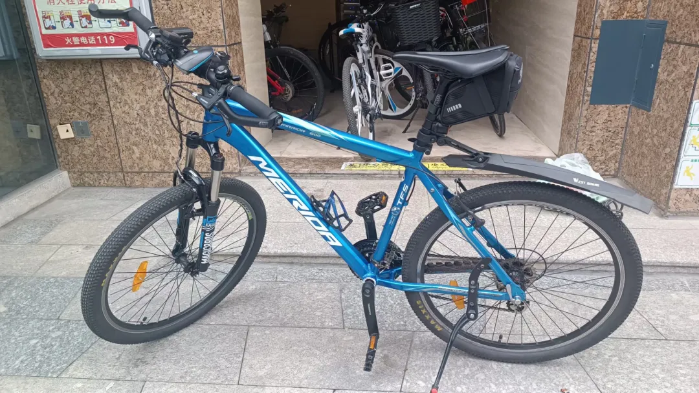

## 更换前叉
本小节演示用车依旧是美利达勇士600。

起因就是因为勇士600的原装前叉已经锈死，没有了弹性，我反复涂抹赛领前叉润滑油，但是内部的铁锈一直跟着内管涌到外侧，非常脏。因为这根前叉也是用了9年了。但是由于当时我的前刹还是V刹的缘故，导致很难买到好的带V刹柱的前叉，所以就随便买了一根120多块钱的弹簧叉（后续证明真的非常差非常难用）。后面的文章有分享我改V刹变碟刹，就又换了好的碟刹前叉。那这是后话了，这里先讲解如何换前叉。

先拆旧前叉：

然后这里在拆的时候出了一个小bug，就是我把头管的培林撬坏了，后面复盘的时候我发现其实不用拆头管里面的培林的，看一下我拆坏了的培林：

没办法，只能试着拼夕夕看有没有新的，竟然真的有，尺寸啥的先用游标卡尺量一下：

toopre这个国产牌子还不错，和乐百客都是我很喜欢的国产品牌，这边又做免费广告了。

有了新配件就可以换前叉了：

完工：
