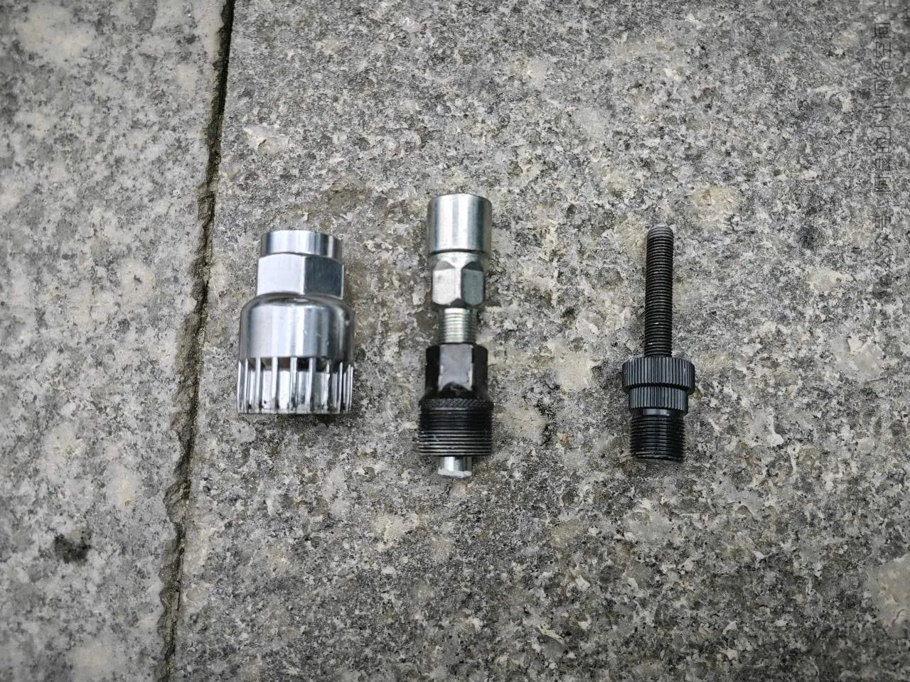
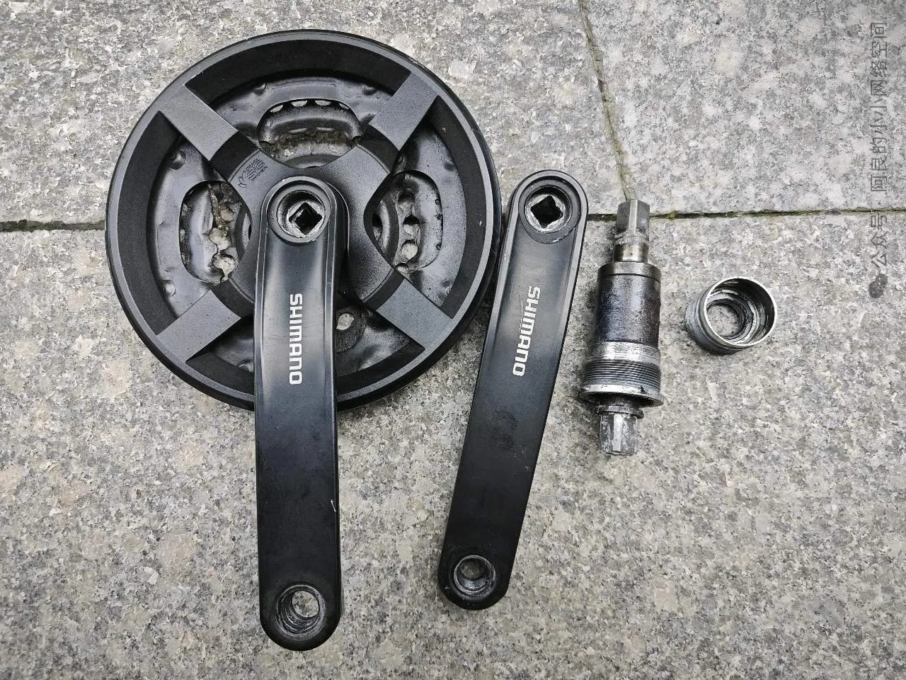
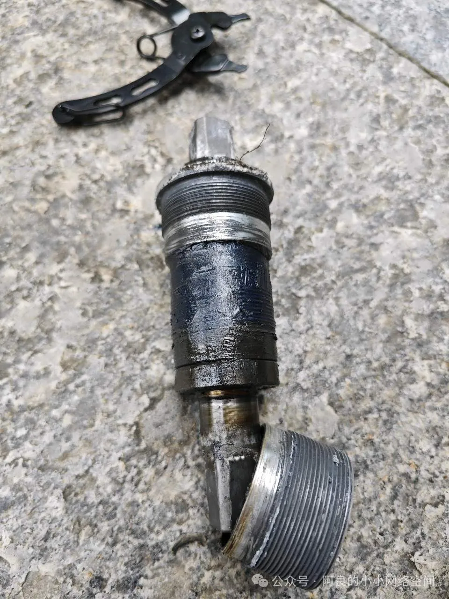
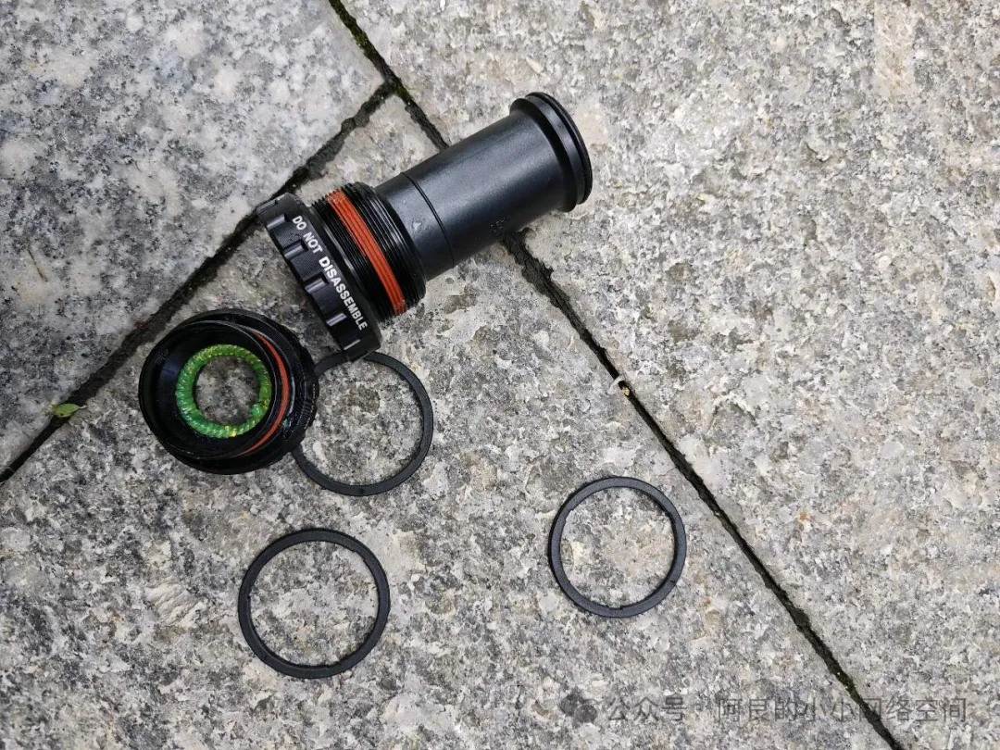
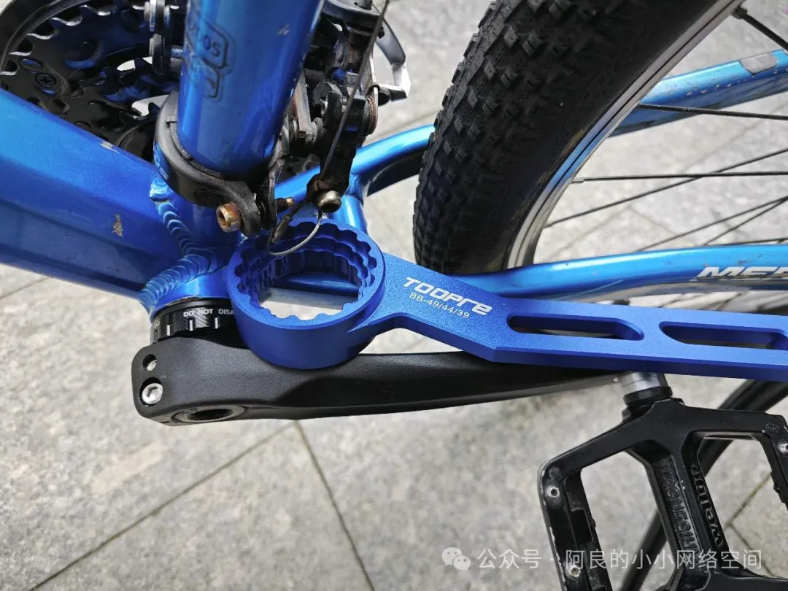
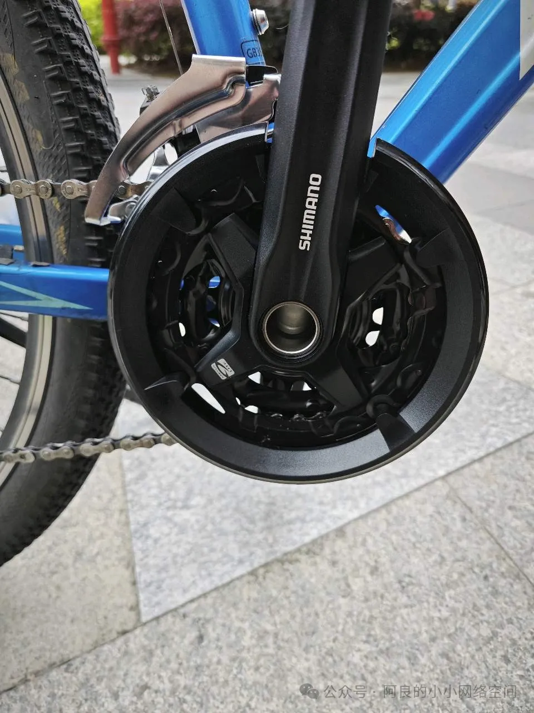
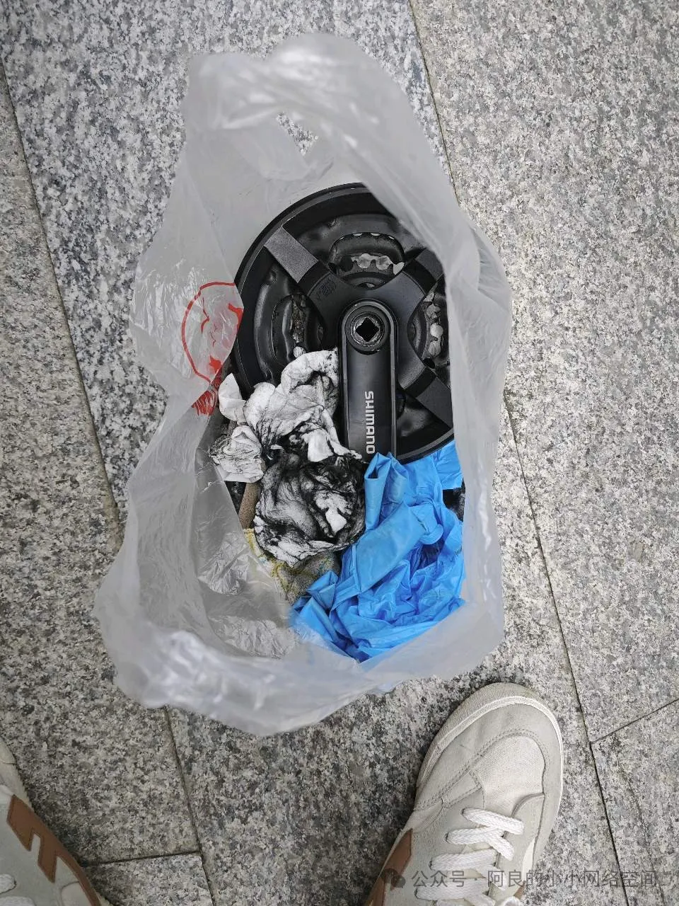

## 升级中轴
起因是中轴处一直发生异响，因为之前方孔中轴已经完全锈死，临时用WD40处理了，但是不到半年，中轴处又重新发出异响。因为我使用的方式比较硬核，用来全天候通勤，福建这边的阴雨天又非常多，所以各个配件都很容易生锈。那这次我决定整个方孔中轴更换成中空一体中轴，试图解决掉整个方孔中轴频繁进水的问题，接下来分享整个更换的流程。

先用拉马拆旧中轴：

覆盖着方孔中轴外层的是我之前用WD40除锈后涂抹上的润滑脂。这次发现，五通内部底部有一个小孔，用来排水的，从座管那边会有水进去，都被黄油堵住了，所以每次都锈烂了，这次我把小孔通干净了，也没上黄油，水就会流出来了。

新的中空一体中轴之前已经买好并到货了：

这里有用到垫圈，我的五通长度是68mm，这款中轴长度75.5mm，送了3个塑料垫圈，每个宽度2.5mm，左侧垫1个，右侧垫2个就刚好了，还有一种73mm宽的五通，垫圈就是左0右1。

用中轴扳手安装到五通上：

这次用的是27速的牙盘，就是其实不是完全匹配的，因为24速的只有方孔牙盘，中空牙盘最低速都是配9速的飞轮。但是由于对中空牙盘的渴望胜过了一切，就想说试试，这边要感谢一下淘宝单车店“建业车行”的老板伟伟，他跟我确定可以用，于是我就下定决新换3*9速的牙盘。

最后经过实践，我发现9速的牙盘可以兼容8速的链条。前拨要调好，根据当前前拨的型号配置最大盘42或者44（由前拨尺寸决定）的9速牙盘，飞轮也不用动。但缺陷就是不是所有24个档位都特别顺滑，但是也足够完全用了，毕竟解决了异响这一主要矛盾。

最后记得把垃圾都收拾好，统一丢到垃圾桶：
