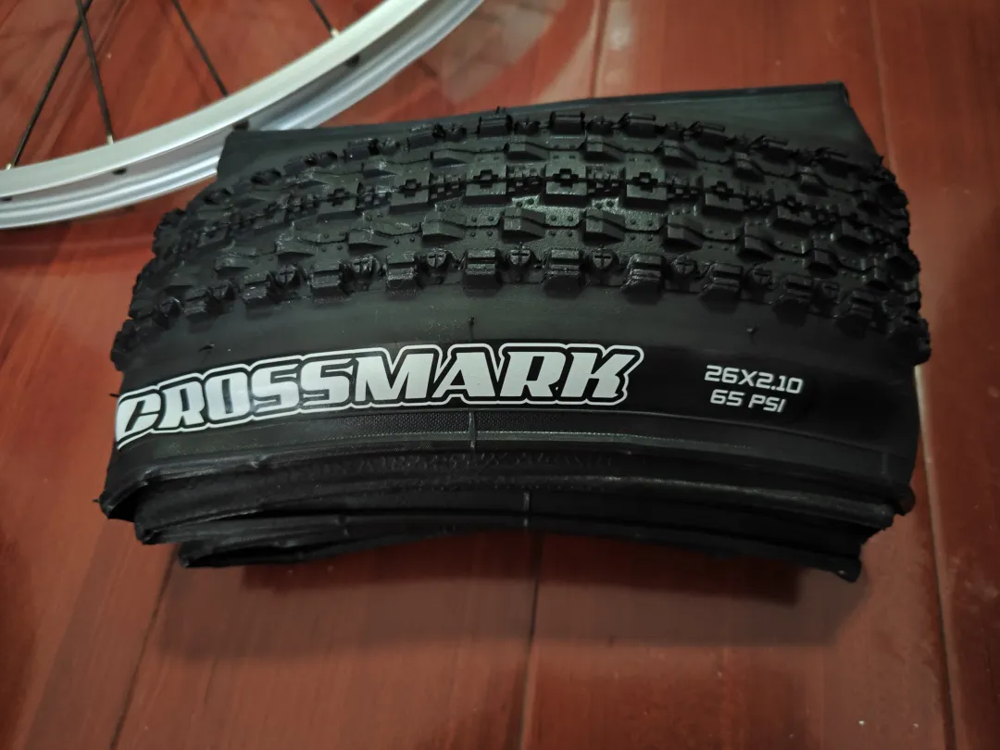
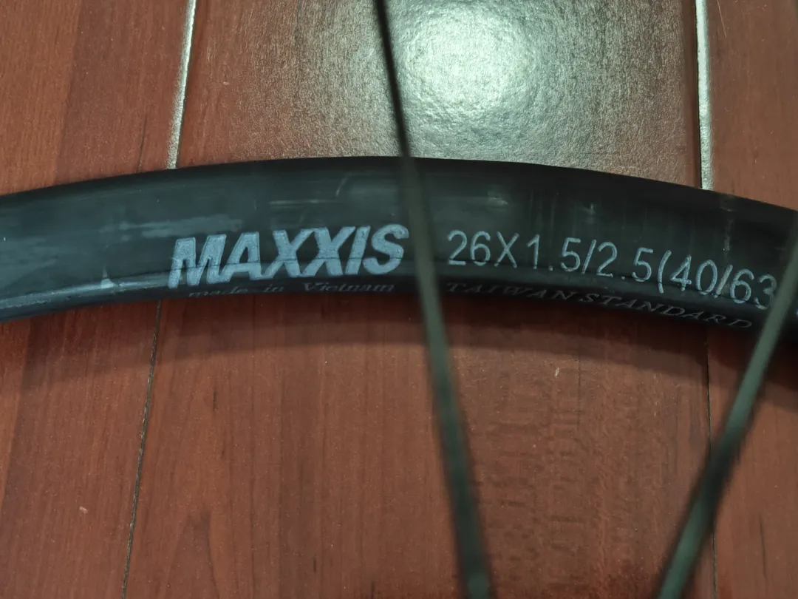
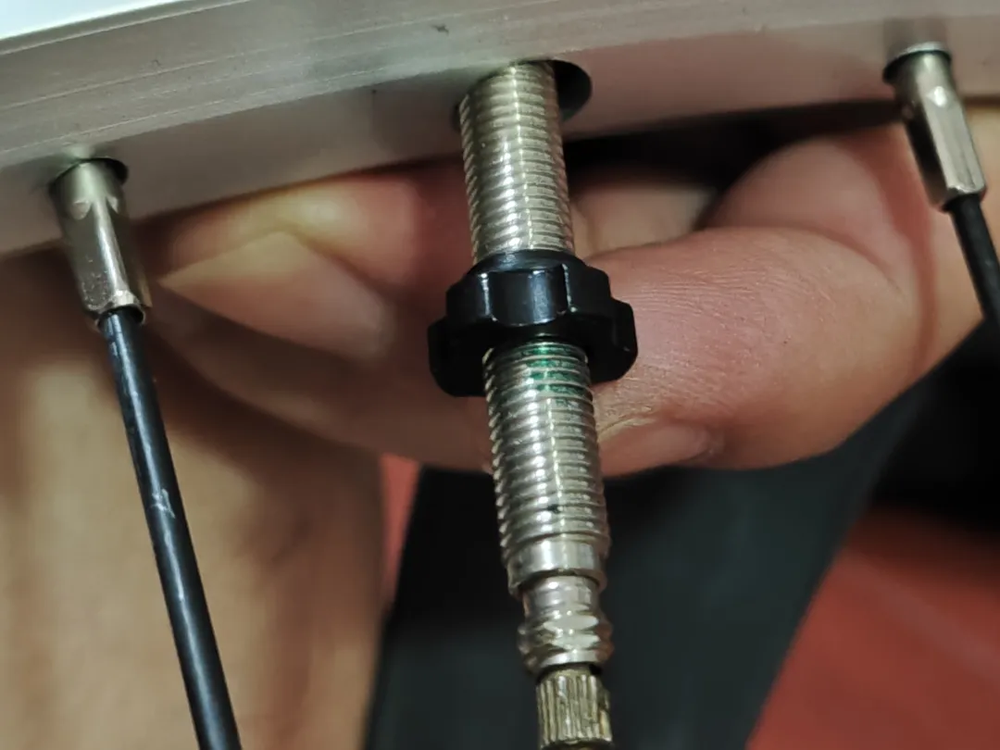
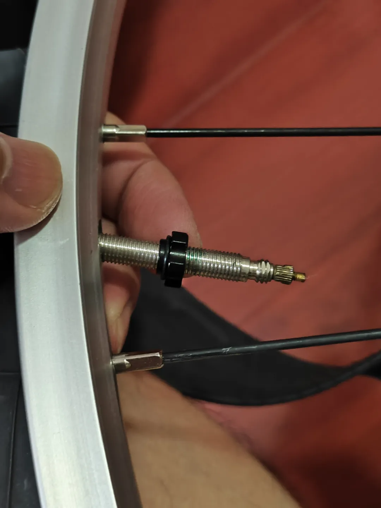
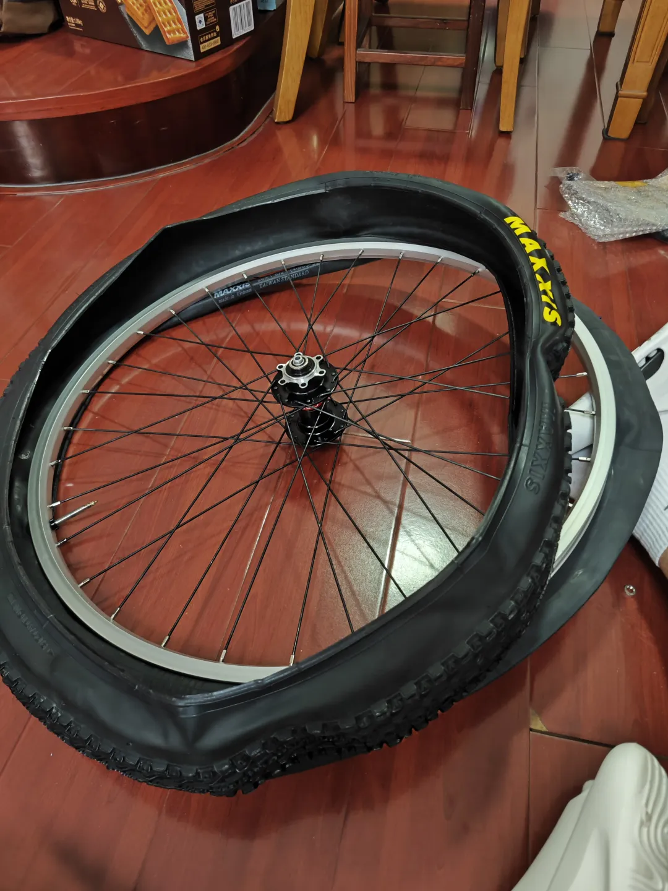
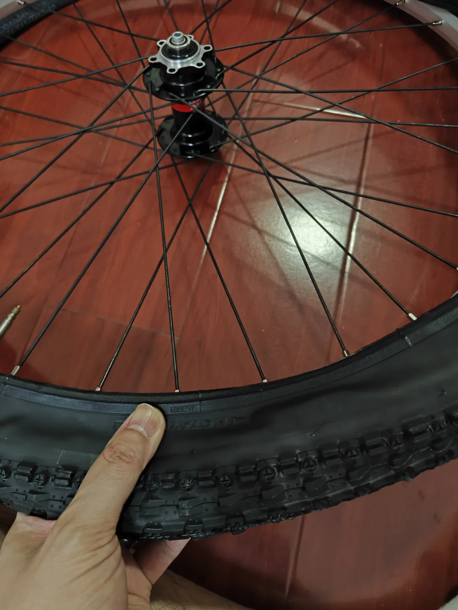
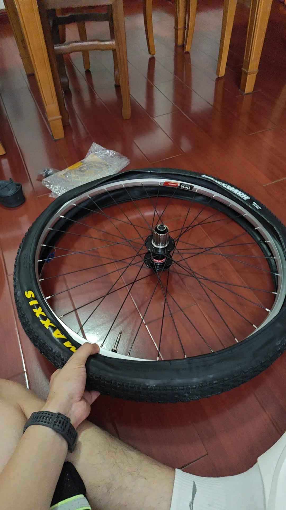
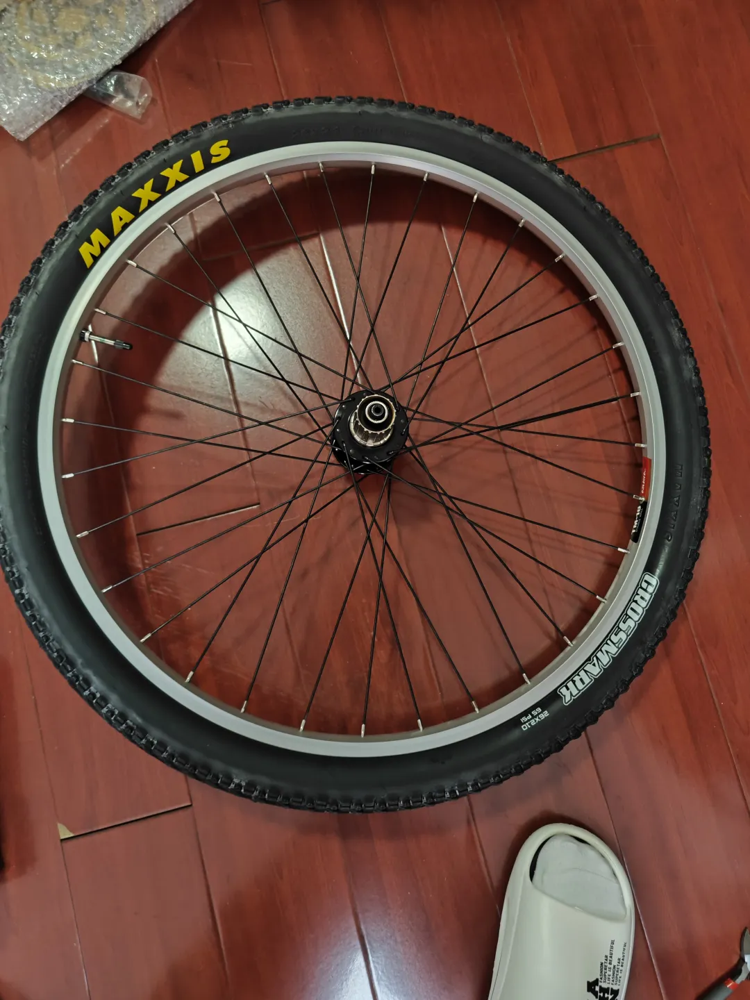
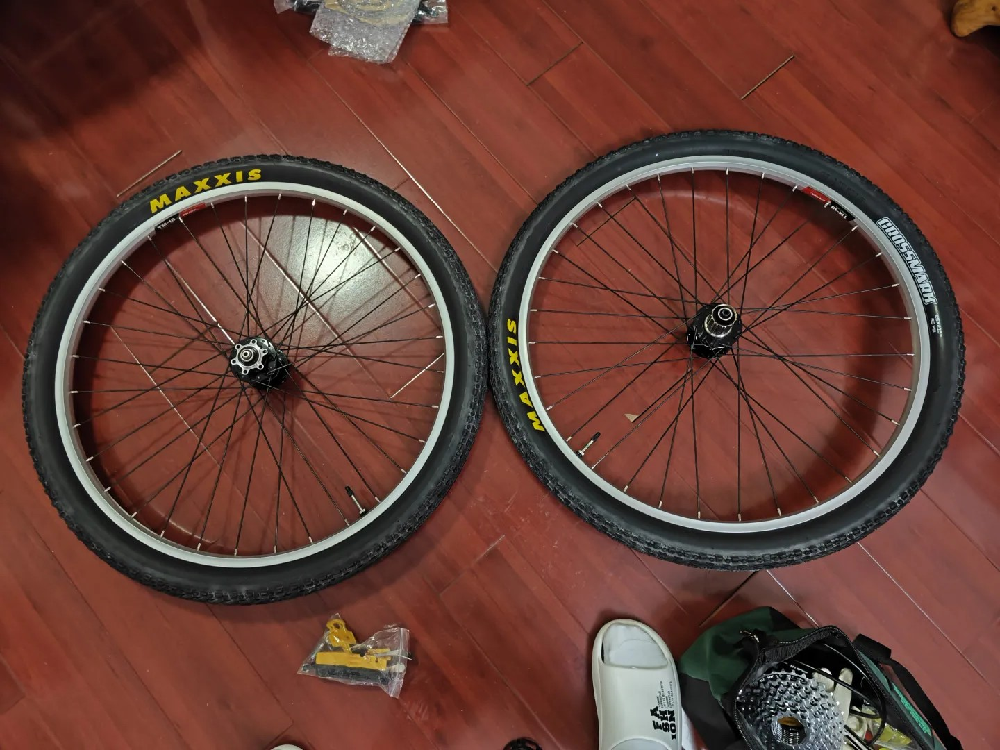
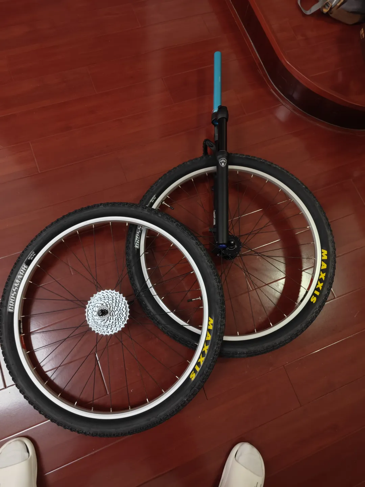

## 升级车胎
起因是换了我自己编的新轮组（后续会分享编轮技巧），就顺带一起升级一下内外胎。

新配的是玛吉斯2.1宽度的最防滑的折叠系列crossmark，因为后叉宽度受限的原因，非boost只能配到2.1：

内胎选用的也是玛吉斯的超轻内胎：

轮圈是美嘴的，因为我另外一辆车迪卡侬XC50用的是法嘴，我发现法嘴的打气、放气方式都比美嘴先进很多，于是我淘宝了美嘴转法嘴套件（因为轮圈买的早，本身同时支持V刹和碟刹的26寸轮圈就不多。加上当时也不知道法嘴的好处，于是买的轮圈是支持美嘴的），实现美嘴轮圈配法嘴内胎：

接着就是给轮组安装轮胎了：

装一下飞轮和前叉（我这里又买了新的马尼托M30碟刹气压前叉，因为后续V刹被我改碟刹了），装轮胎的工作就完成了：
