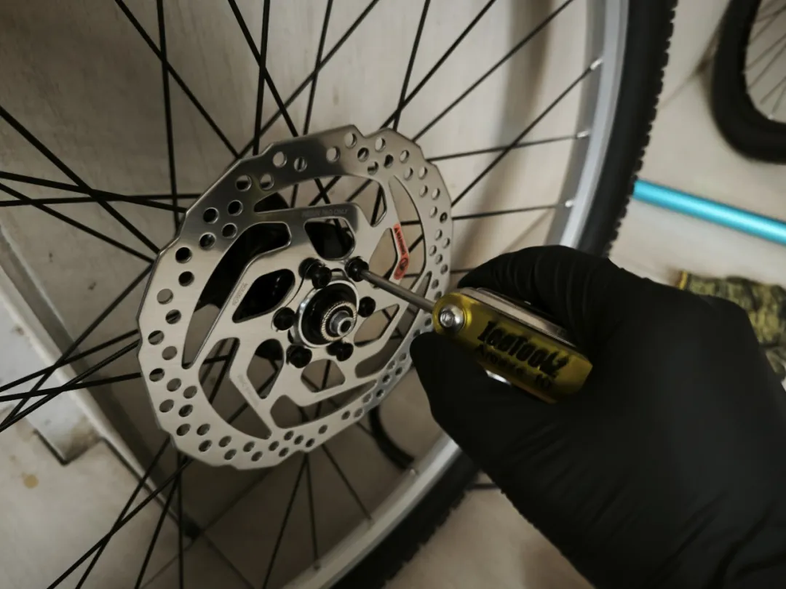
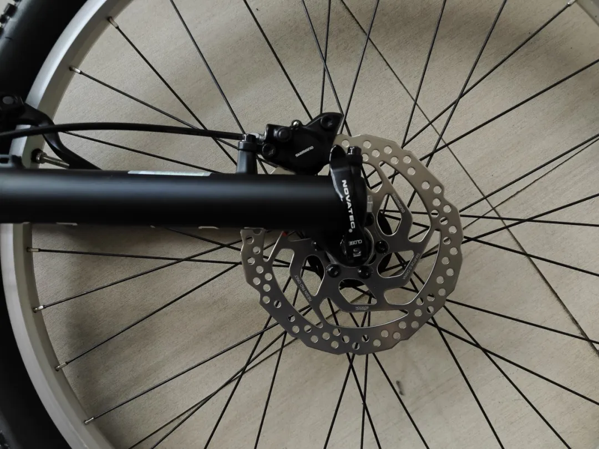
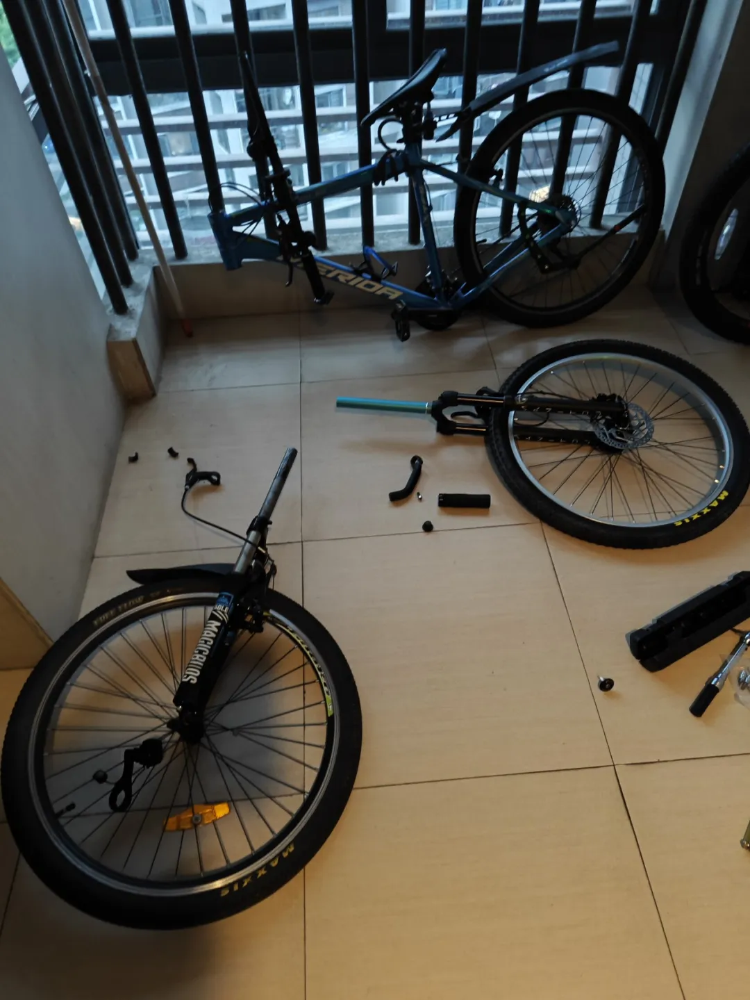
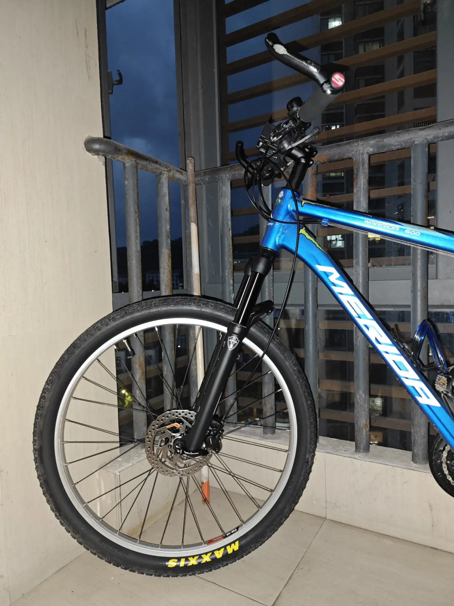
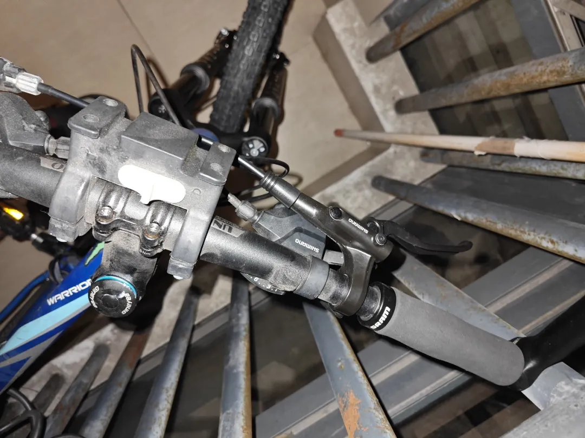
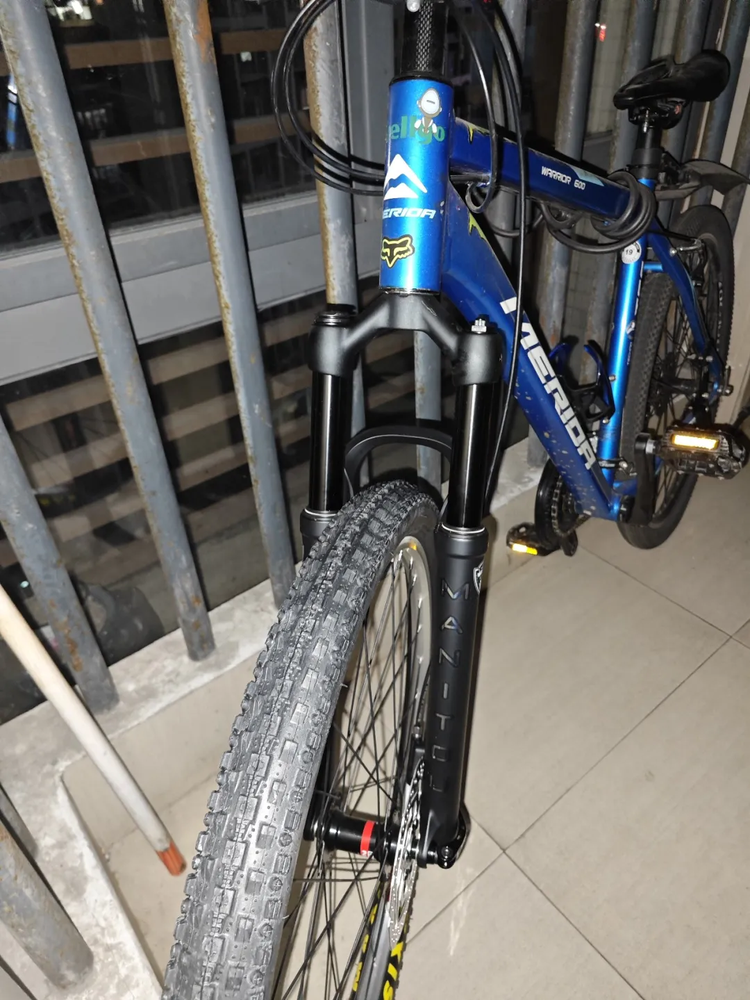
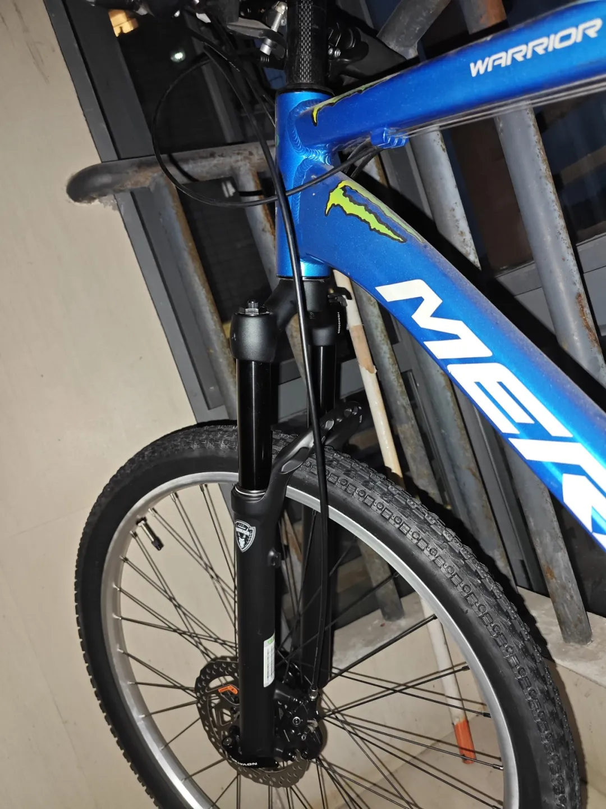
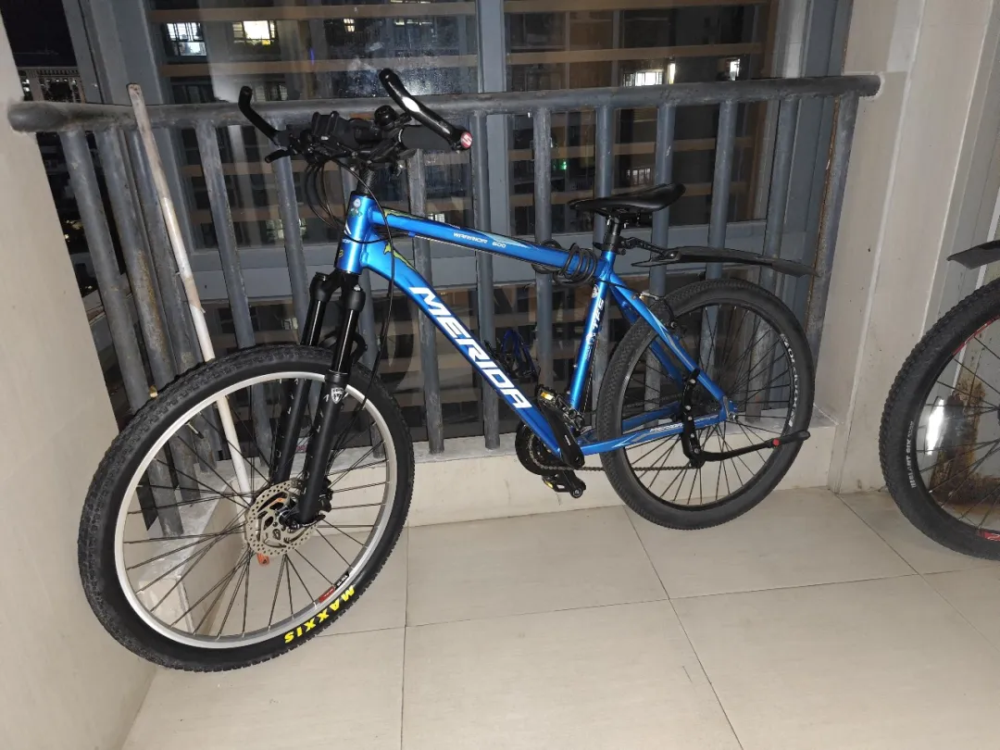

## 前轮V改碟
本小节演示用车还是美利达勇士600

轮组是自己编的，之前配的花鼓是久裕的D041SB和D042SB，就是支持碟刹的经典久裕花鼓，刹车器配的是禧玛诺的经典刹车MT200，那先给轮组安装碟片：

接着是安装刹车器：

这里提一下icetoolz的小扳手，一把就完成了改造的所有工作，而且很好用，70块钱左右，推荐。

拆下来原前叉：

把新的前轮和前叉安装上就好了：

