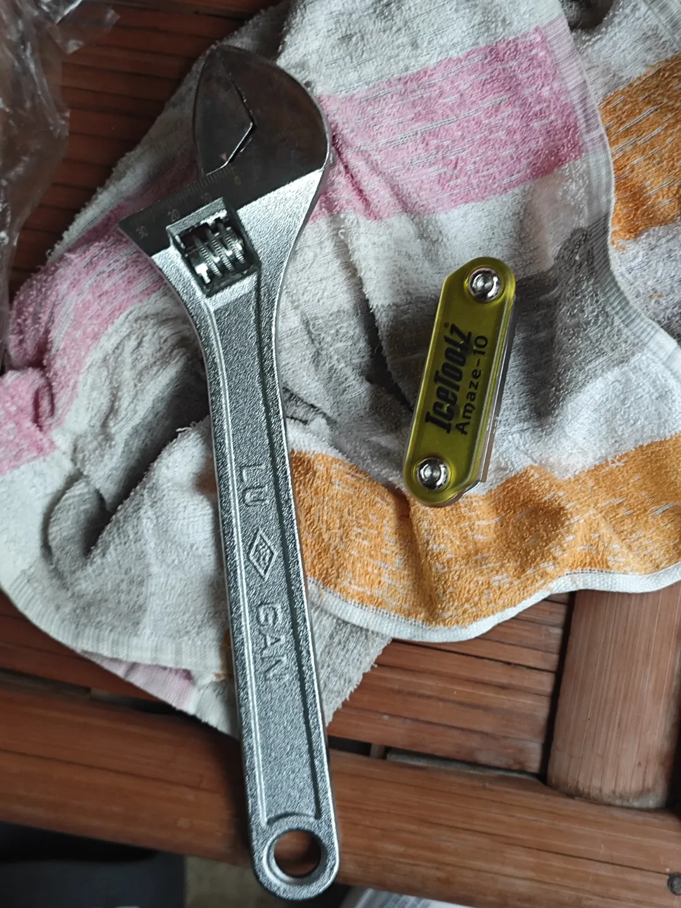
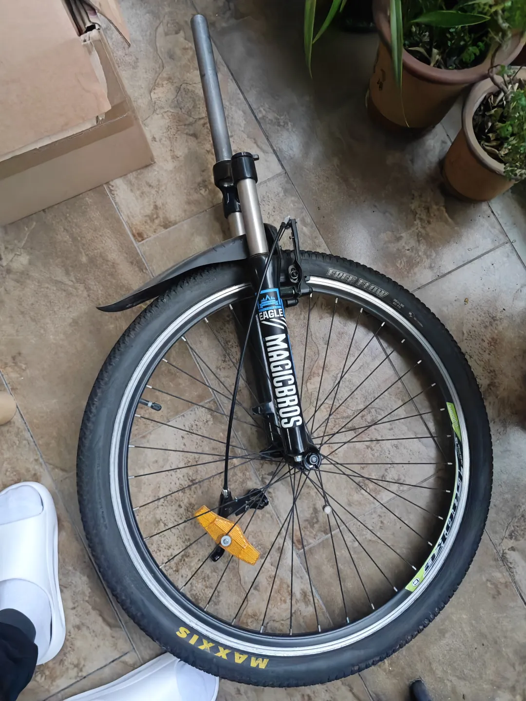
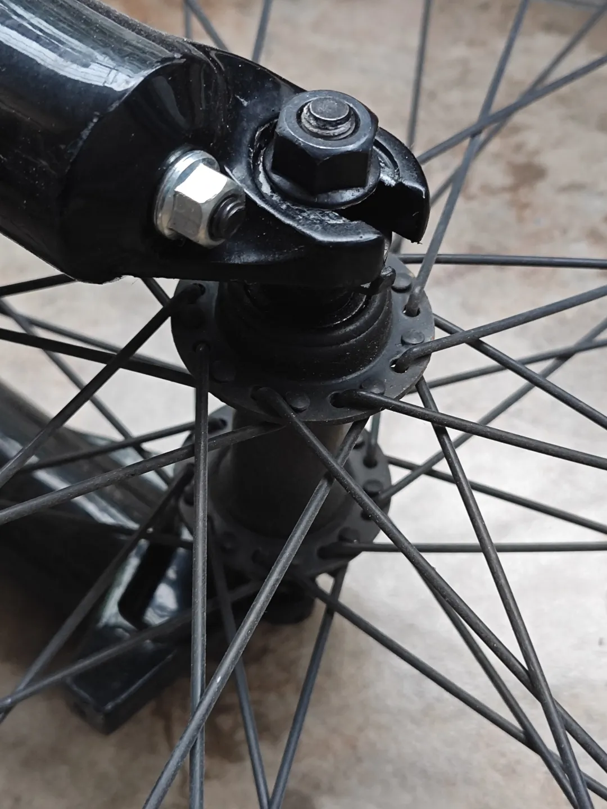
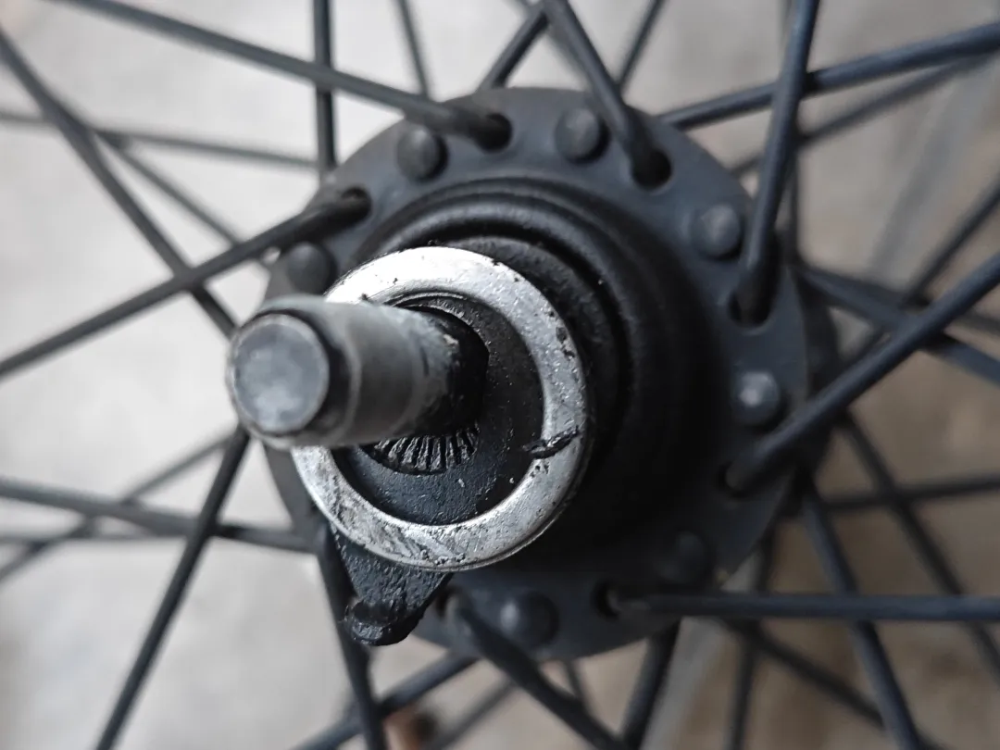
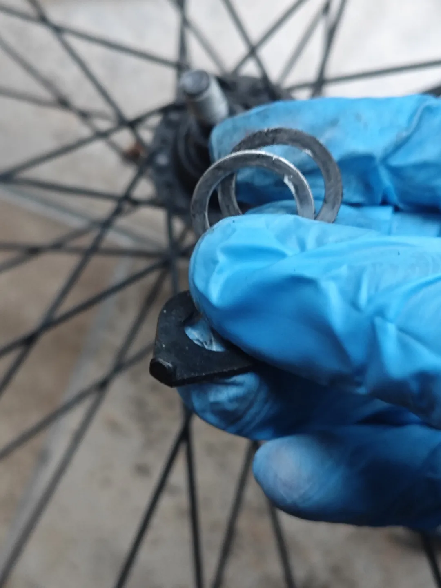
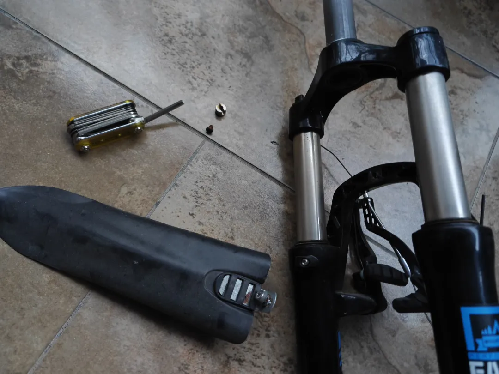
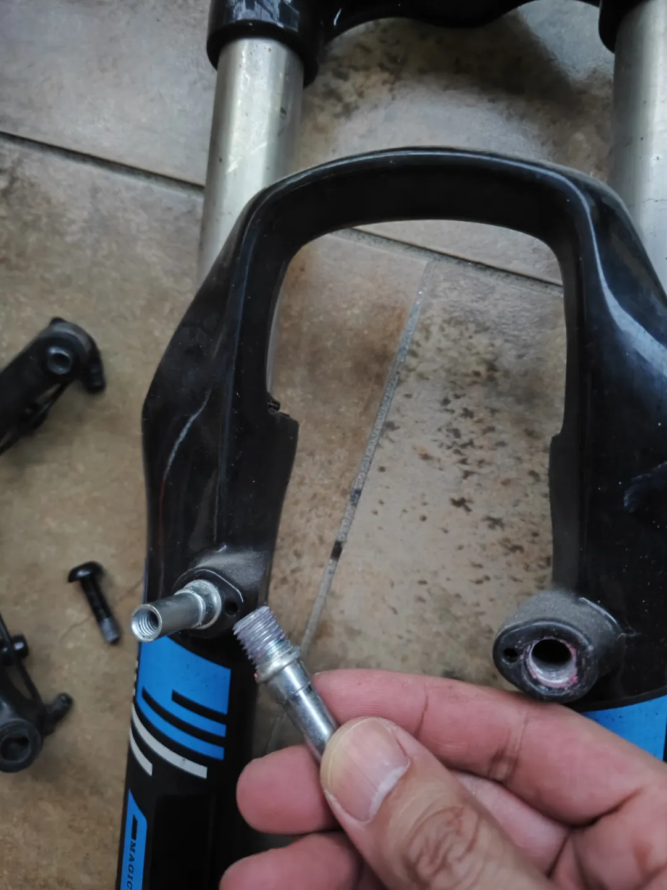
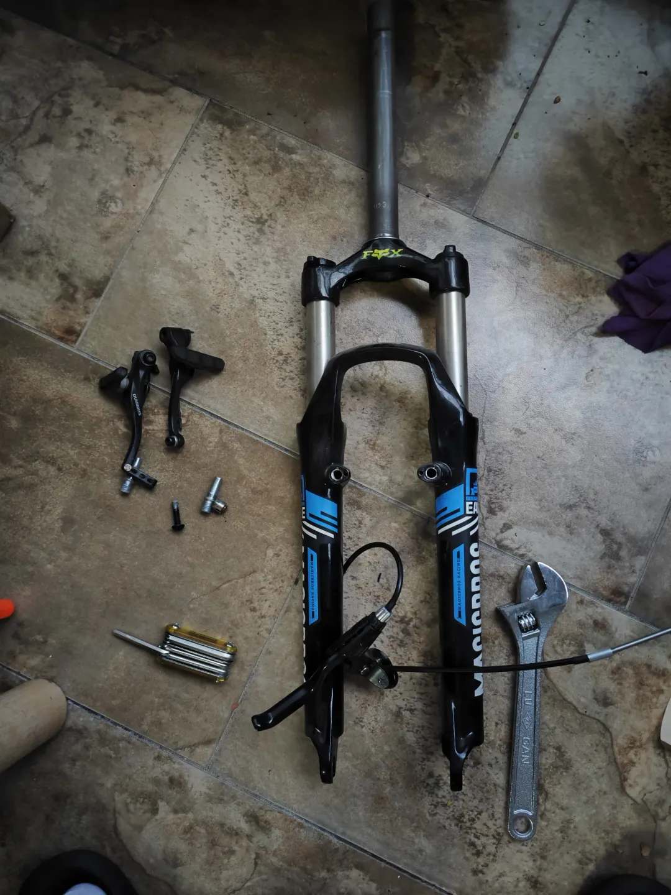
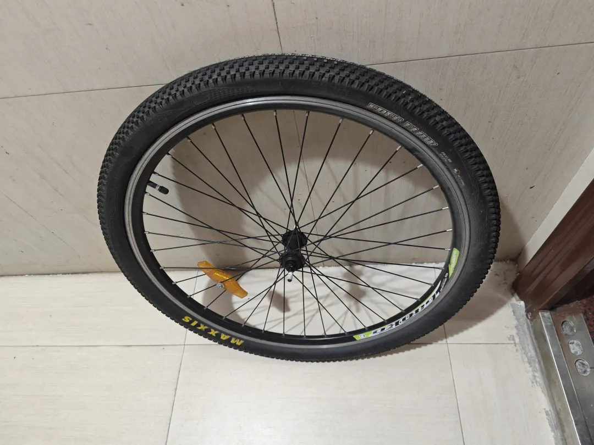

## 拆V刹
起因是完成了前轮的V改碟，那原来的V刹架和弹簧叉我想就拆了给它们收起来，那这篇就介绍一下V刹的拆卸技巧。\

先看一下工具，就2把：\

材料就是之前V改碟剩下的原前轮：\

这里的花鼓还是那种径宽90mm还是95mm的连快拆都不支持的实心花鼓：\

因为前叉宽度是100mm，导致我添加了各种各样的垫片：\

原来的码表是最古老的那种磁吸感应式的码表，也一并拆下来收好：\

接着拆V刹架和V刹柱：\

完工：\

剩下的轮子整个丢掉：\
