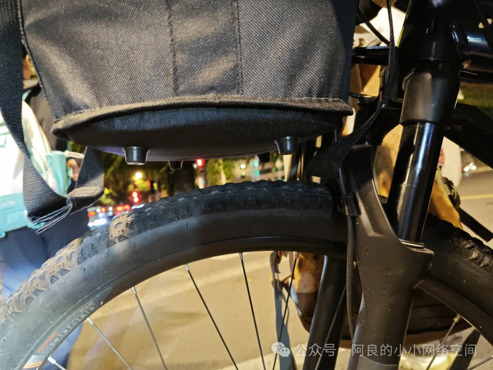
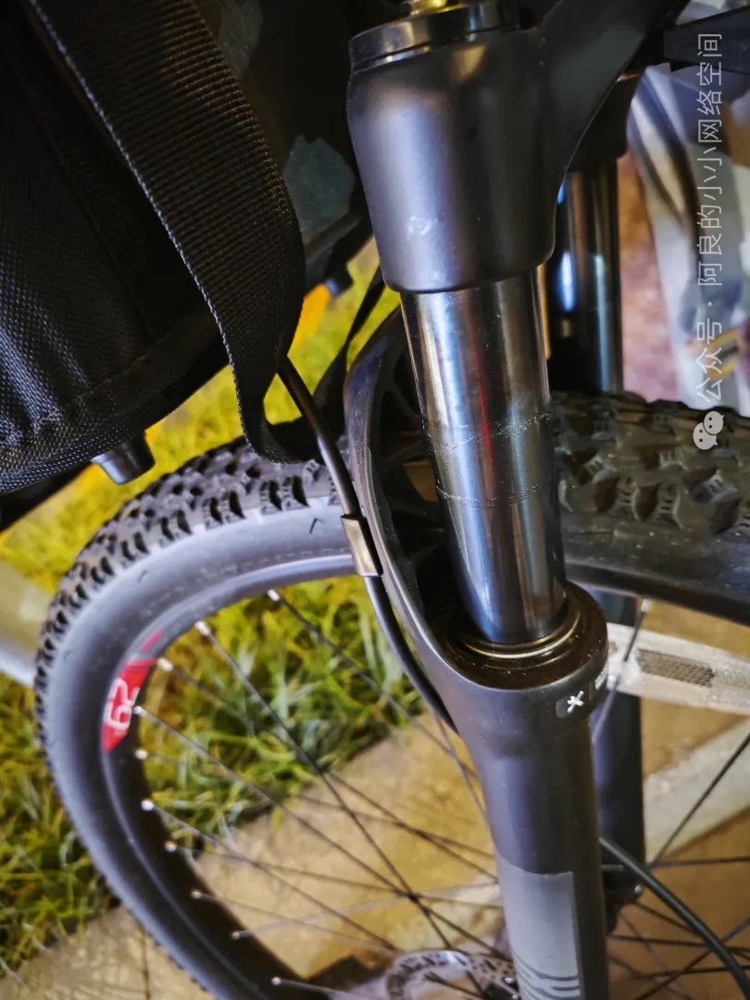
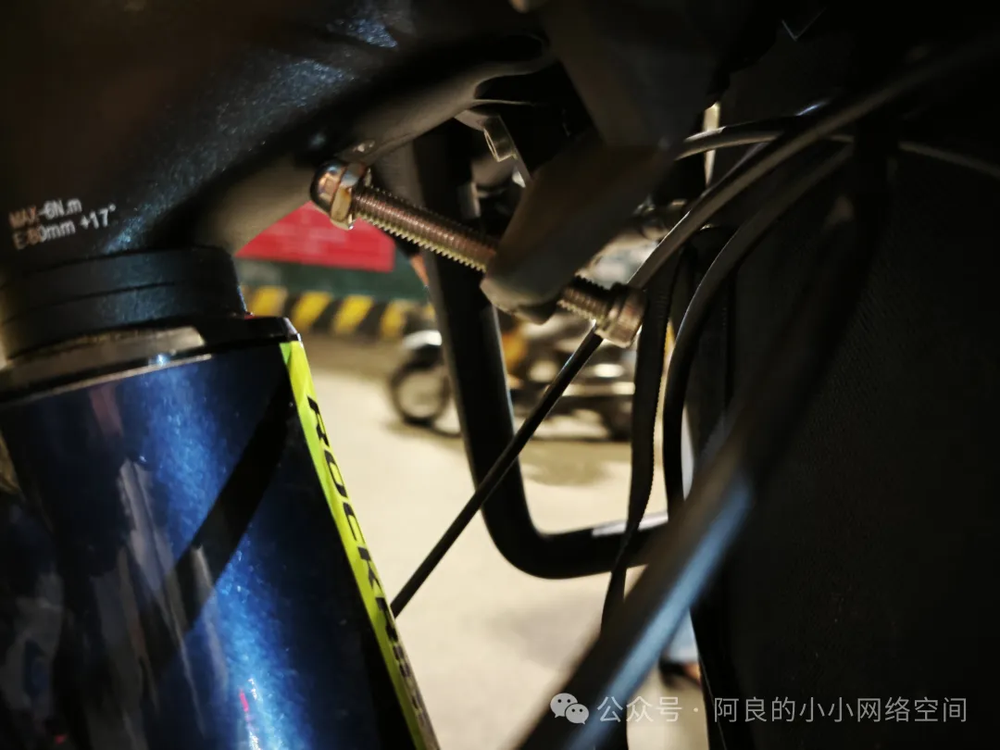
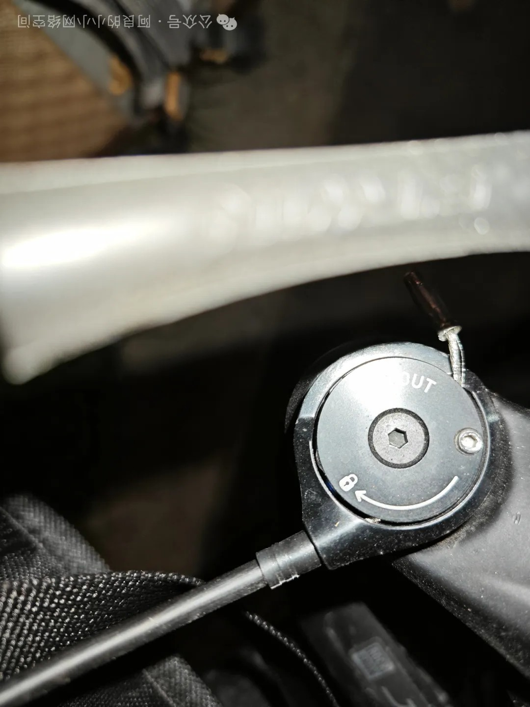
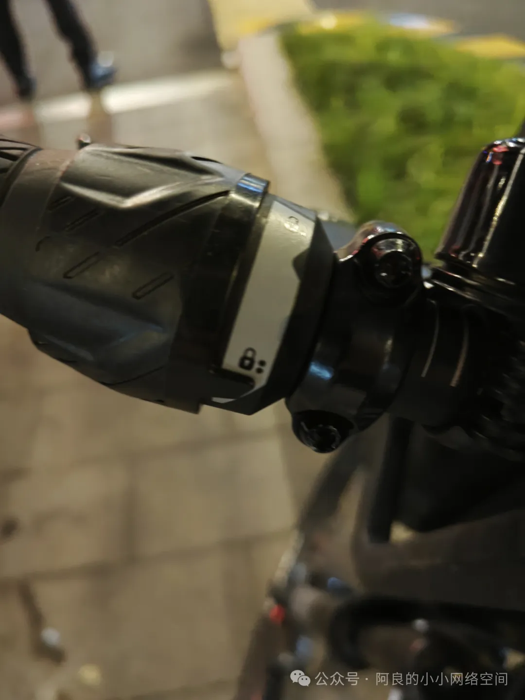
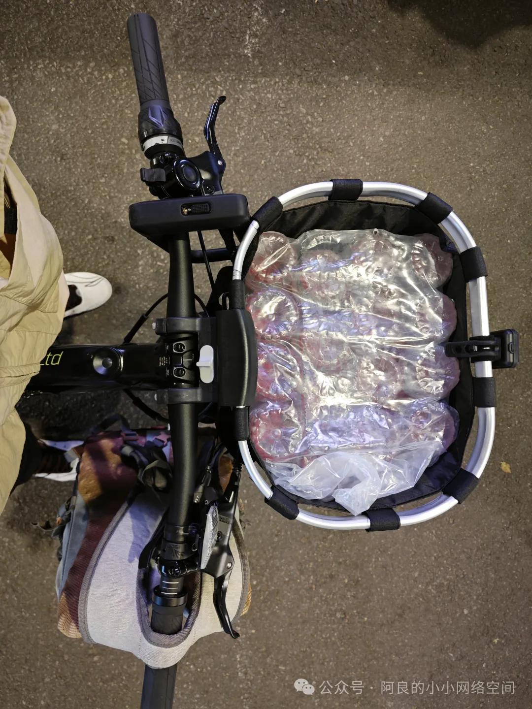

## 改造车篮
改造的车型是迪卡侬XC50。

问题就是车篮底部和前轮特别接近，一旦过坑洼的地方，前叉避震就生效了，行程就会压缩，前轮就会打车篮地，都是摩擦的声音，也很影响车速：

从下图可以看出，压缩行程的印记占全行程约50%，所以前叉压缩的时候整个前叉变短了，然后车篮底部就和前轮发生摩擦了：

那解决的办法，第一个步骤就是用长的螺丝拉开车篮和把立之间的间隙：

第二个步骤就是锁死前叉，变成硬叉，就不会压缩行程，自然就不会发生车篮底部打前轮的问题：

这辆xc50用的是线控锁死的前叉：

当天有24瓶农夫山泉要运输，车篮只能装下16瓶，那我书包再装8瓶，就ok了：

成功运到家：
