## 维修净水机
净水器水龙头漏水，今天直接不出水了，没法用，看看能不能修一下，下图是型号表：
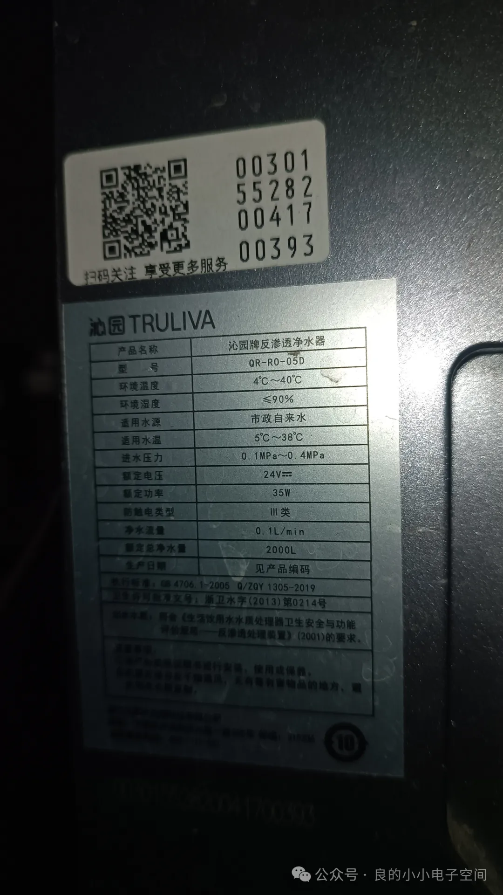

背面的管道图：
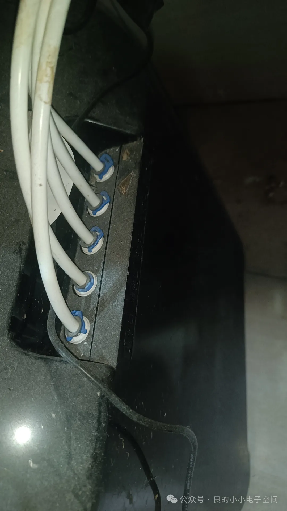

先拆下蓝色扣，然后按压A与白色管套相接，就可以拔出线管了：
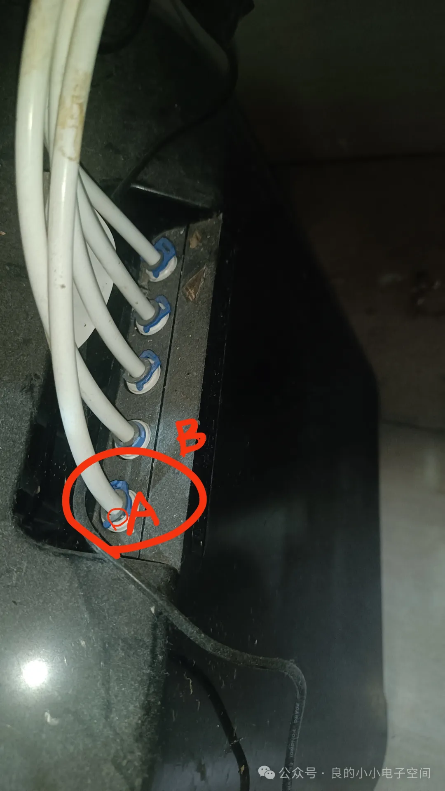

关闭电源，关闭入水口阀门，准备测储水泵有没有问题：
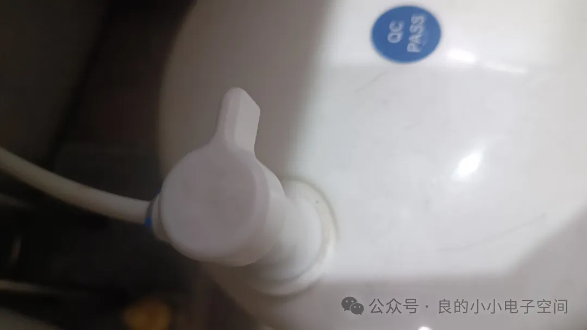

正常出水，说明储水泵正常：
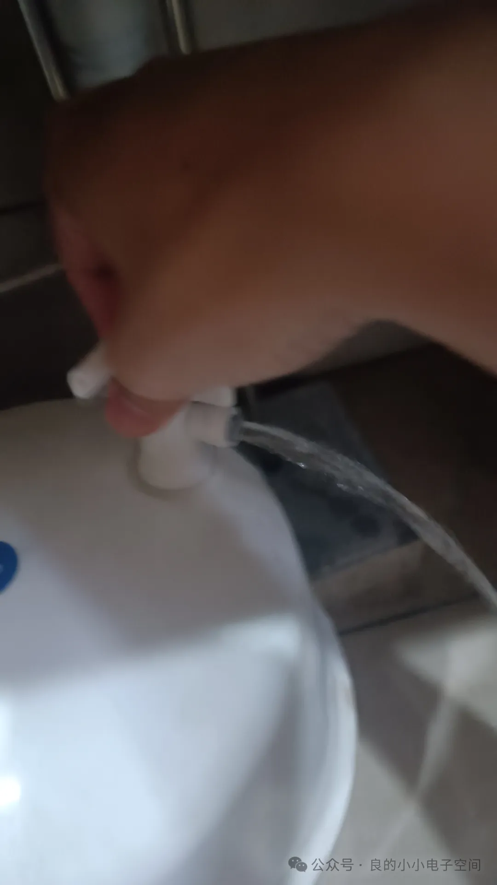

不正常出水这边气阀充气口可以打气，这边泵出水正常，就不用管：
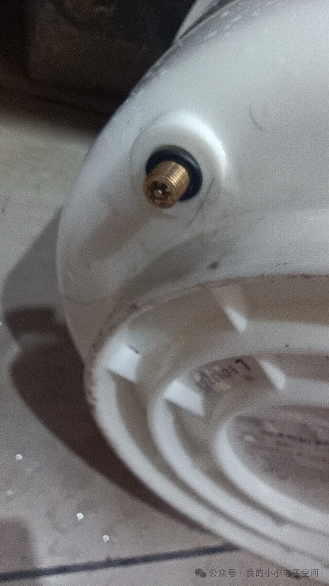

感觉是水龙头的问题，先拆一下了解一下结构：
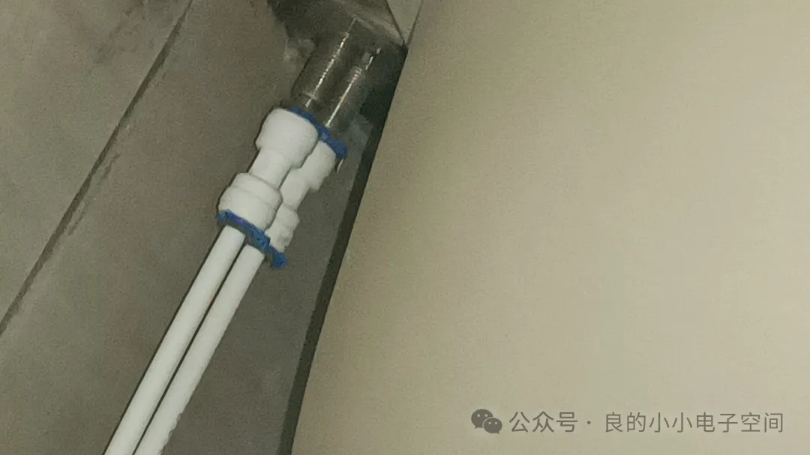
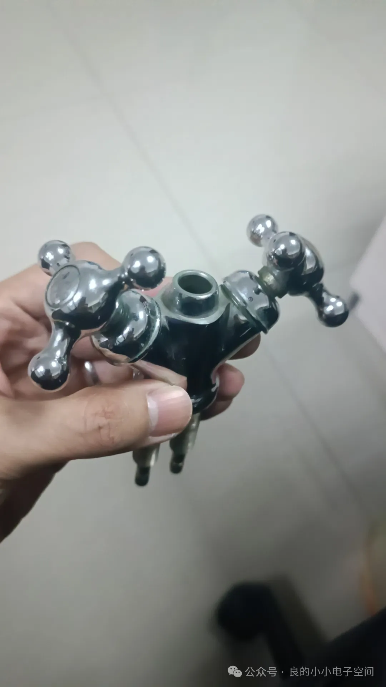
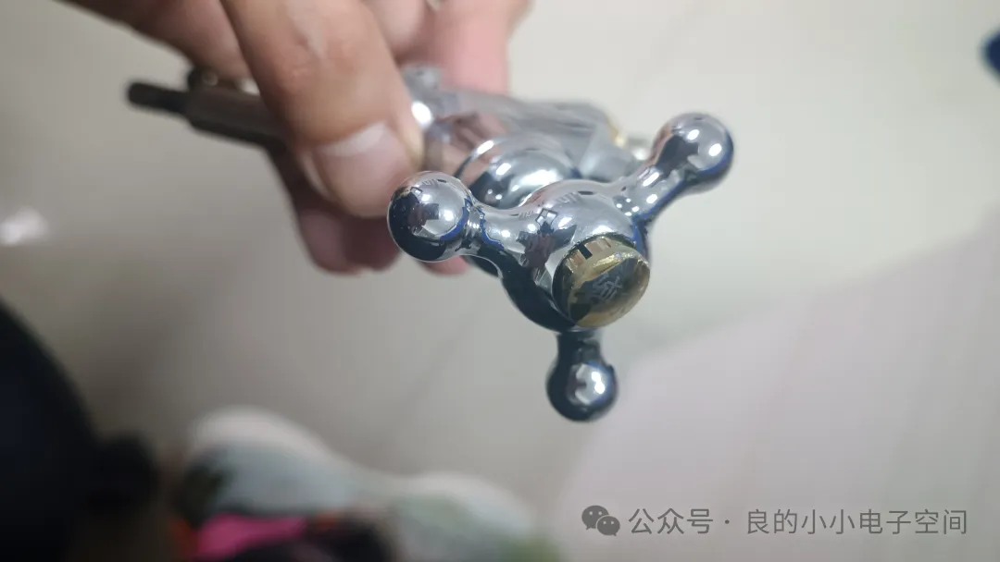
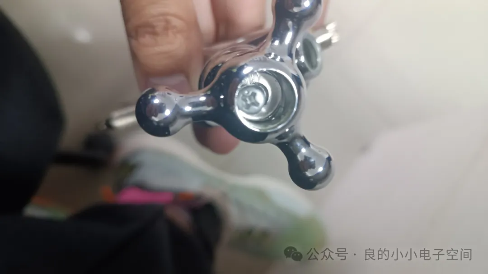
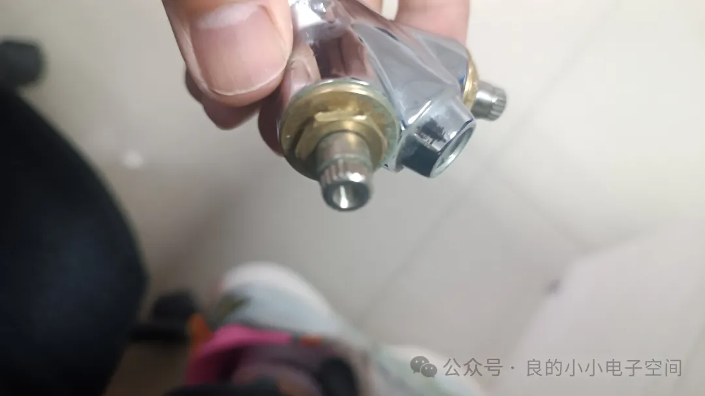
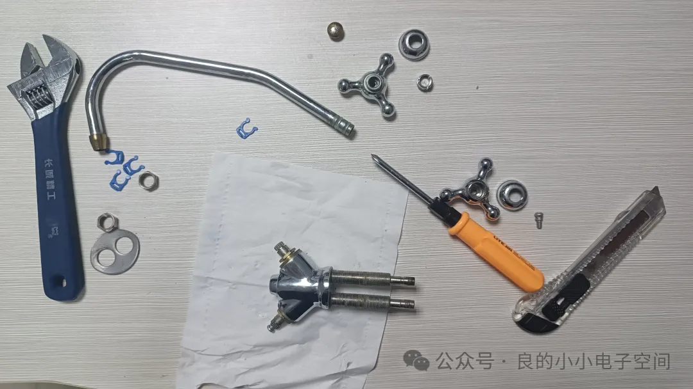

管道是通的，也没有漏水的情况，不知道水压大会不会有影响，我再把水龙头安装上去测一下：
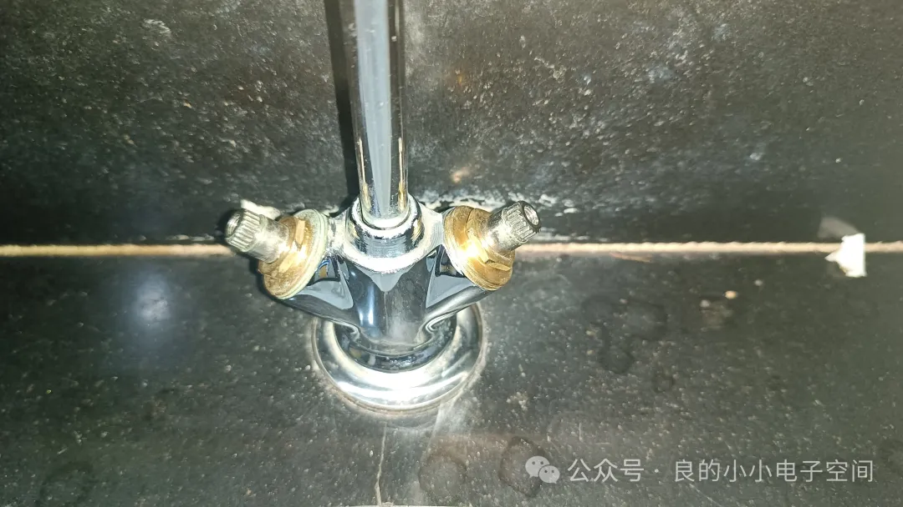
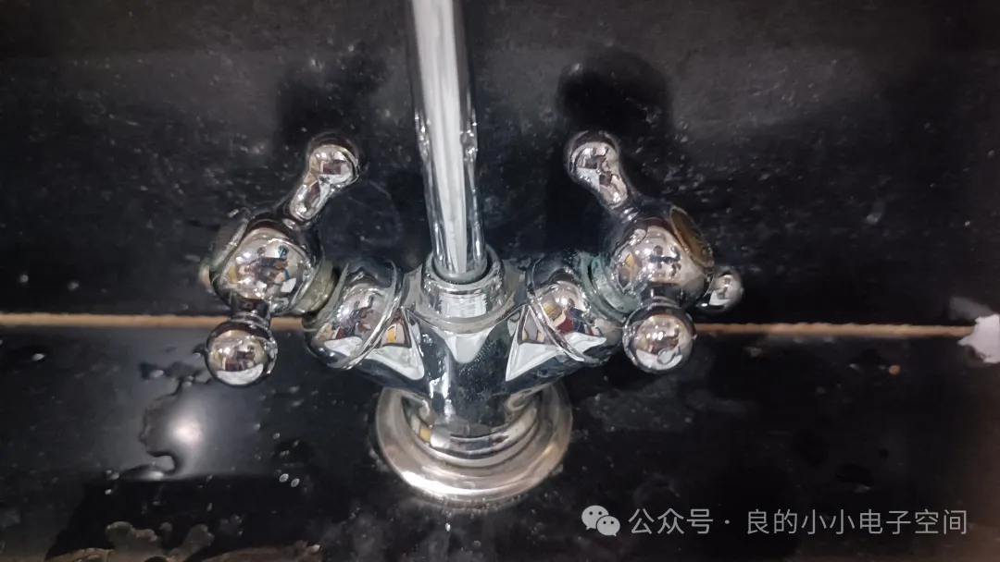

最后也没有修好，不知道是哪里出了问题，今天是维修失败的一天，sad。