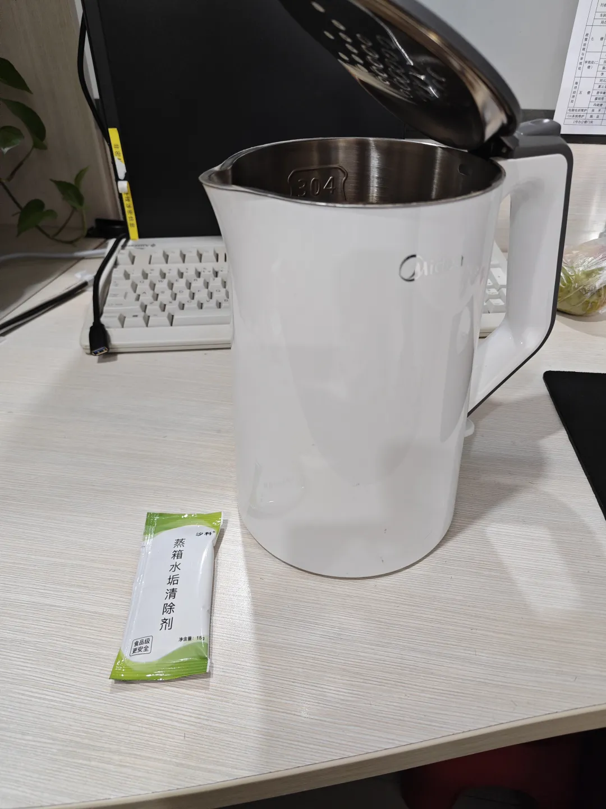
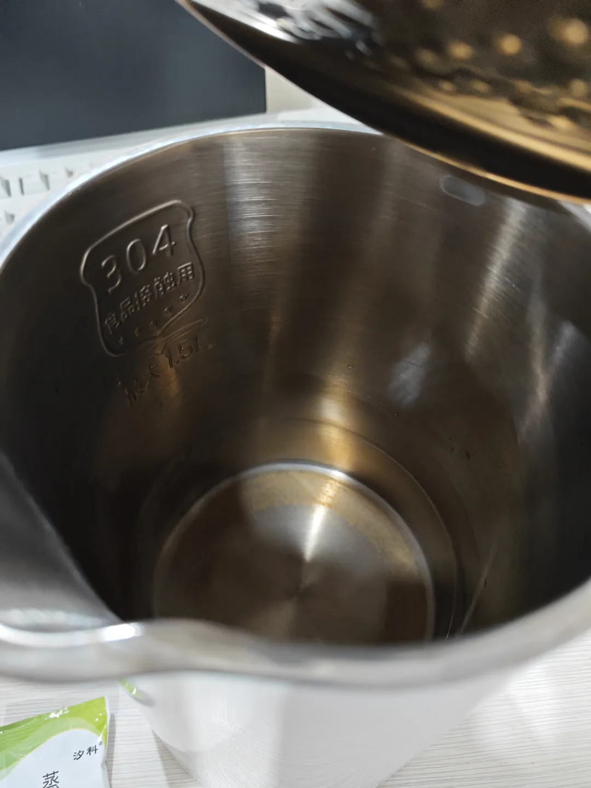
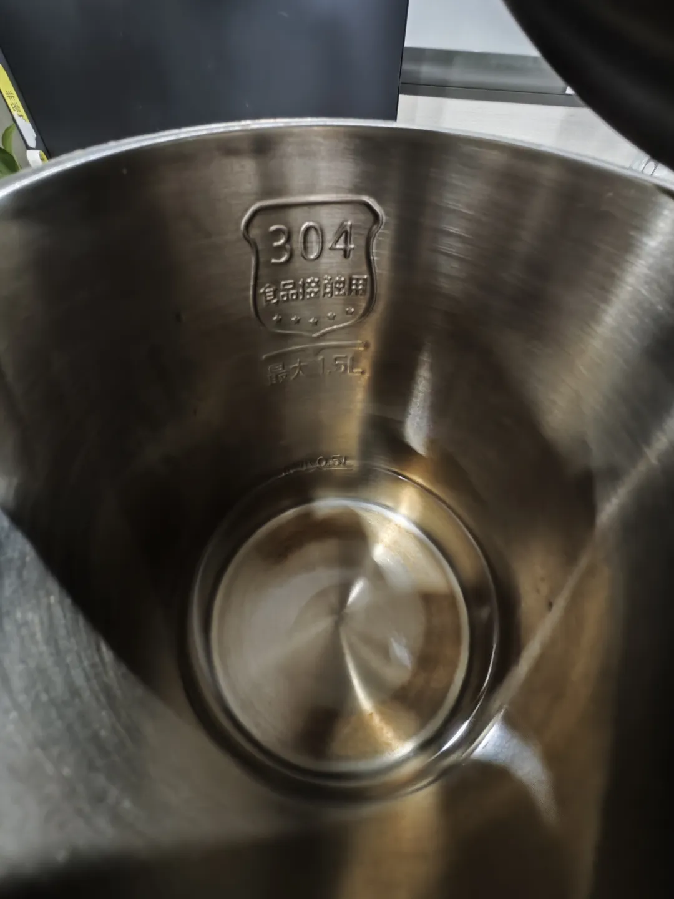
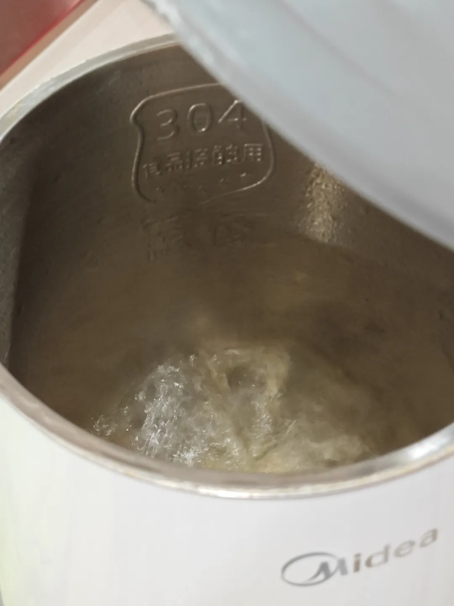
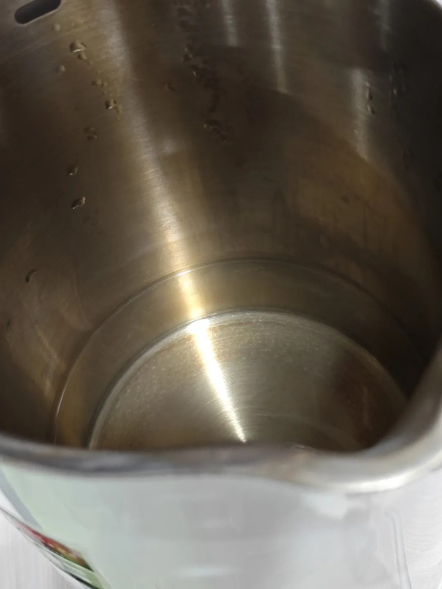
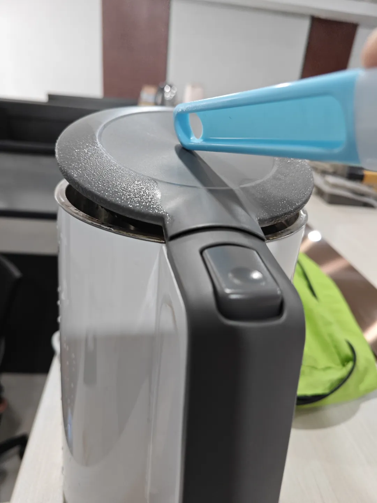
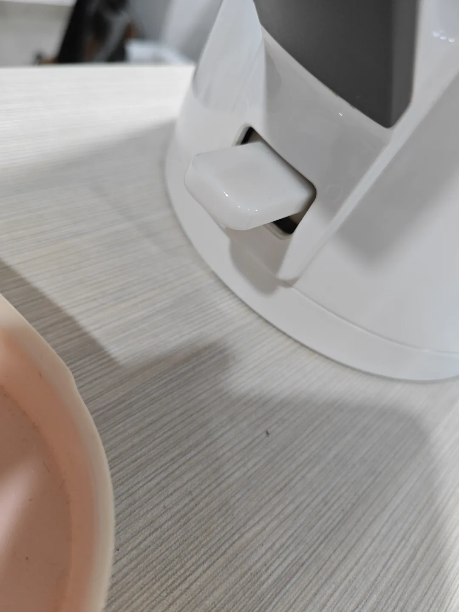
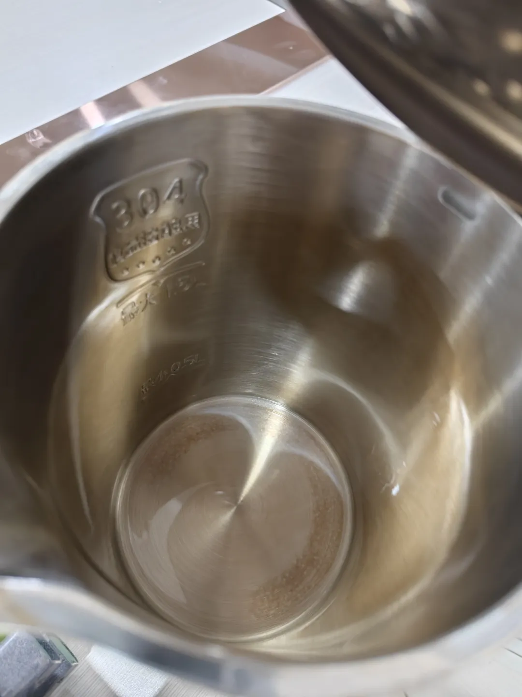

## 清洗烧水壶水垢
昨天洗烧水壶，稍微清洗了一下内胆，发现贼脏，都是黄水，正好可以复用家里用来清洗蒸箱水垢买的清洗剂，就想说试一试：\

清洗前是这个状态：\

倒清除剂，加水：\

烧水：\

烧开了一次，自动跳闸，过两分钟继续再烧，再烧，让我看看里面的样子：\

我觉得可能还得清洗一下，不急，再多烧几次，继续烧。清洗了一下，发现盖子上的水垢都去不了，底部那一圈估计是不是锈了，也去不掉，换一个方法试试：\

这样子烧，这样蒸气就能熏到盖子内侧金属部分也不会自动跳闸，就是手有点累，先烧它5分钟看看什么情况。\

这里顺带聊一下自动跳闸的原理，关闭盖板，高温蒸汽进入手把部分，改变了底部开关处一个金属圆形拨片的形态，开关受力发生变化，自动跳闸：\

拨片就在上图部位的内部，有点像英菲尼迪的标志，不过是圆形的（以前有拆过）。\

下图是最终结果图，干净多了，但重点其实还是锈，不锈钢生锈了，这个毕竟要求食品级，就不除锈了，因为以前除垢不及时吧，导致加速生锈速度：\
