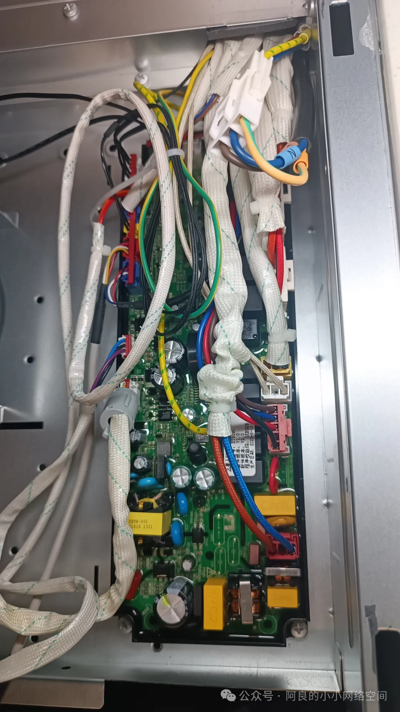
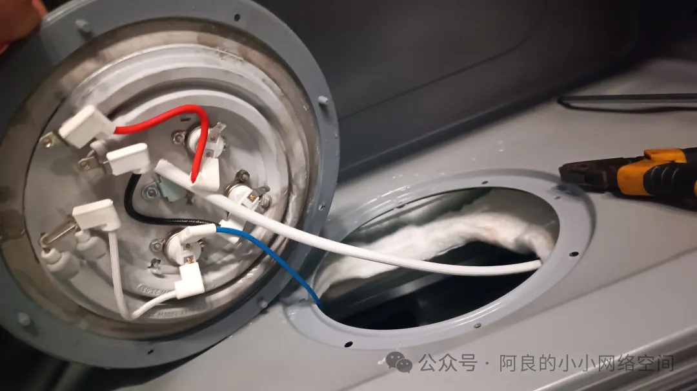
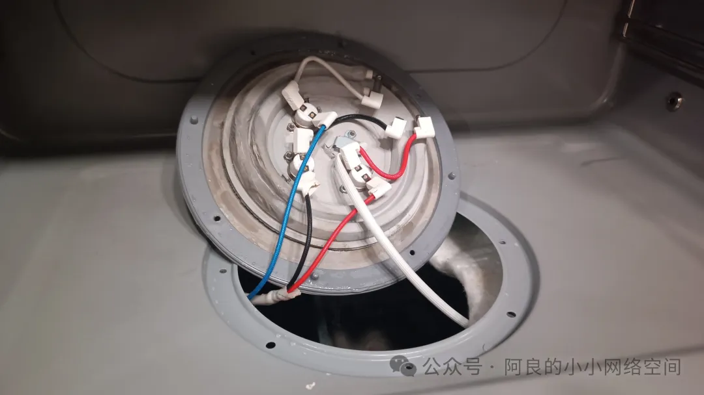
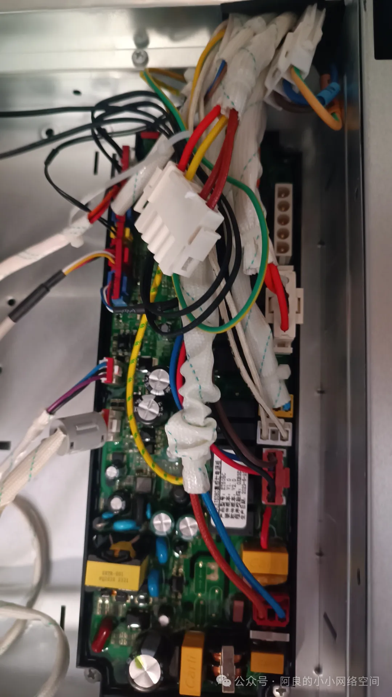
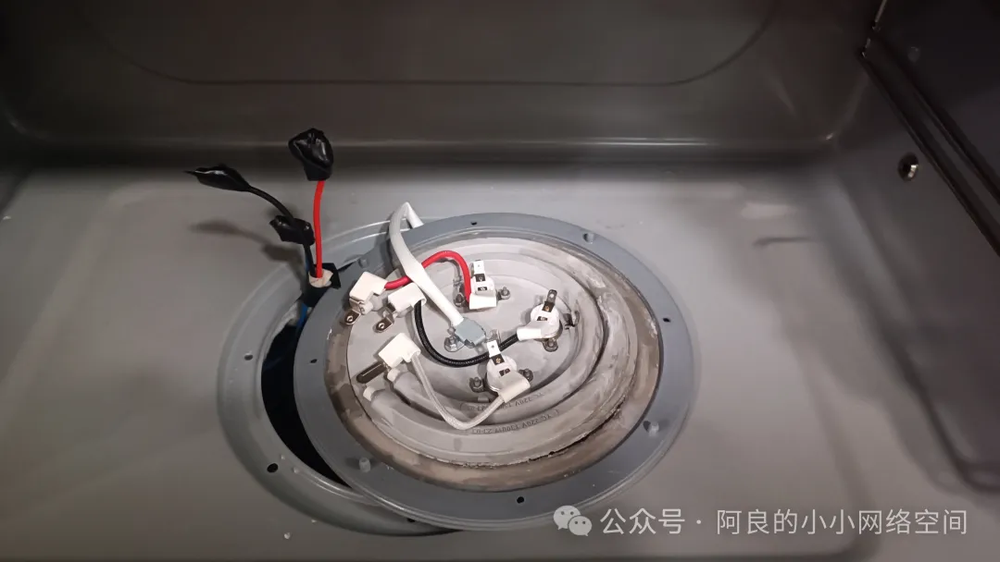

## 维修集成灶
集成灶一插电漏保就跳闸，电工师傅初步判定是集成灶短路，于是我请来了集成灶维修师傅，打开集成灶面板，露出主板：

排线全部拔掉，一个个插上去测（220伏供电线先插），下图红线圈的排线一插就跳闸，主板定位成功：

打开集成灶定位具体部位，蒸箱发热板不发热，烤箱不出热风，定位到蒸烤箱，拆发热板，发现进水。拆掉发热板全部连接线，再接通电源，不跳闸了，定位到发热板问题：

新的配件小师傅没有带，就先撤了，过两天再过来。我晚上回家，开起电饭煲煮稀饭，啪一声，又跳闸了，得，学习的机会又来了，直接实战，上手。除了红黑白三根短线外，外接的红黑蓝三根线都被小师傅重新接上发热盘了：

蓝黑两根线连着下图的排线，已经被断开了：

发热盘上红色那根长线是直连集成灶插头的，所以，它！是！带！电！的！好吧，三根线用电工胶粘好防触电：

注意：在通电状态下，红色的线头是带电的。实战结束，分享的这些技术真的很简单，只要去实践，多了就都能会了。