## 保养循环扇
入冬了，今天的任务主要是清洁风扇并打包封存，因为是夏天刚买的新风扇，所以电机没拆，过两年深度清洁再拆，循环扇的型号是艾美特紫天鹅pro：\
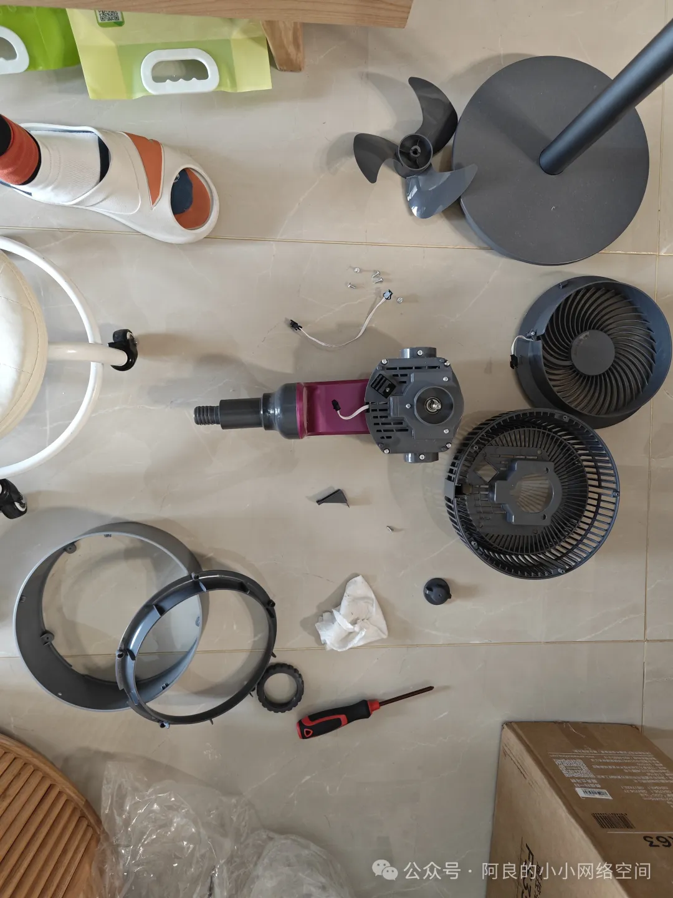

看红字，禁止水洗，这个是风扇外叶片，因为是带液晶操控屏的，所以不能水洗，我用湿布擦拭了：\
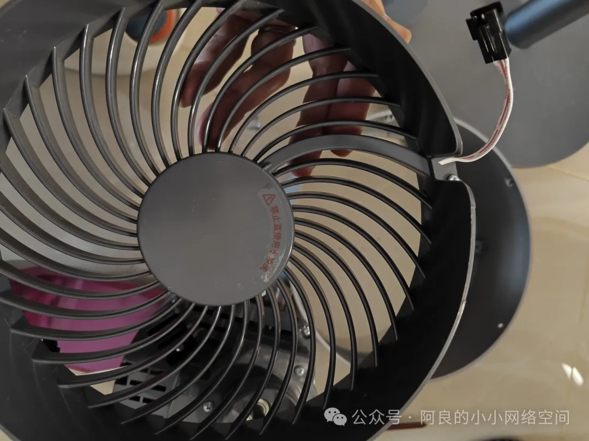

不一样的主要就是这根数据线，需要从主机传到外置叶片，所以处理排线的时候需要注意一下：\
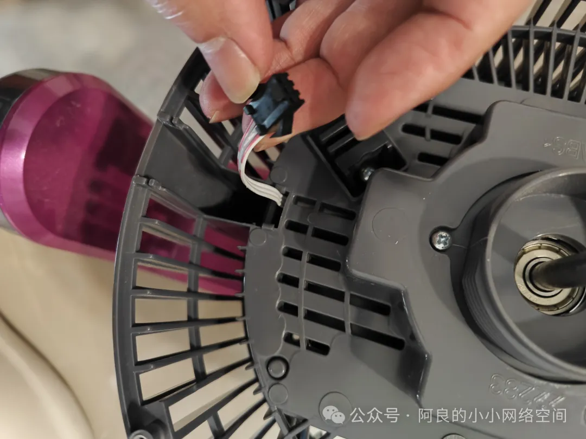
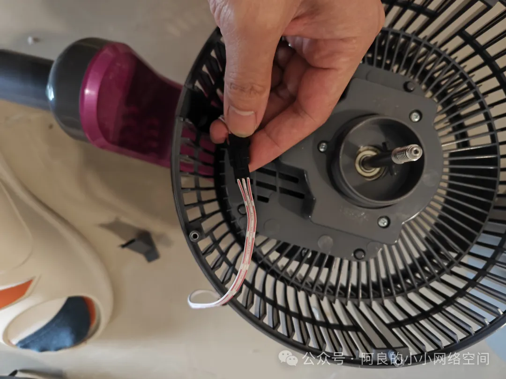
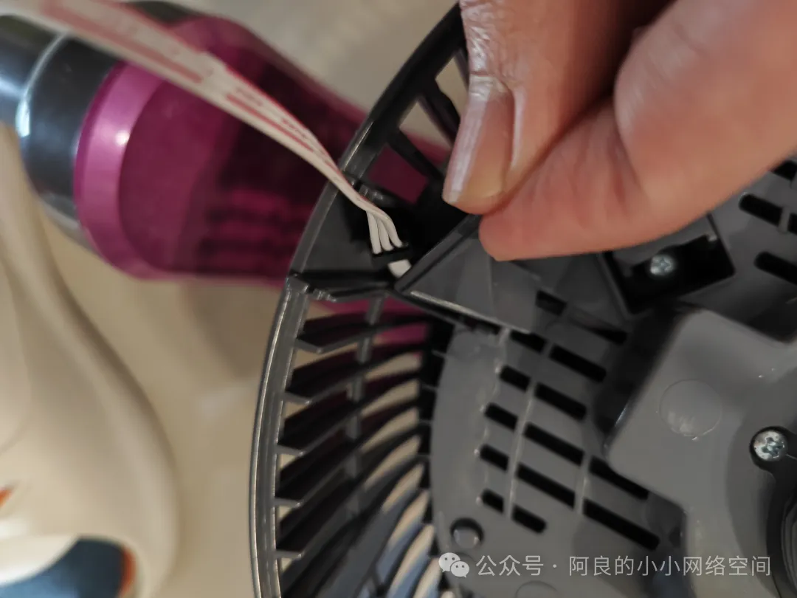

这边安装保护罩要底部先插入，然后中部按压就可以了：\
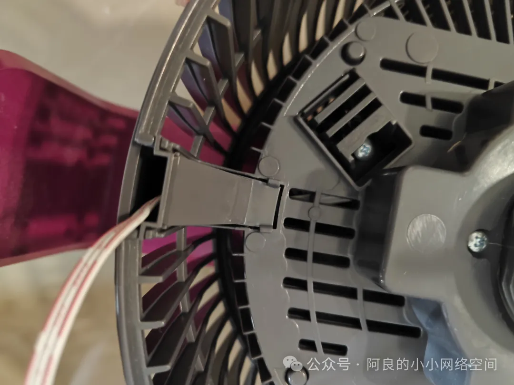

走线这样就做好了：\
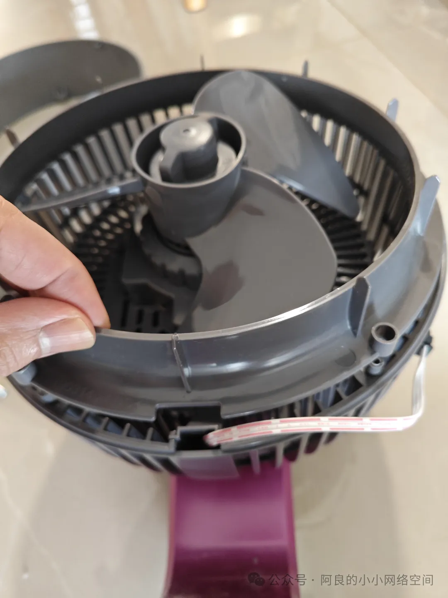
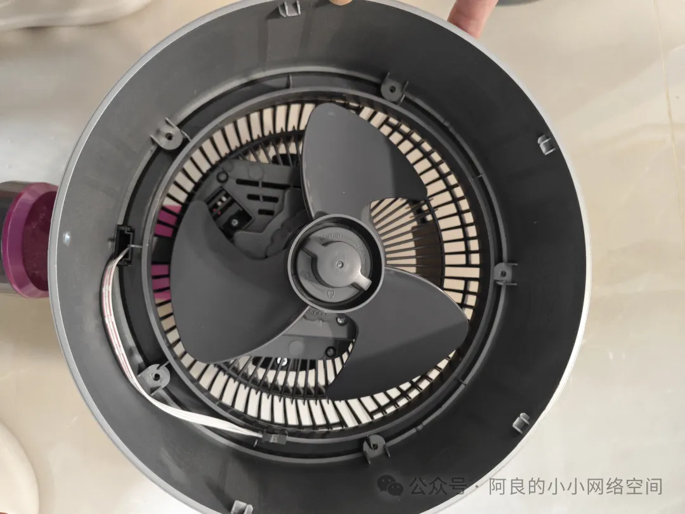
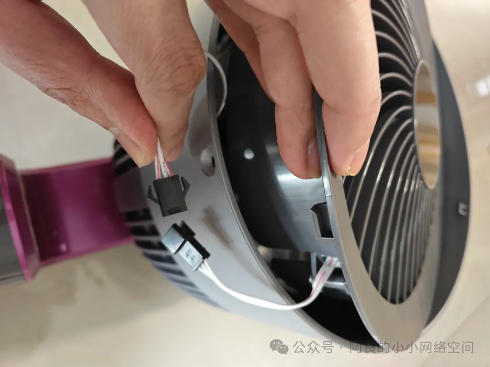
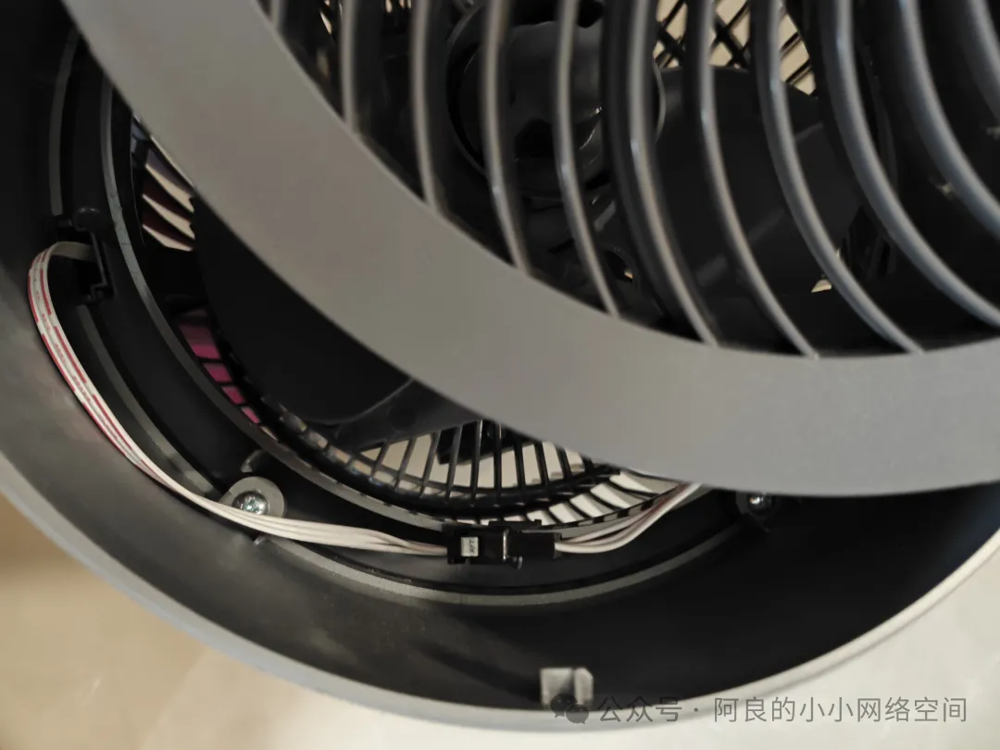

一开始随便旋了一下螺丝，发现上不紧：\
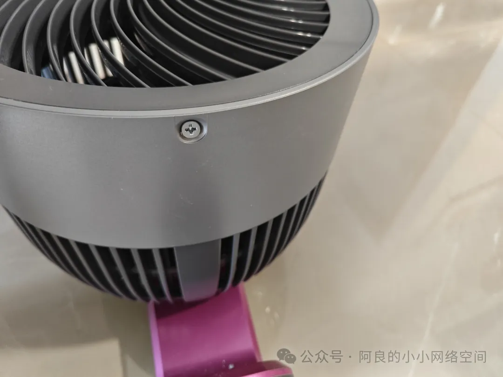

观察了一下，只能停在这个位置上螺丝：\
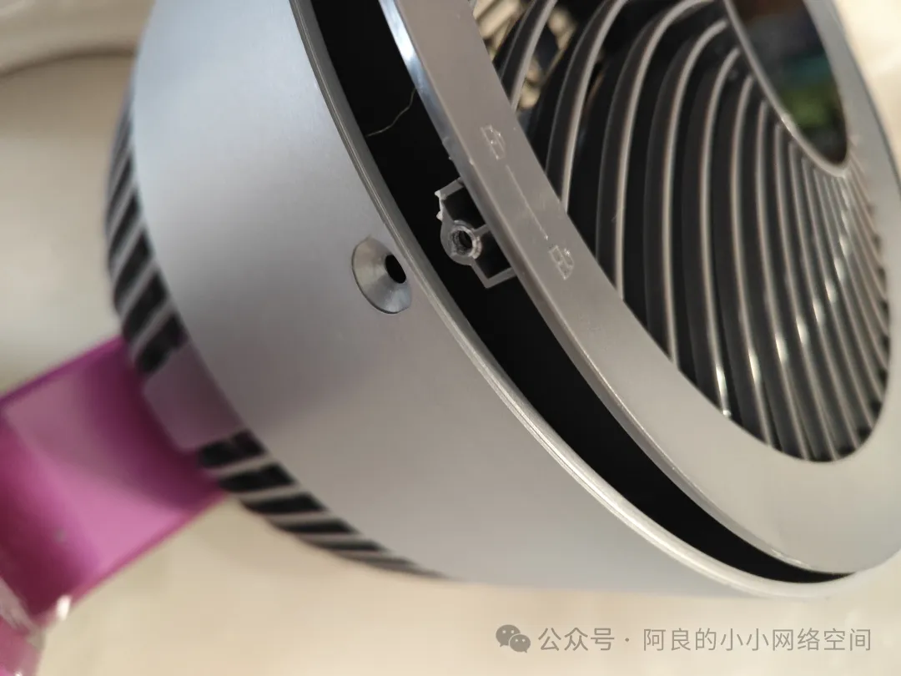

that's all.\