## 维修暖风机
### 维修
此次维修使用的是德力西的DEM11数字万用表，京东、淘宝都是46块8：
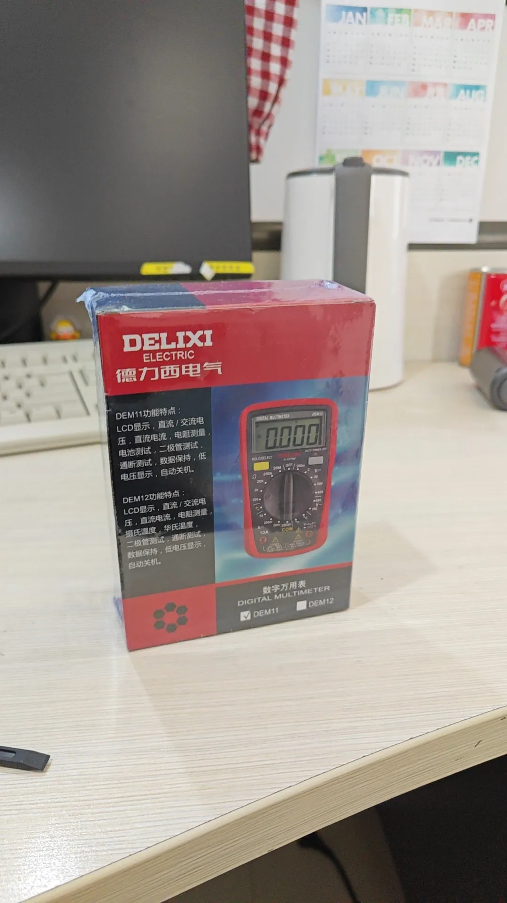

出现的问题就是：暖风机通电后，打开风速档位、打开温度调节档位，灯亮，但是没有热风吹出，就是说，同时没有风、和热，这两个问题。

首先，根据说明书的要求，将线路插入对应的孔洞：目标是测通路是否发生断路。然后，按压黄色按钮，将hold模式调节到通断测试的模式，直至屏幕出现“无线信号”图案：
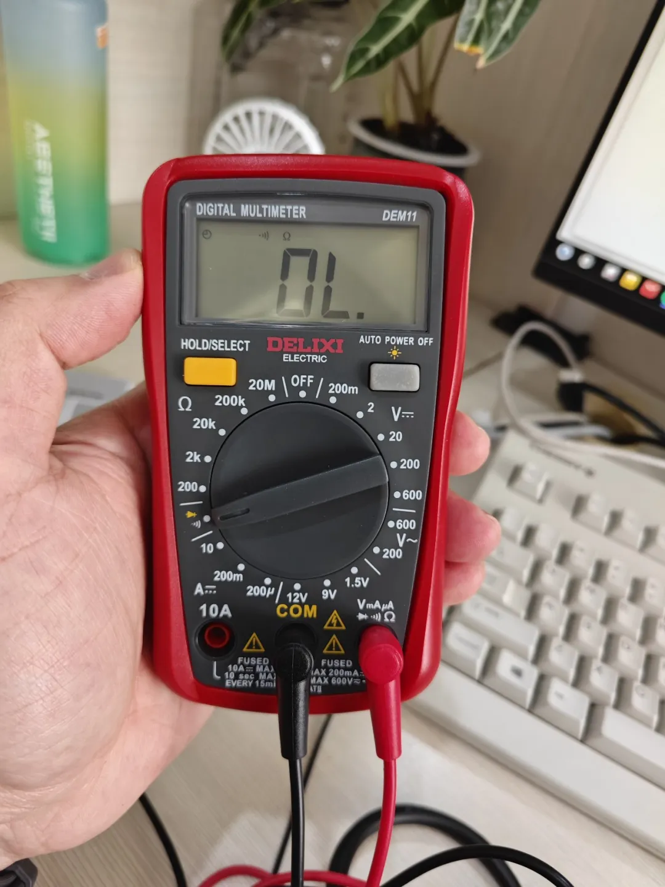

本次维修参考了哔站UP主：“阿兵电器维修”的视频。根据“阿兵电器维修”的经验分享，我们先从电源线的火线入端开始，一个一个节点排查。火线进入的第一个模块是风力调节开关，那我们打开风力开关（所有工作都在断电情况下进行），参见下图，开始测风力开关模块：
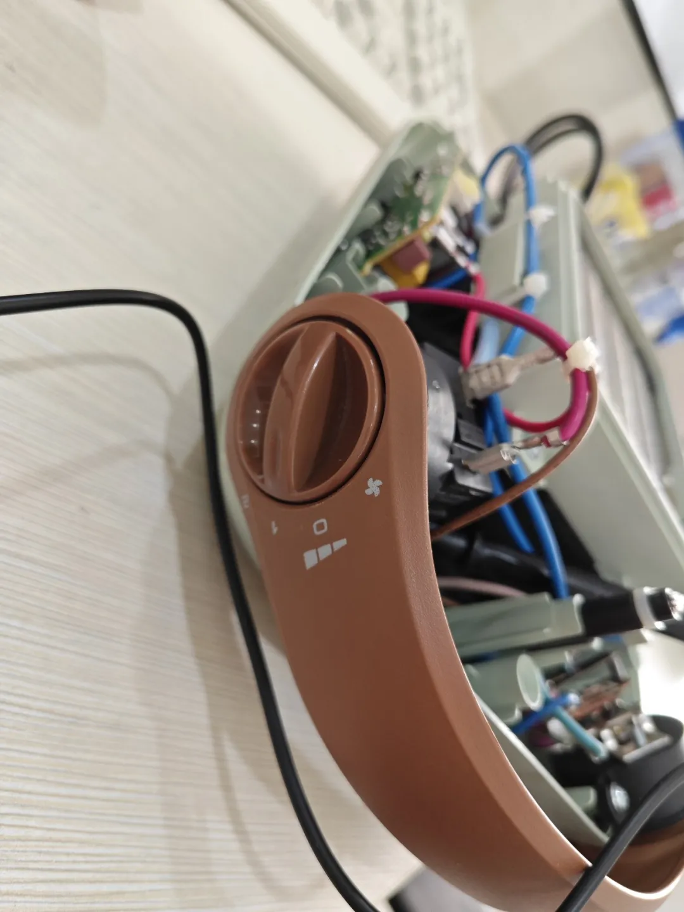

在风力调节模块的：进、出，这两个节点测试通断情况。测试结果：万用表发出蜂鸣声，说明电路短路，为通。我们可以排除这个节点的问题：
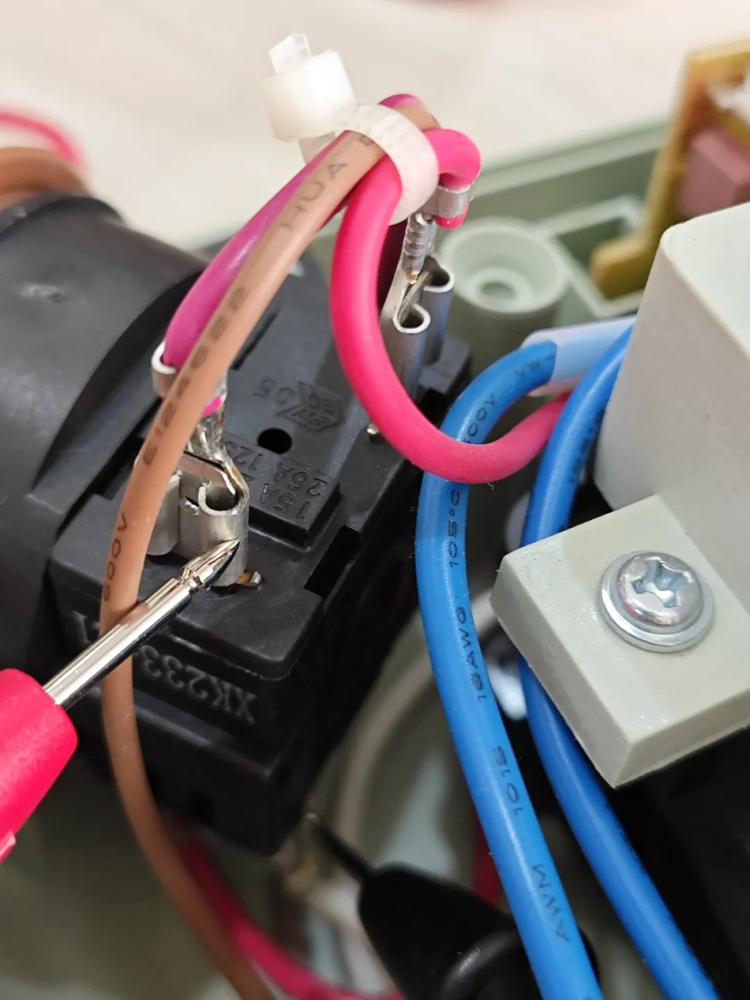
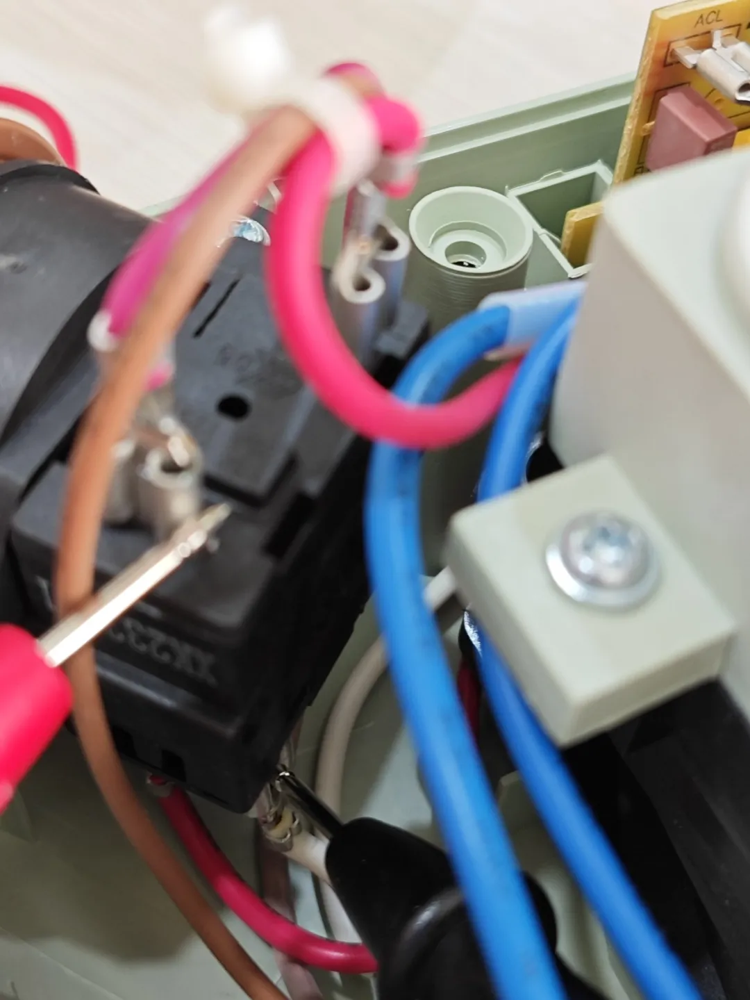

我们继续沿着火线的前进方向，排查第二个模块，第二个模块是小灯泡。根据一开始我们说的，小灯泡会亮，所以排除小灯泡烧坏了导致断路的问题，于是排除第二个节点。

接下来，我们跟着火线，走到了第三个模块，就是温度调节器：
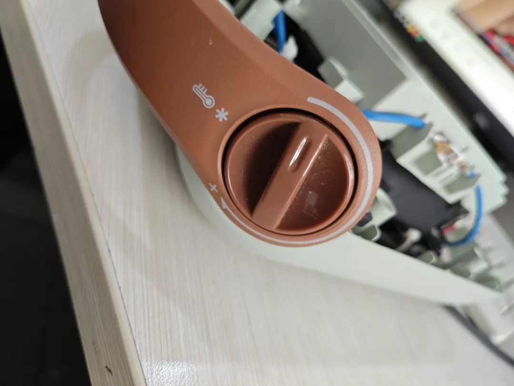

打开温度调节开关，开始测试：
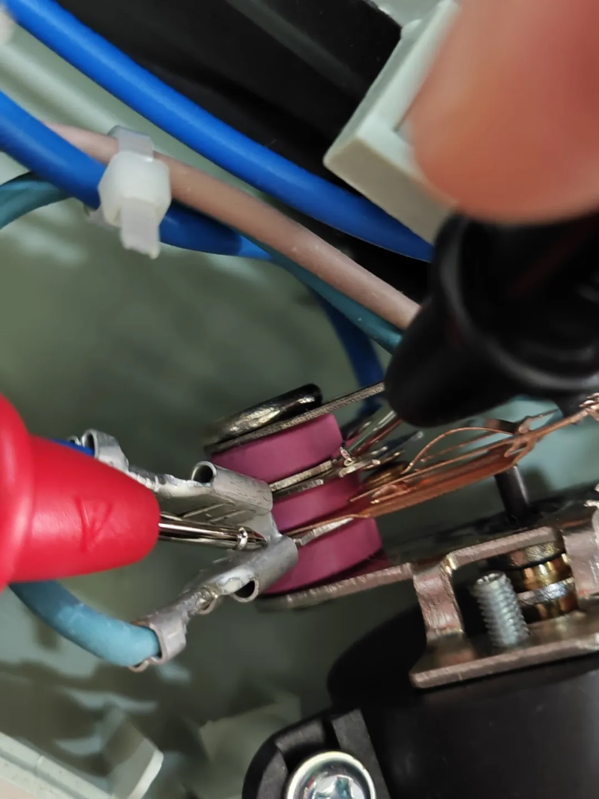

温度调节器打开情况下，我测试了下图这两个点位，发现万用表没有发生蜂鸣声，说明两点间发生断路，我继续进行排查：
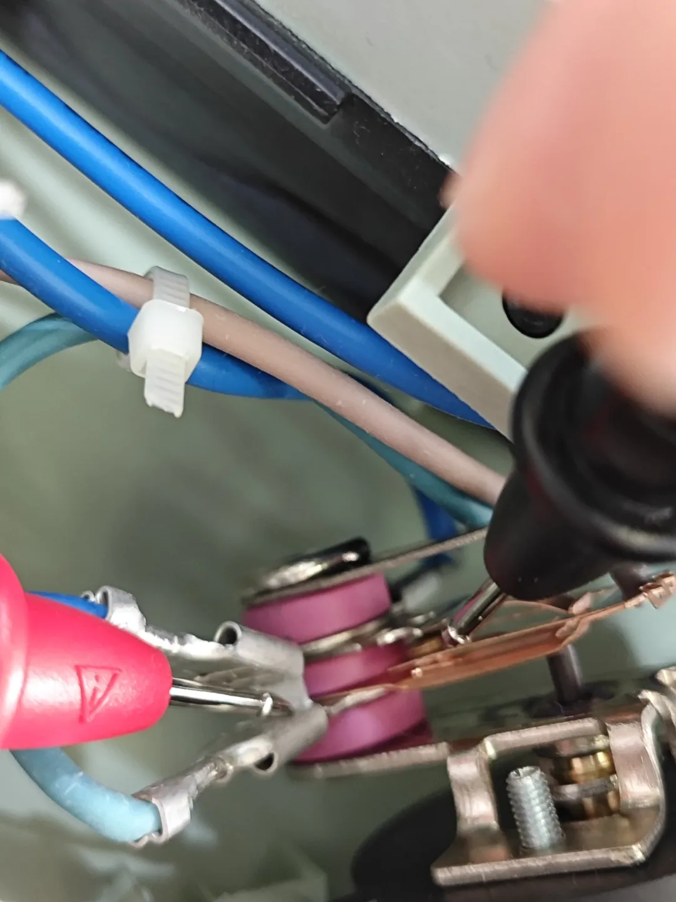

我测了下图这两个节点，万用表发出蜂鸣声，于是，问题定位到了接触点。根据“阿兵电器维修”的分享，我也怀疑是接触点污染导致断路，于是我用了餐巾纸擦拭了一下：
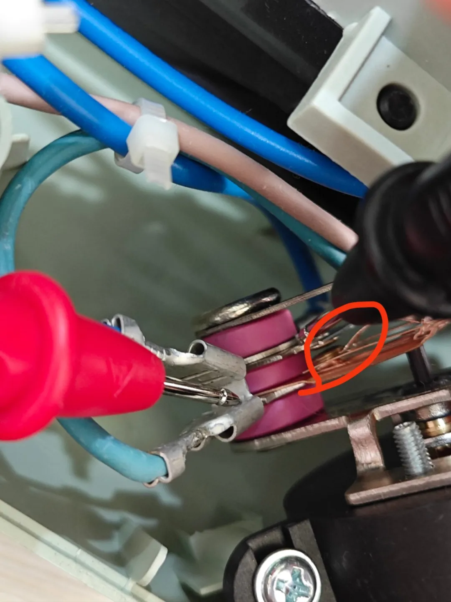

就是上图这个点位。擦拭完，我们将暖风机插电测试，测试结果参考下面的视频：
<video src="../videos/暖风机出风.mp4" controls width="100%"></video>

成功吹风制暖。OK，维修完毕，装机：
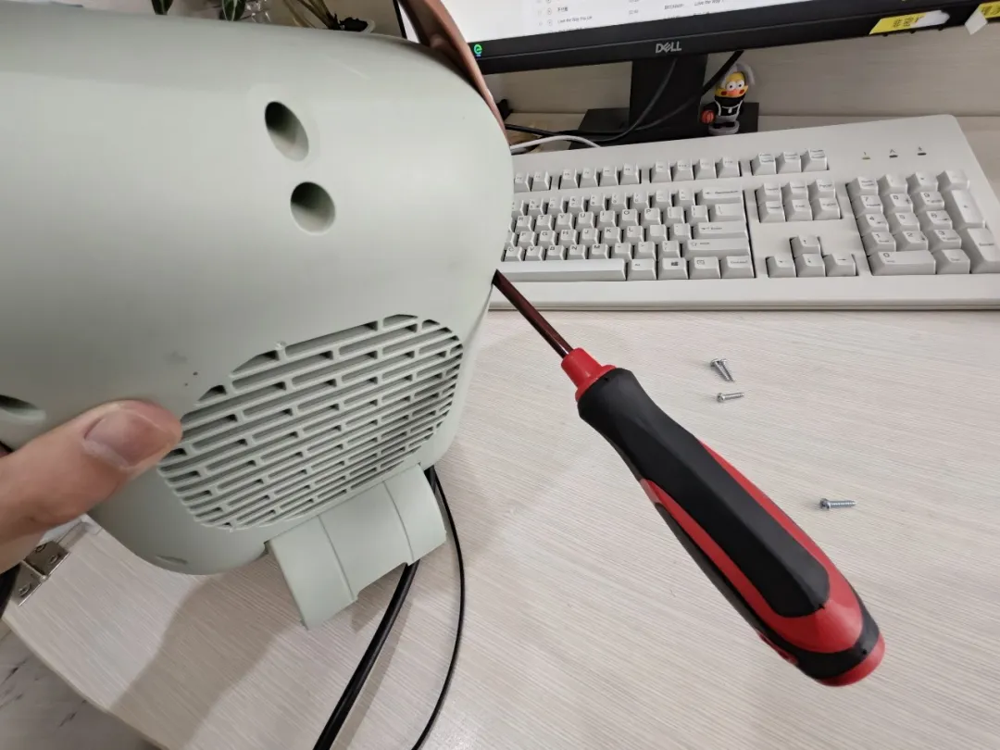

整个维修过程花费1周左右，首先，是观看前辈的分享视频，找出大概的维修思路，接着，京东缺失的测试工具（用京东是因为自营比较快），等工具到位，接下来就剩最后的维修一步了，一个一个点测试就好了，不要图快，扎实一点，一个一个来，一般正常使用的电器都不会有特别大的问题，基本都能通过这个方法修好。

### 开关优化
后续我发现，制热的开关要旋转很大的角度，昨天擦拭的铜制贴片才会接触到下半部的电路，整个使用的过程容易烦躁，所以，我又研究了一下这个贴片的机械原理，做了一点改进。

上文中，我把开关分成了吹风开关和制热开关。在使用中，我发现这个划分有问题，先做一个纠正。这个“风量开关”，其实应该是模式选择开关，左侧那个风扇的意思是冷风，右侧的两档指的是热风的风量大小，所以，关吹冷风就要往左转，向右转只能吹热风，吹不出冷风：
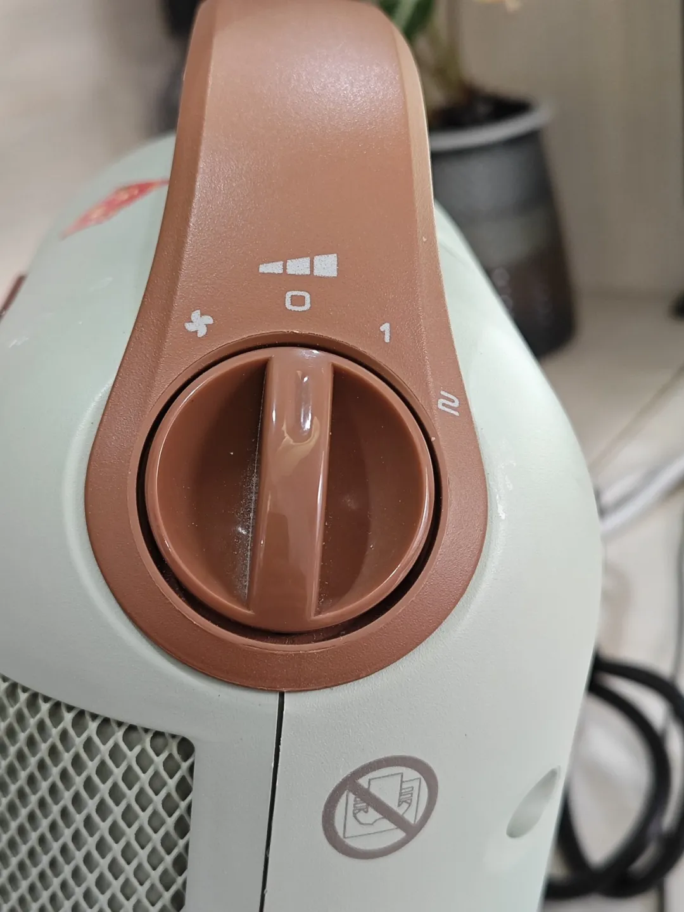

我们再来看下图，这是昨天说的“制热开关”，但是其实，把开关调到下面这个雪花档位，是无法出风的，不论之前的模式选择开关选择的是单冷风模式，还是加热模式（1档或者2档），这个真正的机器开关必须旋转到上图灰色的部分，才会吹出风，那如果之前选择的是加热模式（1档或者2档），这里通过旋转的程度可以进行温度的调节。这么来理解应该就没有问题了，我们可以进入正式的优化工作内容了：
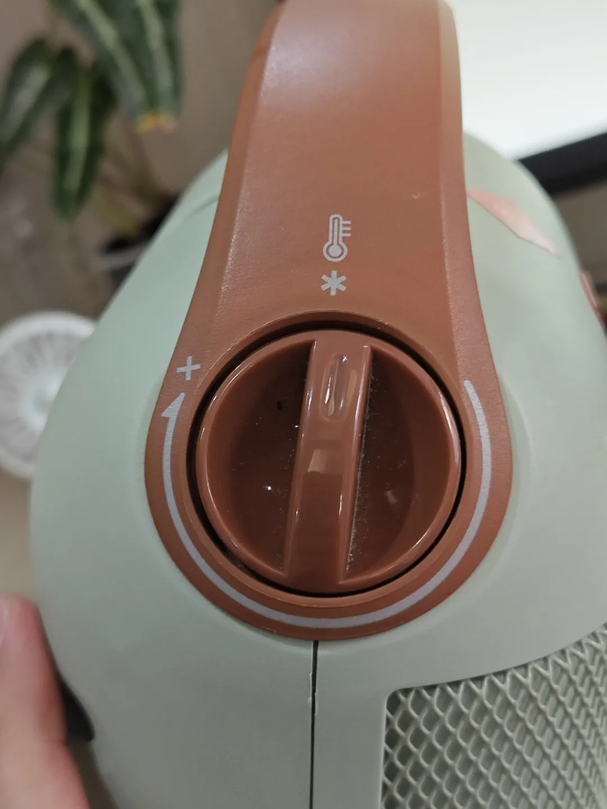

如下面的视频和图片所示，通过旋转加热开关调整黑色顶针的长度，然后那个月牙形状的铜制贴片就会发生形变，接通下半段电路，这里的加温原理我不是很懂，因为我理解旋转开关只能调整顶针的长度，那在接通那一下的时候是有一个量变到质变的过程，那之后呢？铜片已经接触到下半部分电路了，再缩短（这里我待会讲）顶针长度，会加大两个接触面的接触面积吗？可以确定的点是接触面之间的力会更强，压力会更大，接触面可能会有扩大，这和温度的增加又有什么关系？电流的强弱可能和接触面的压强和面积有关，是电阻在起作用吗？这个地方留作疑问，我们先跳过去：
<video src="../videos/暖风机开关优化0.mp4" controls width="100%"></video>

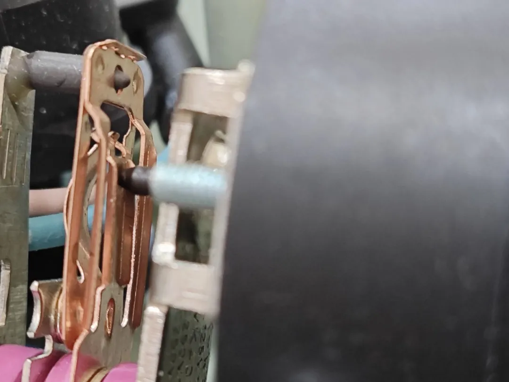
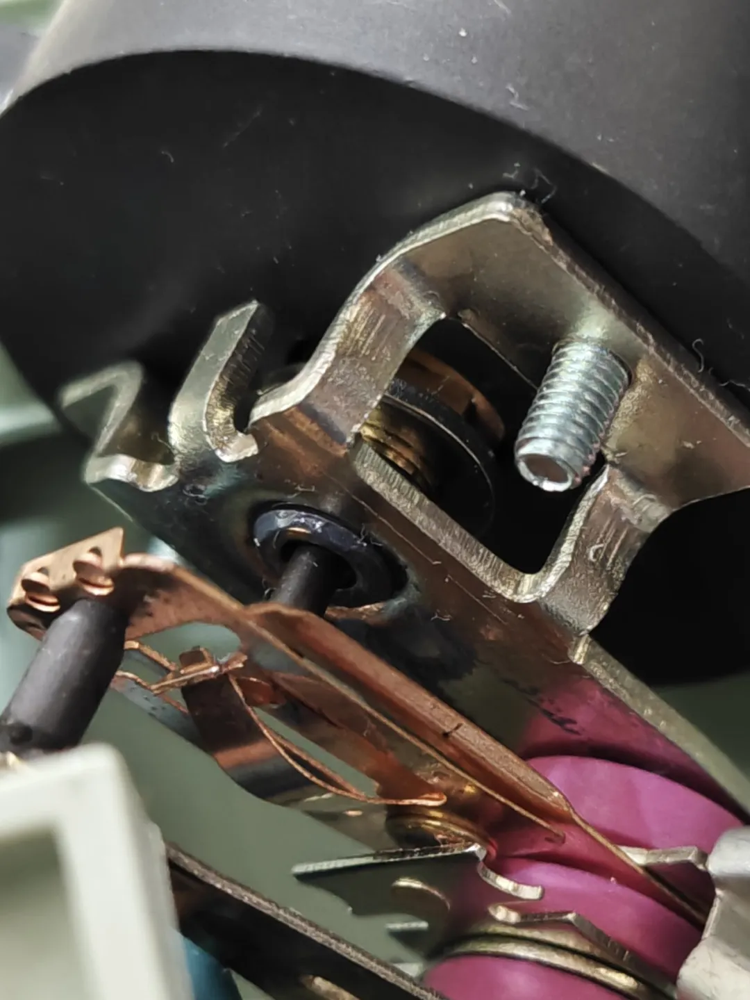

这里有一个不一样的点就是，开关和顶针的关系是相反的，就是向右旋转加热开关，顶针是缩短的，所以它是逆旋度的：
<video src="../videos/暖风机开关优化1.mp4" controls width="100%"></video>

当顶针缩短到一定的程度（加大顶针和铜制贴面的距离），就会导致电路接通，那事情就变简单了，我们只要把视频左侧的整个接触双层板用手往左边掰就可以了，然后通过不断地开、关机器，来调整这个掰动的角度，实践中发现，只要往左掰一点点角度就可以了，掰多了，开关在“雪花”的状态下，铜制贴片也是贴近下半部电路的，就没那么完美了。
