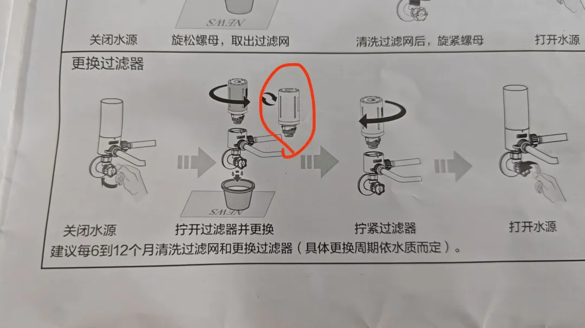
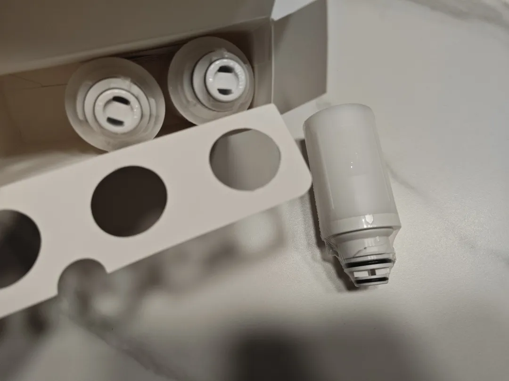
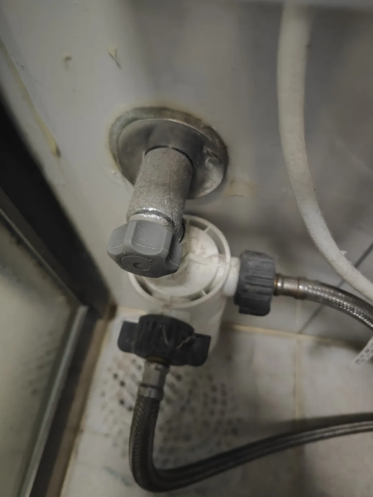
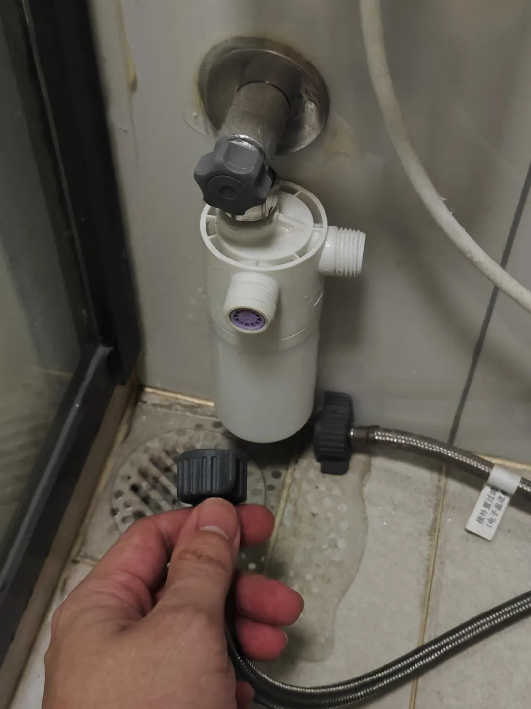
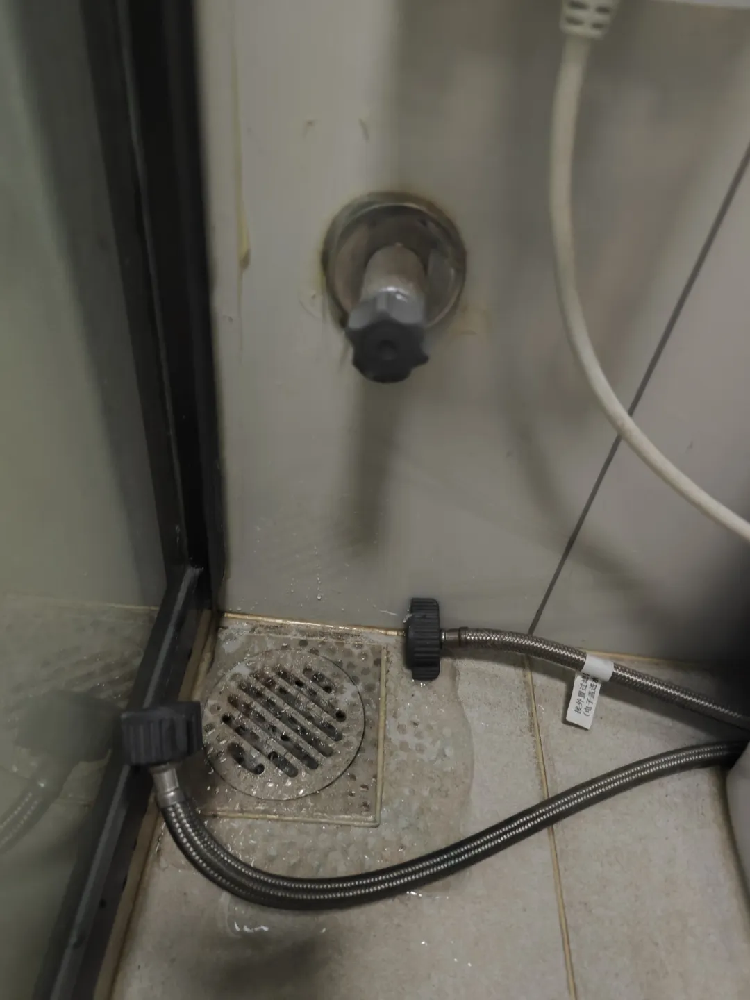
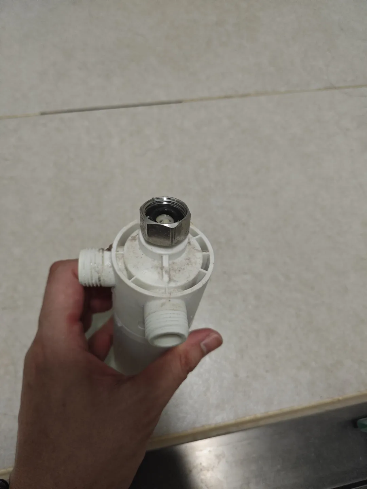
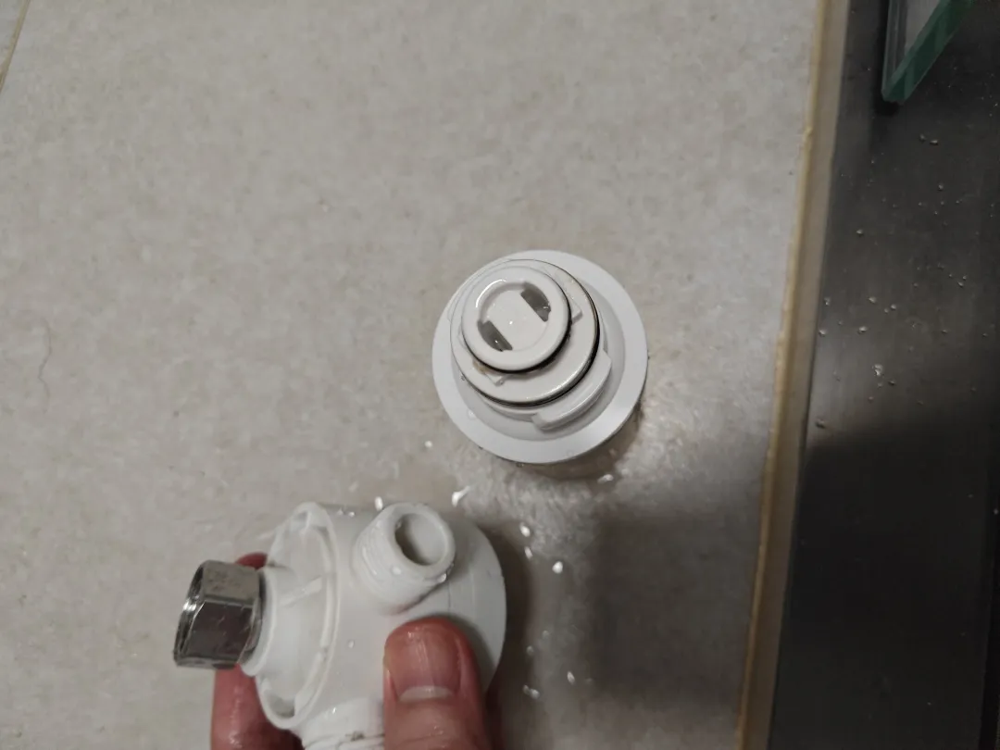
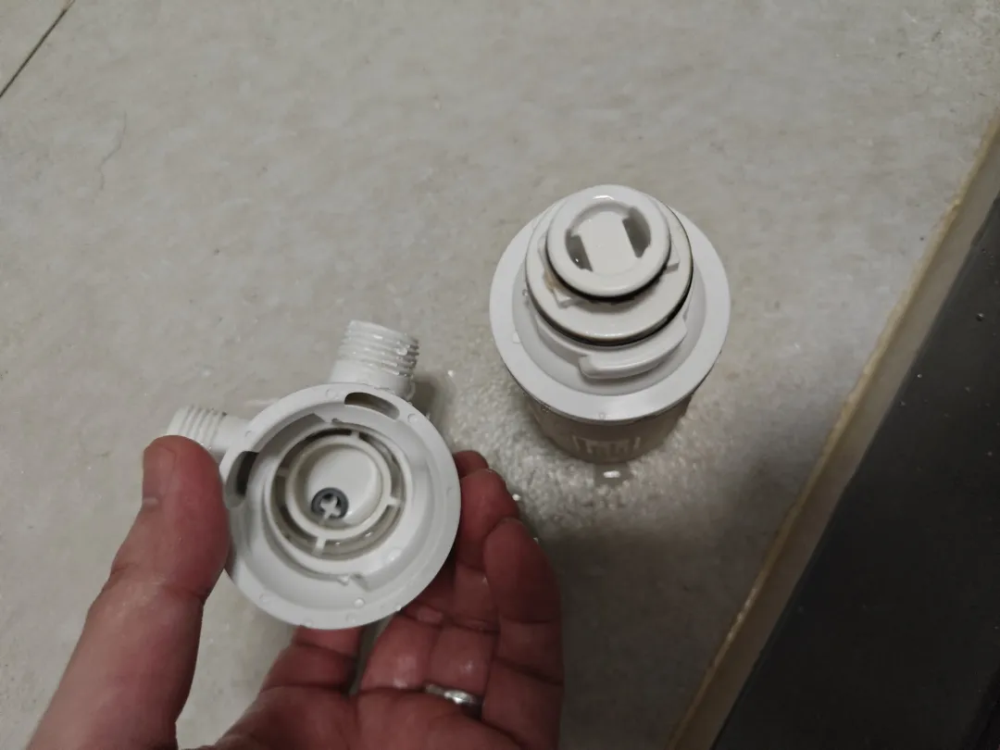
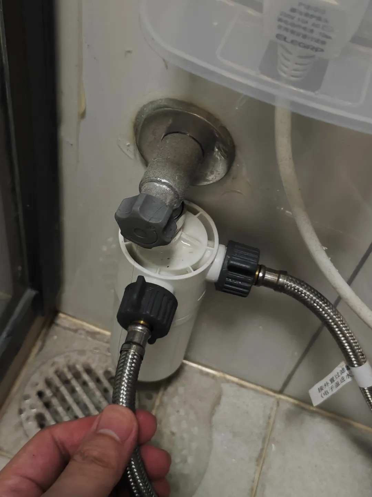

## 更换马桶过滤器
说明书上建议半年至1年的时间内就可以更换一次前置过滤器了：

根据上图说明书的指示，只需要买红圈圈起来的那个内胆就可以了，那我们上官网买好替换芯，就可以开始操作了：

水管打开的时候，旋钮是拉长的状态的，那我们只需要把旋钮旋紧：

这个就把水龙头关上了，这下，我们需要把抽水马桶的水放掉，待会拆过滤器的时候就不会漏水了：

开始拆装：

把新的过滤器更换上去，然后就可以上回去了：

