## 恢复磁盘数据
家里有1块04年的计算机硬盘，数据读不出来了，我就说试试做一下数据恢复吧，毕竟现在有DeepSeek了，一切皆有可能了。

像下图磁盘1这种状况，首先，全部都是RAW格式，说明异常了，中间那一段还是未分配状态，初看之下感觉没戏了，但是问了DeepSeek，推荐先尝试进行数据恢复，建议使用的工具是TestDisk，那我就试试：
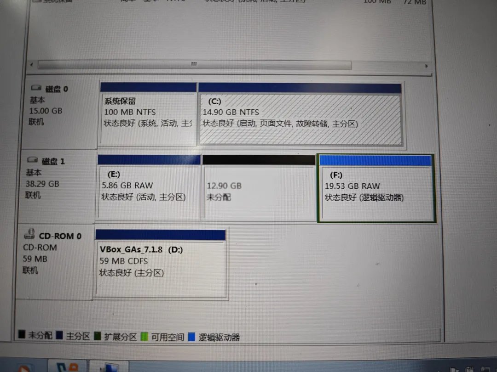

TestDisk显示总共有3个盘，第一个是主盘，也就是系统盘，第二个叫program，第三个叫filebase，后两个都是fat32格式的盘，做mbr恢复引导之后还是报I/O错误：
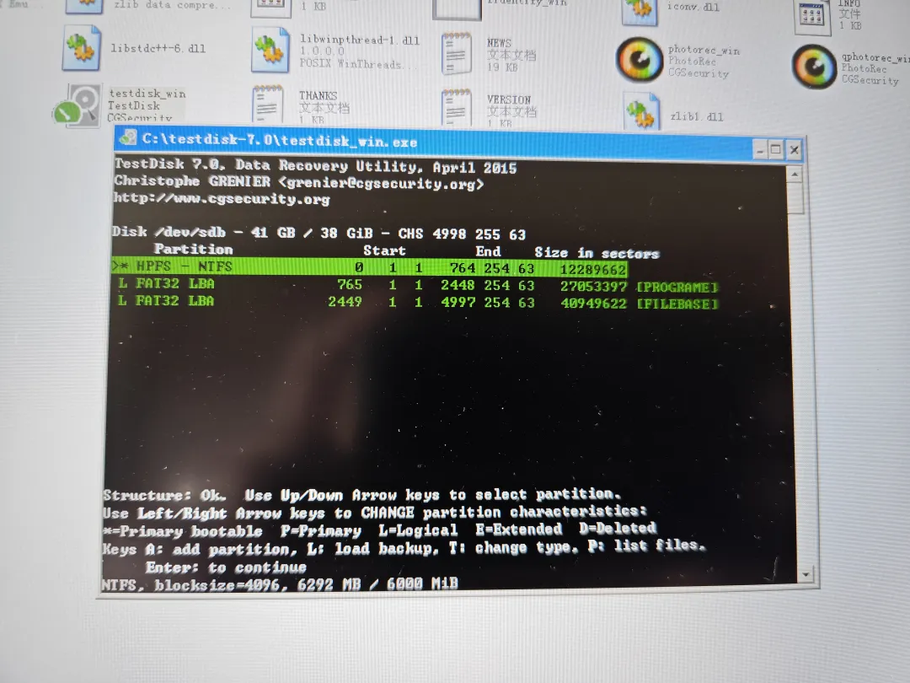

我继续DS，建议用chkdsk命令进行磁盘修复，那我只能继续。可以看见，TestDisk之后，那个未初始化的磁盘变正常了，我后来多次验证发现，这个TestDisk也很随机，不一定每次都能恢复好，恢复好一断电就又返回初始状态了，感觉就很神经刀：
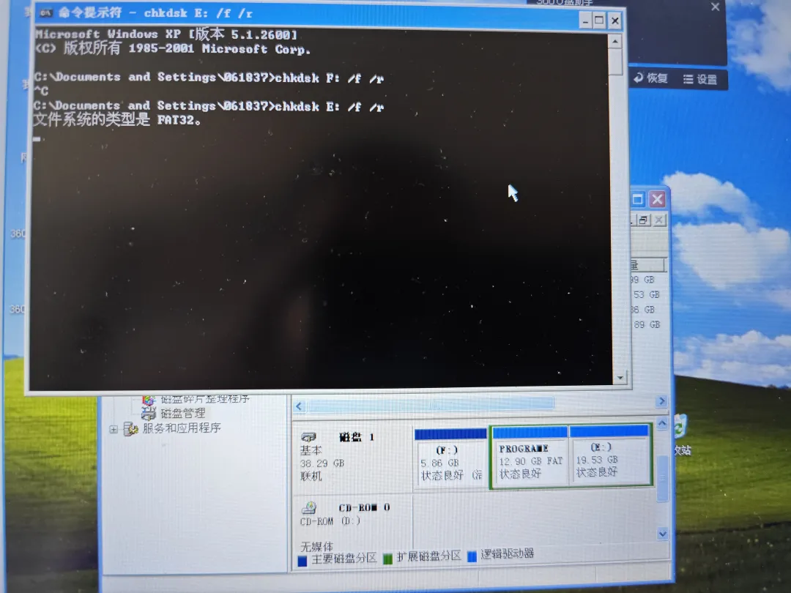

但是chkdsk也报错误了：
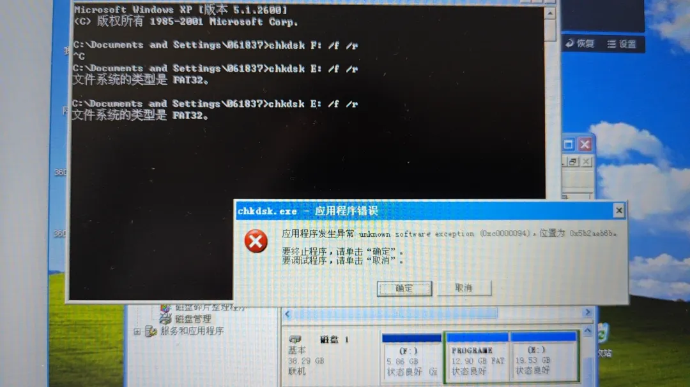

没办法，继续DS的建议，上DMDE：
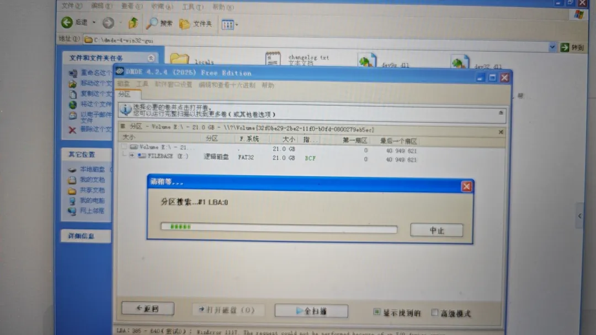

结果DMDE也报错了（后面我发现这个报错是可以强制忽略的，但是要点击多次并等待）：
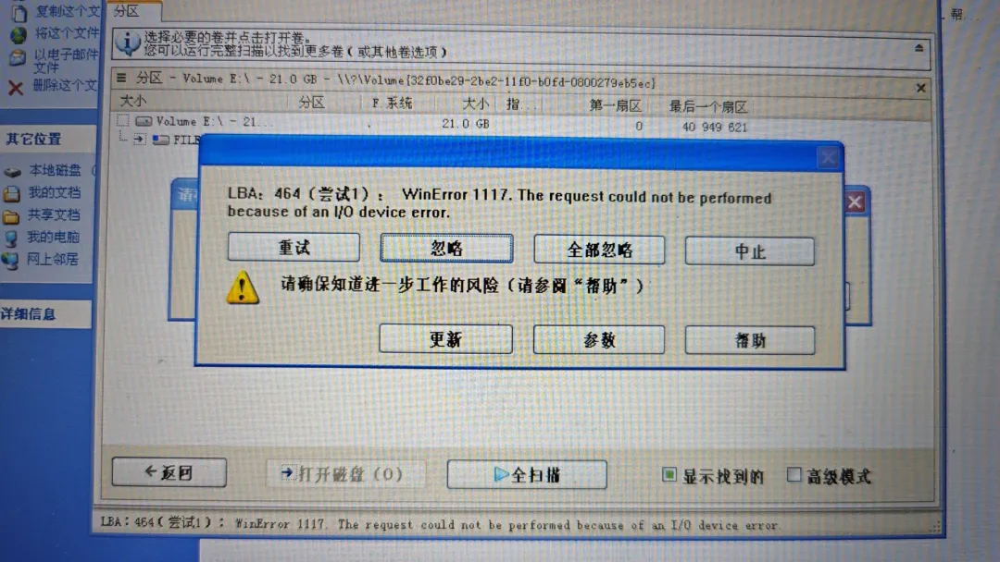

我就又问DS，说用HD Tune查一下是不是磁盘有损坏，那我继续查，发现损坏率0.3%：
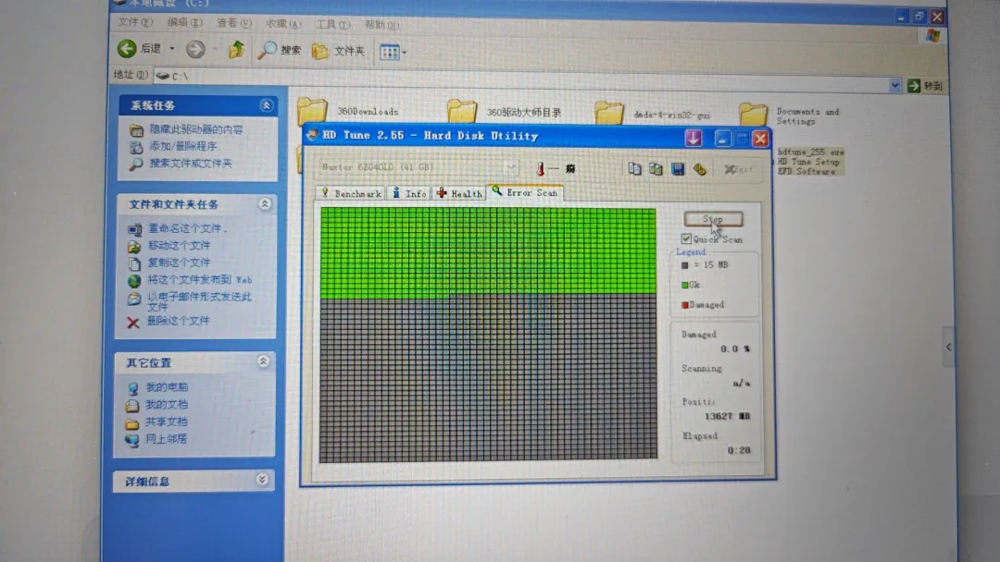
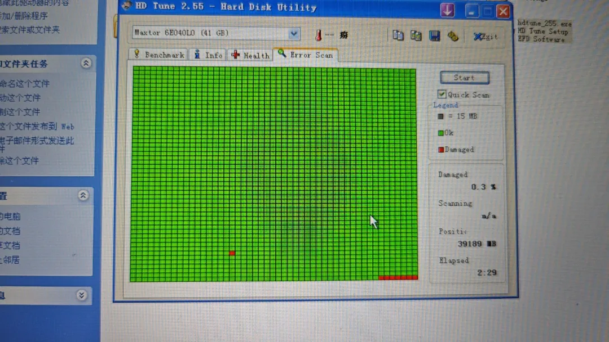

我问DS，说再复查一遍，以确定是逻辑损坏还是物理损坏，那我又复扫。这次发现仅剩一个点位了，并且上第一次扫描的一个点位重合，说明有物理损坏，那怎么弄，DS推荐用UFS Explorer，我试了一下，可以直接穿透磁盘读取里面的内容了：
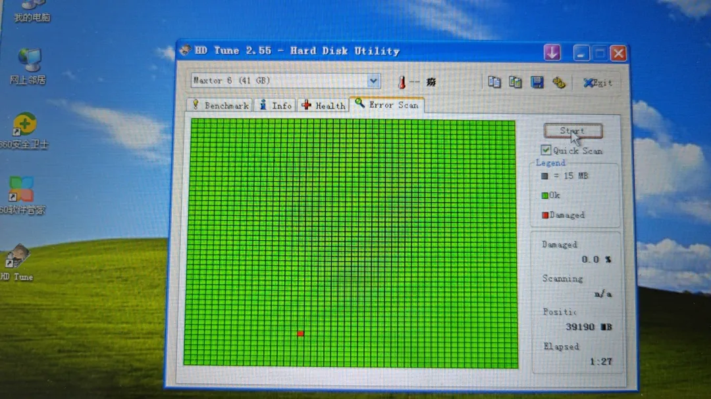

正在高兴的时候，发现复制内容功能是要付费的，我找了很久没找到合适的激活码，只能继续DS，DS又回来推荐DMDE，于是就回到上面这张图：

这个地方需要反复点击全部忽略，我是点了很多次，都无效，然后点了中止，又弹出一个对话框：你要放弃吗？我当然不放弃，然后点了否，再回来，就可以点击全部忽略了。。。神奇。。。后续内容涉及我个人隐私就不放图了，我放几张DS指引我的建议：
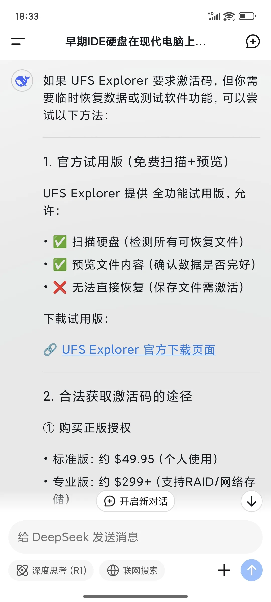
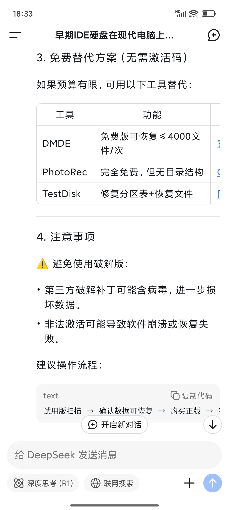

最后我用DMDE恢复了磁盘里面所有重要的文件，谢谢DS，谢谢梁文峰。