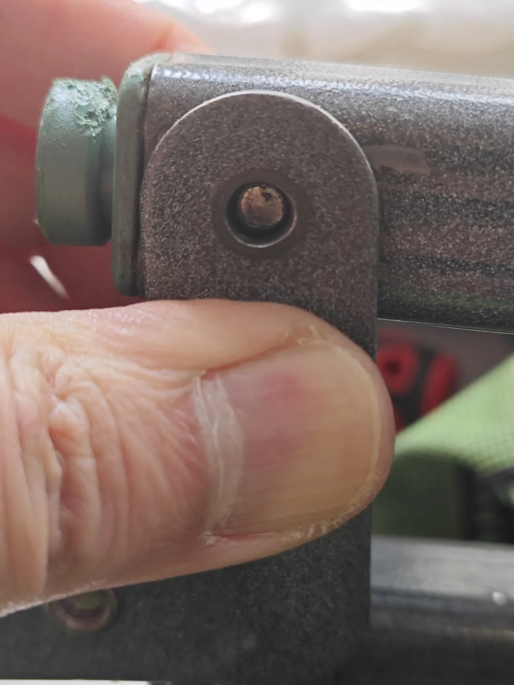
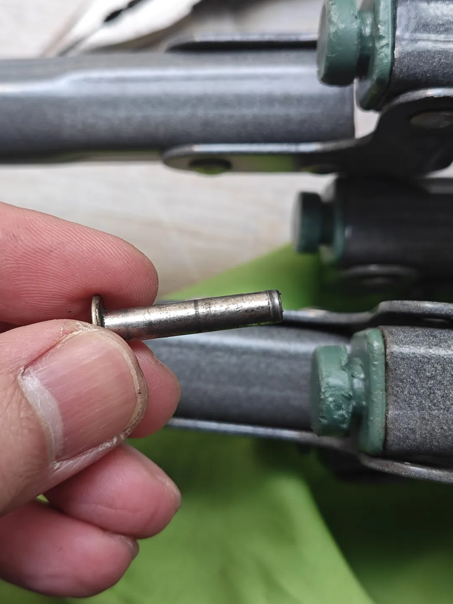
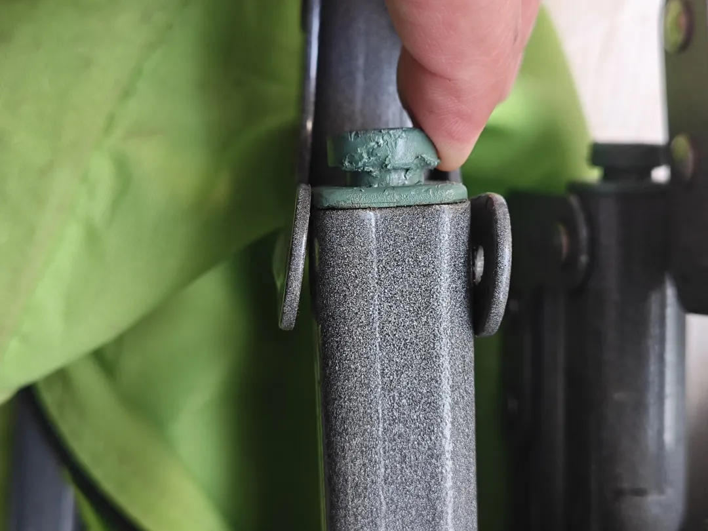
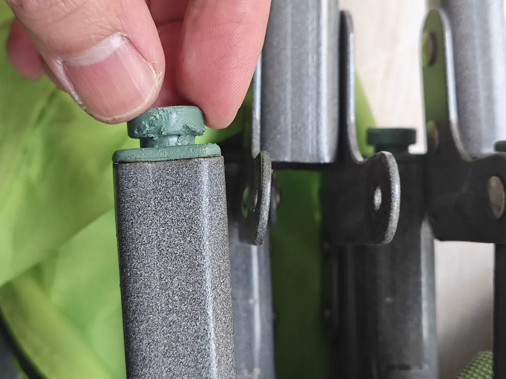
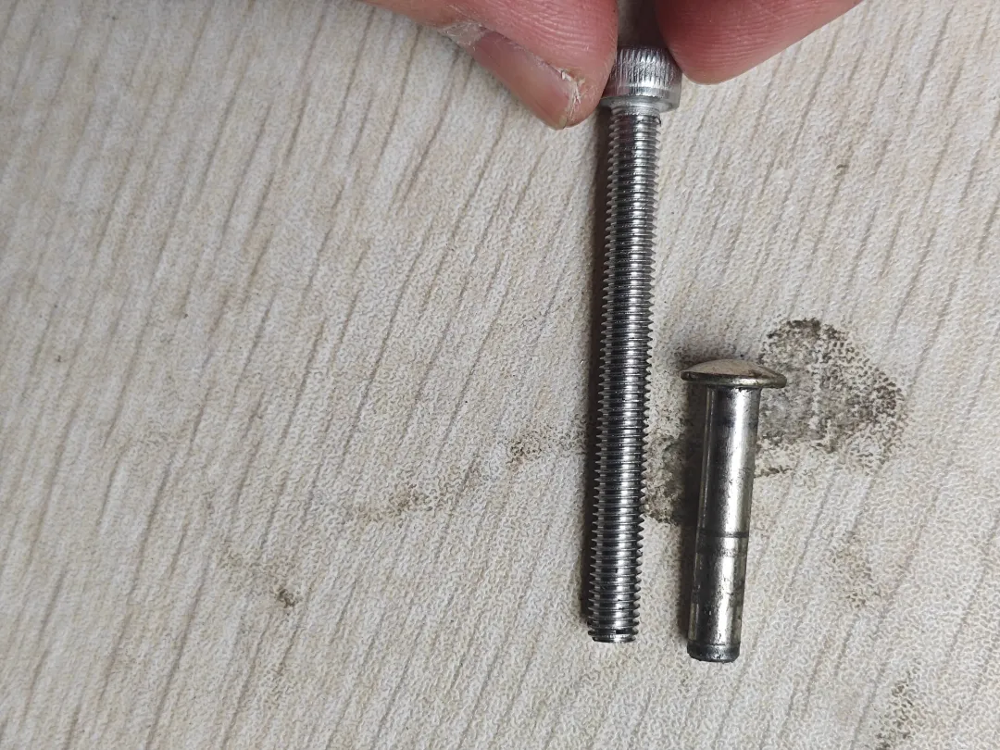
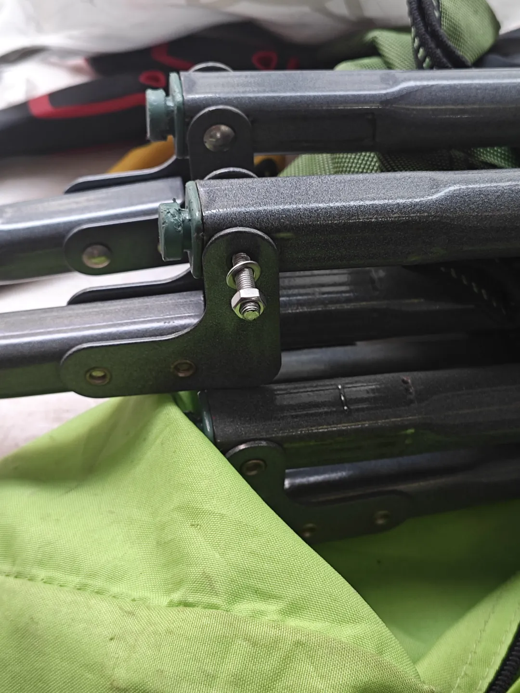
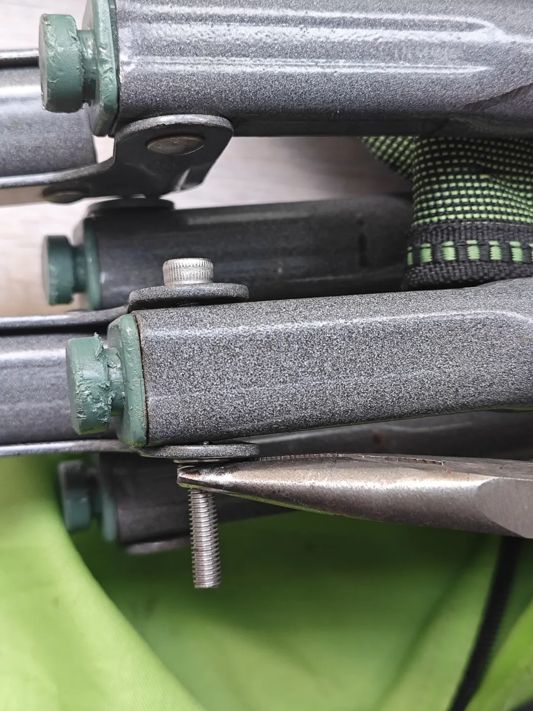
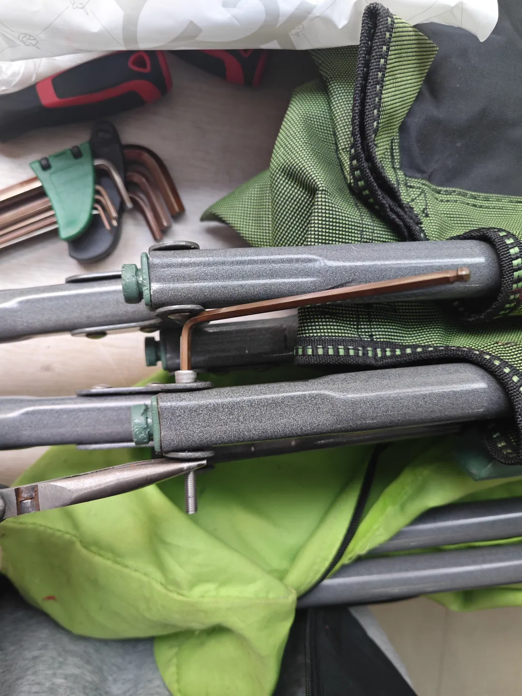
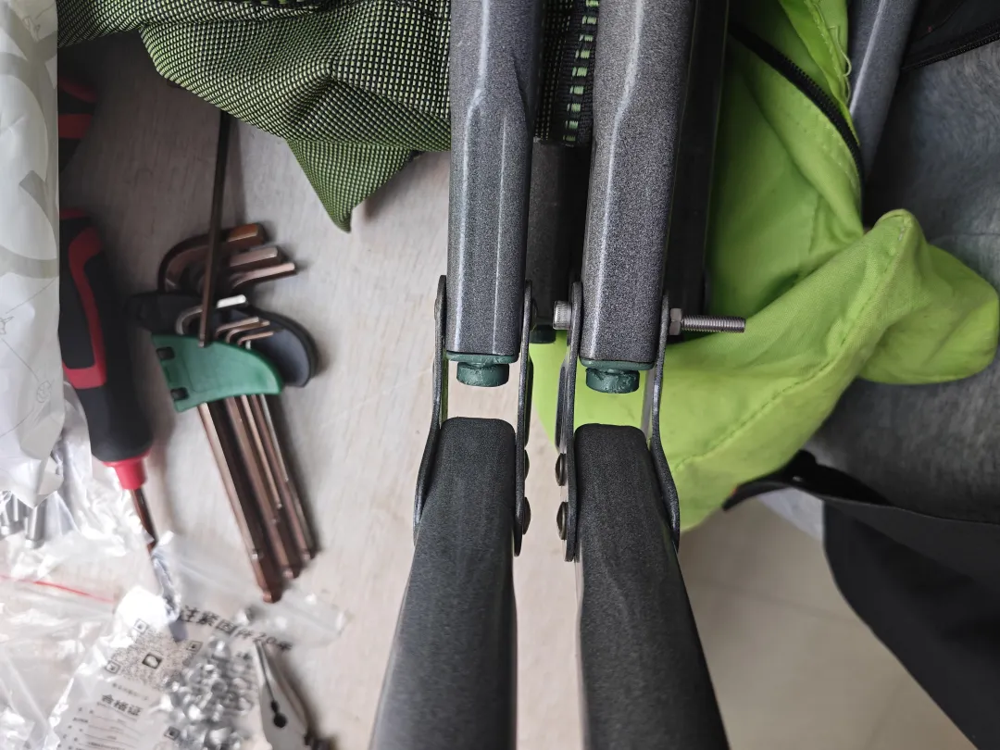
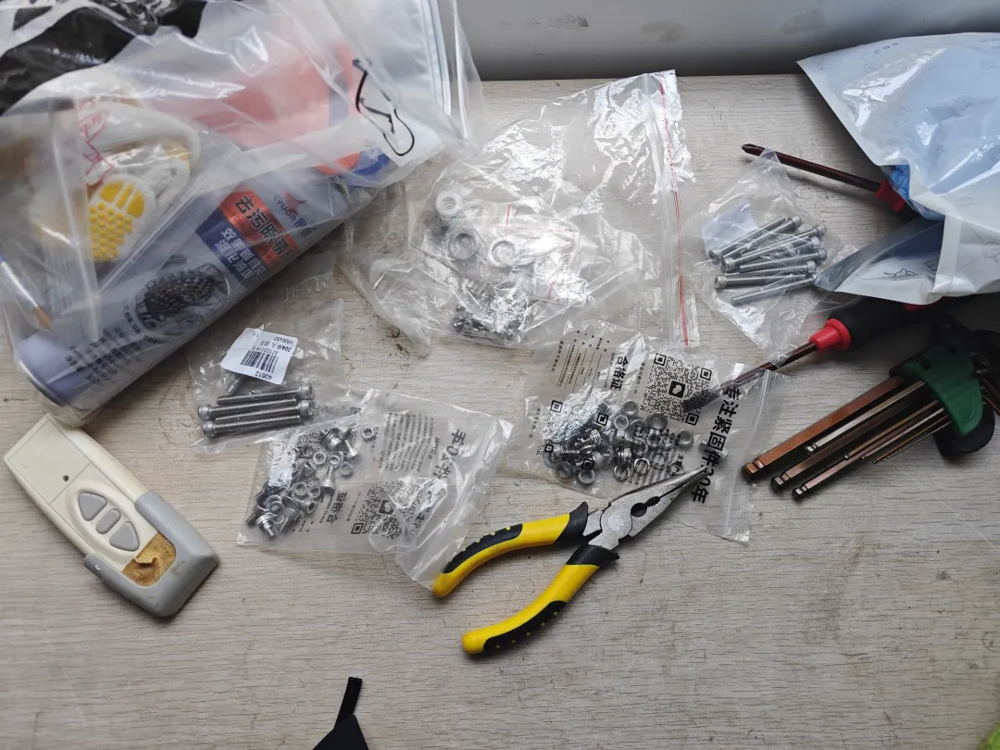

## 修理行军床
### 行军床去噪
第一个问题是行军床折叠的时候噪声很大，于是我怀疑是生锈的原因，于是用自行车的除锈剂来给行军床除锈：

<video src="../videos/行军床去噪.mp4" controls width="100%"></video>

### 行军床关节铆钉脱落
第二个问题就是行军床关节处的一个铆钉断了一侧的头部：

这根轴的铆钉帽脱落了，一不小心就会脱落，导致整个行军床特别容易散架：

但是我发现，我当时为了给我的XC50修理前车篮配的M5（直径约5毫米）螺丝竟然派上了用场：

一样粗，有意思了，虽然长了一倍，凑活着用吧，毕竟不要再花钱买：

看看我的工具包：

