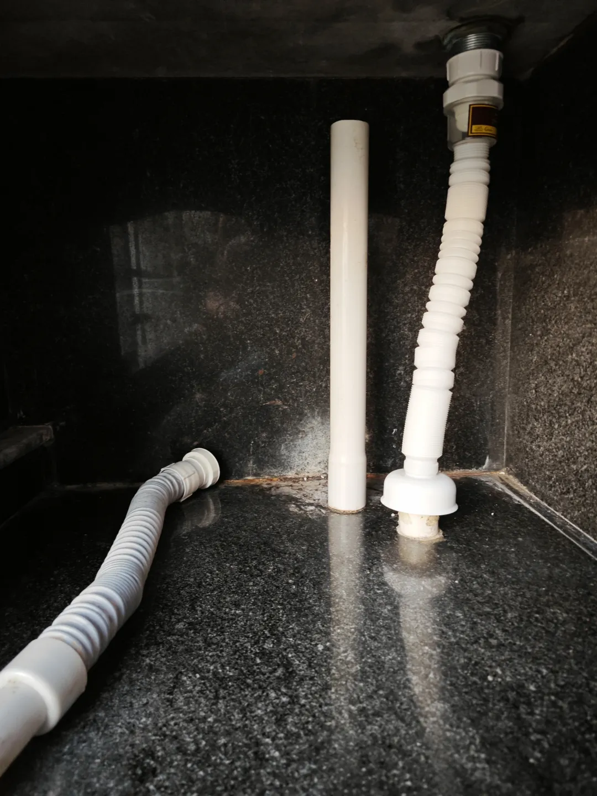

## 更换阳台下水管
入水口是45mm（4.5cm），之前买的3.2cm的，不能用，然后发现卫生间的洗脸盆入水口是3.2的，就拿去给卫生间用了，其实是为了阳台这个洗衣池买的，不懂，尺寸没买对。

然后阴差阳错，就有了之前的一篇换卫生间洗脸盘下水管的博文。

于是我量好阳台的入水口尺寸后，确定是4.5的入水口（只有这两个尺寸，所以很简单），就京东了，整套管只要17.9元。

整件事的原因是原来的下水管会溢出，因为没有橡胶做密封，现在潜水艇的肯定是有，毕竟是15年前装修的房子了。

今天花了2分钟换上了，以后下面储物间不会再溢水出来了：
