## 自己剪头
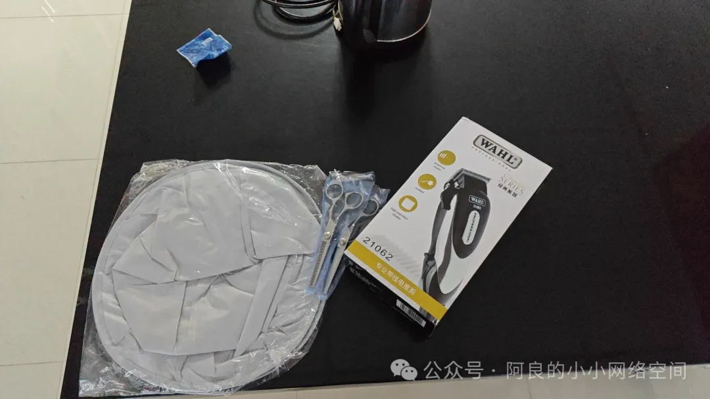

刚开始学，用的工具是牙剪，京东可以买，19块钱好像是：
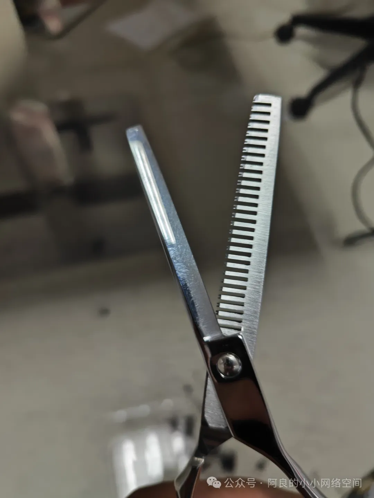
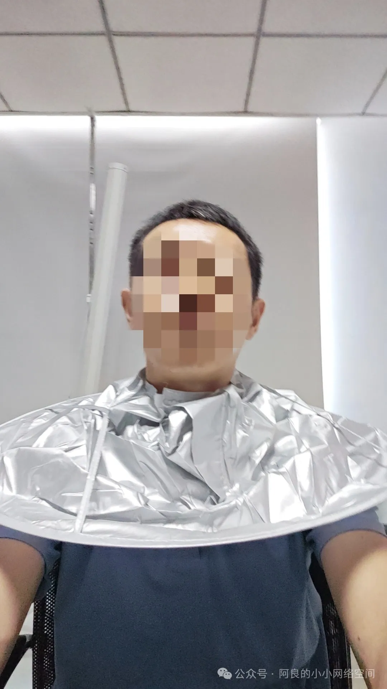
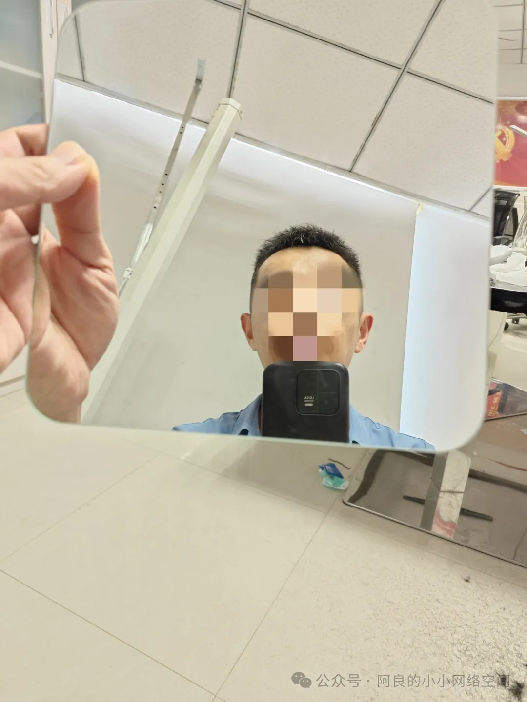

后脑勺的头发是最难的，只能一次次攒经验，靠手感，而且还要有朋友点拨，因为看不见，即使用双面镜子也看不出立体感，所以完全靠一个人是非常难的事情。
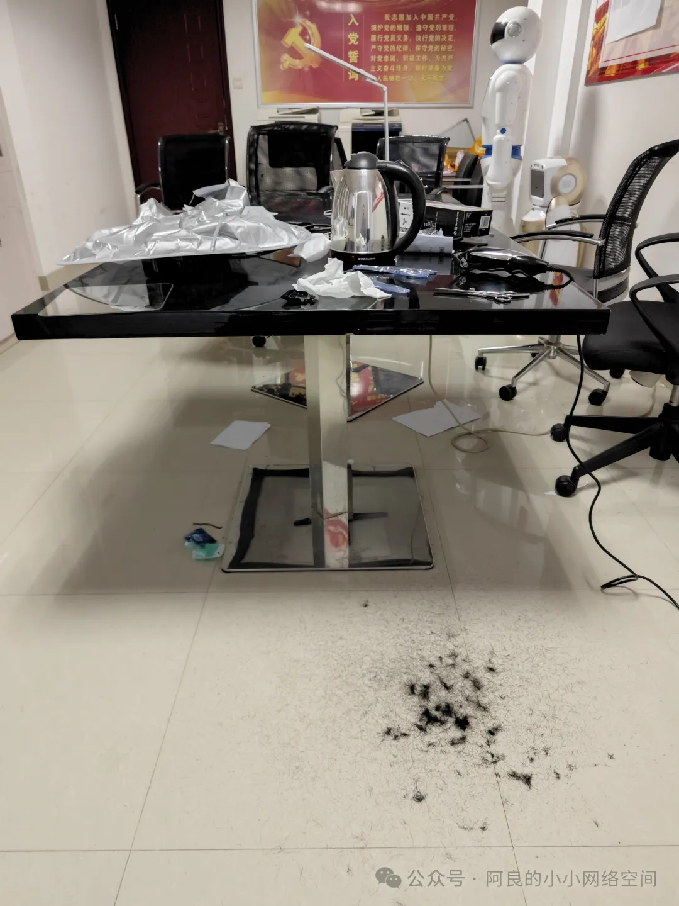
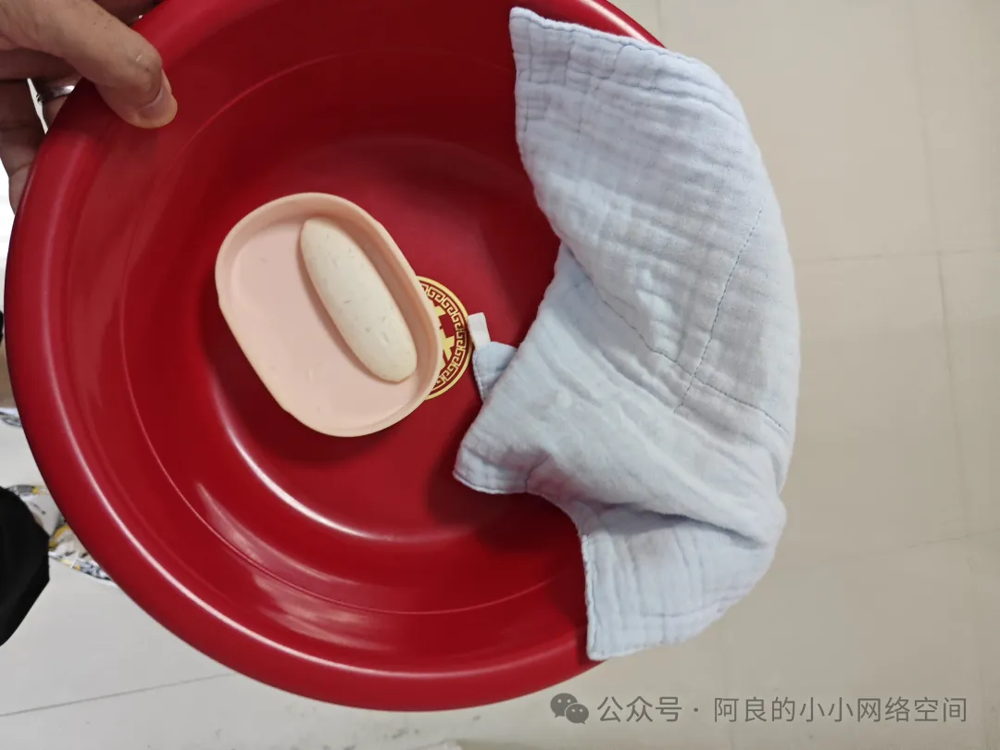

关于剪碎发的技巧分享。要点就是，左手拽住一撮头发，右手用牙剪从中部（发量多的朋友可以从根部）逐步剪到发梢，然后一撮一撮，直至剪到左手随便拽起来一撮都差不多长度就可以了：
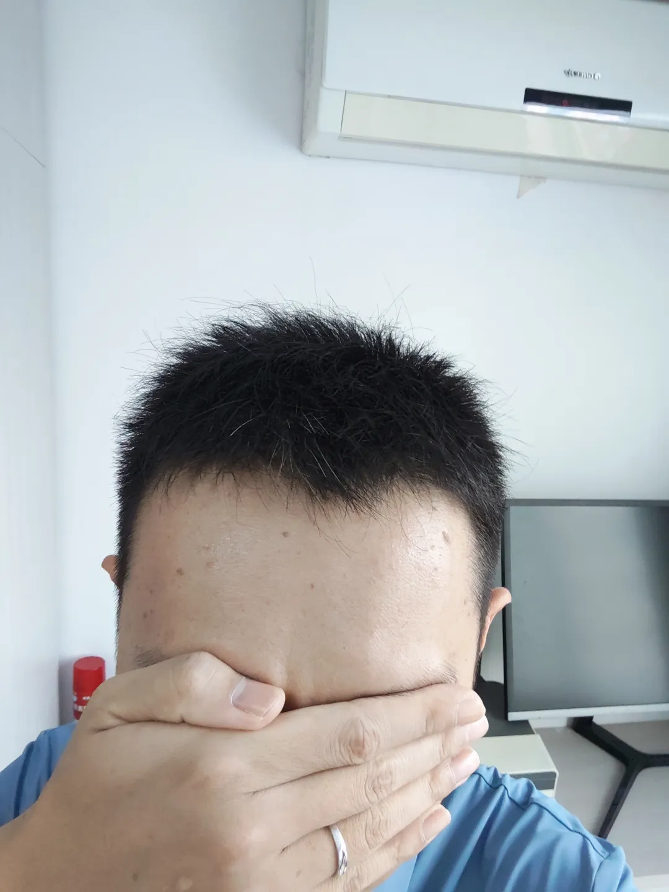

用“平剪”剪头。

牙剪作为自己剪头的入门工具，存在一个最大的弊端，就是把头发剪得很稀疏，像俺这种中年男人，头发本来就不多，就不合适了，只能上平剪，而且平剪有一个优点，就是能把发梢剪得很平整：
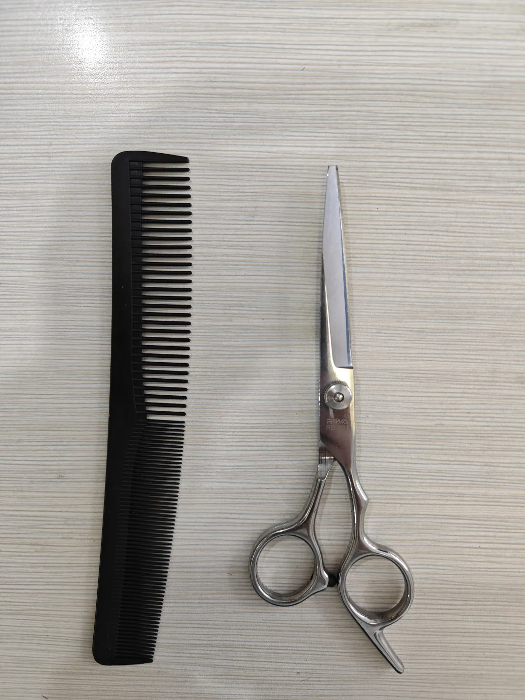

这里建议的方法还是盲剪，要点和剪碎发类似，左手拽住一戳头发，右手用平剪只剪去发梢部分，如果需要剪短一些就主动用左手控制好差不多的长度，然后用平剪剪去发梢即可：
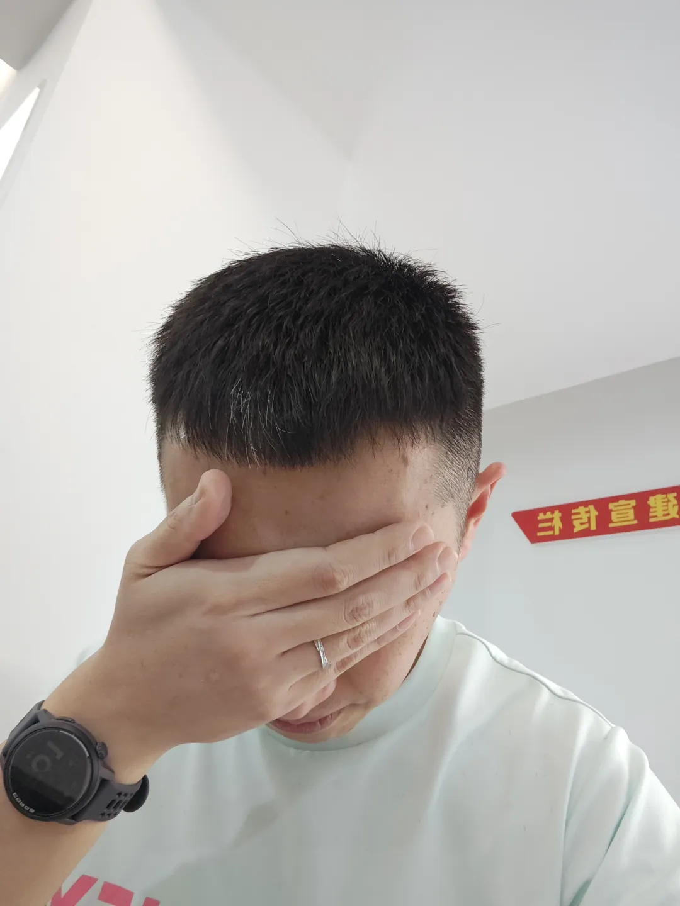
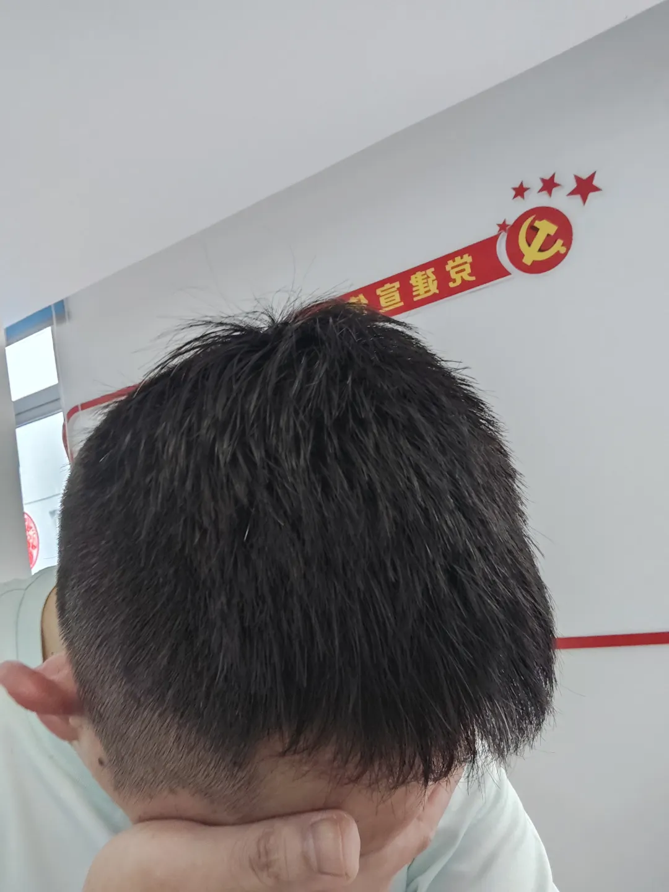
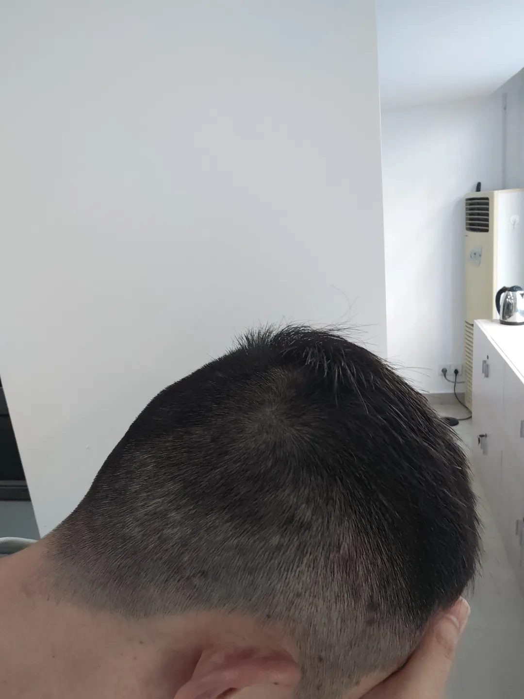

成品看一下，还可以吼，比原来牙剪的是不是好多了，不会感觉头发太稀疏。

