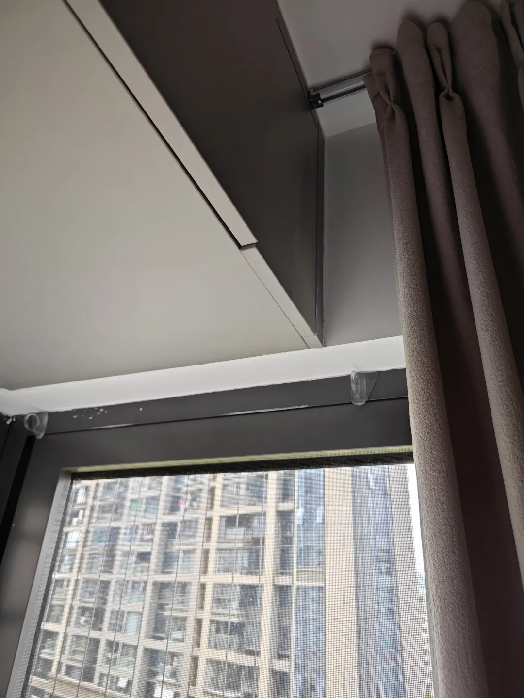
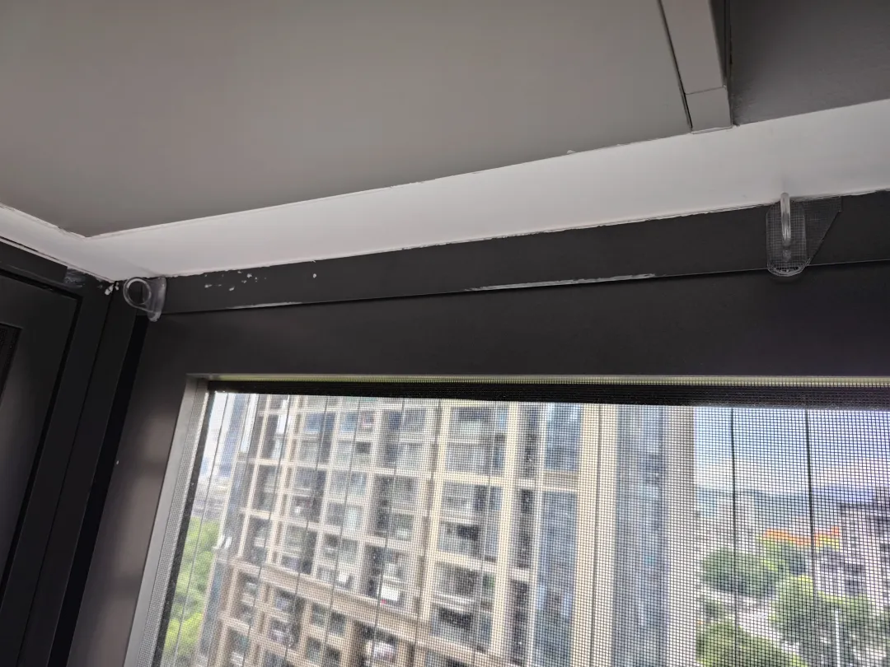
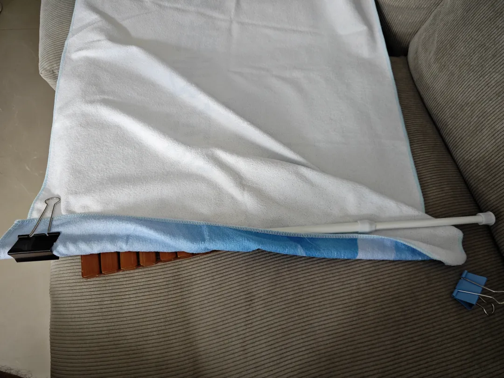
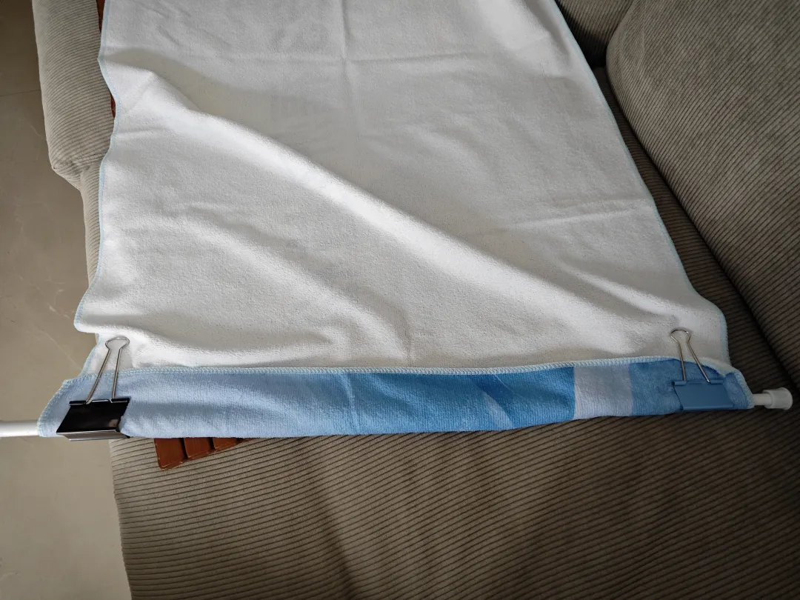
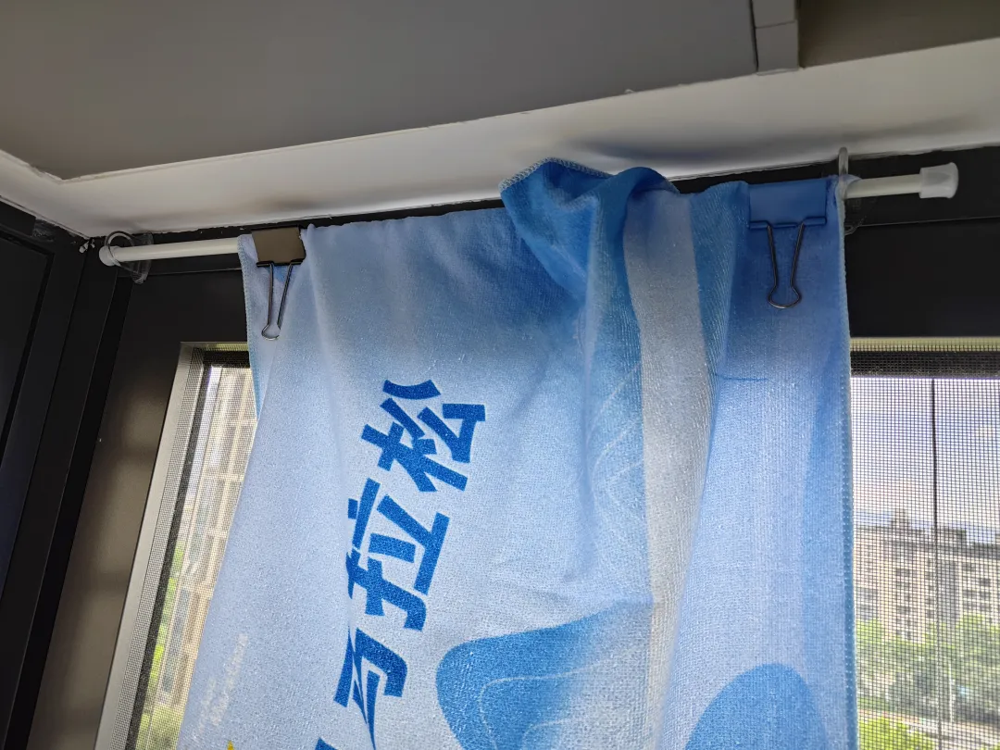
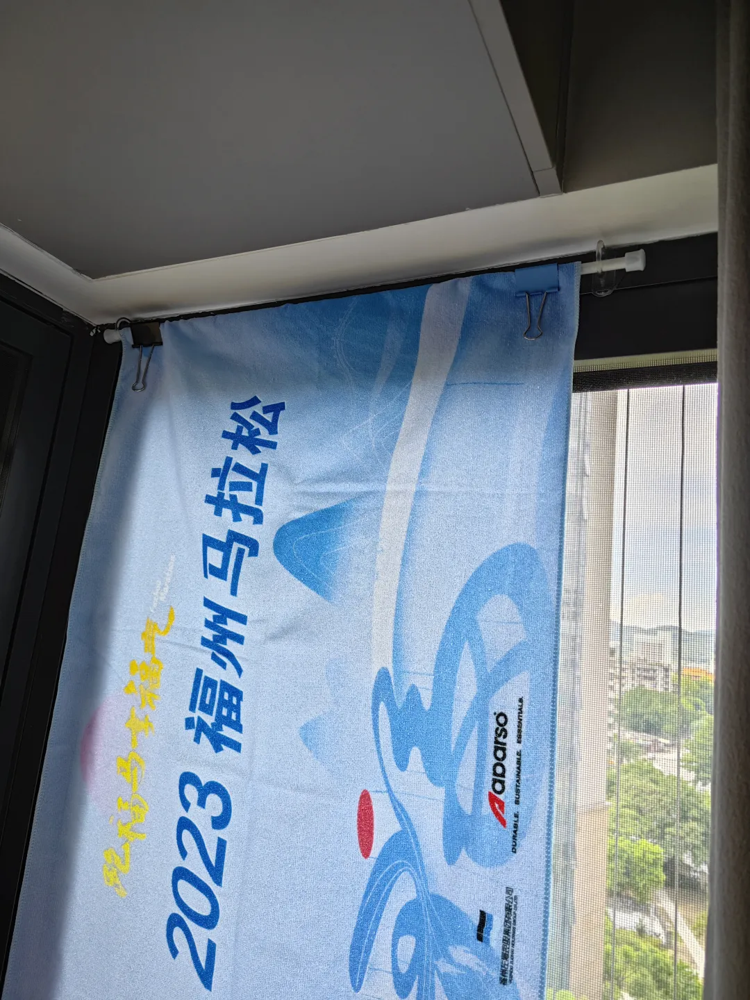
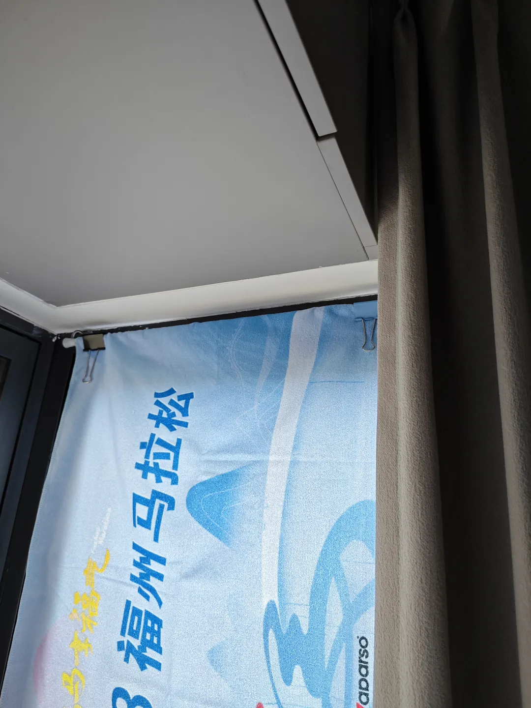

## 自制小窗帘

像这种，窗帘拉不过来，两侧又没有受力点做伸缩杆，只能这样，从侧面粘贴挂孔：

看这个伸缩杆，一边粗一边细，所以一边要用大的夹子，一边可以用小一点：

然后挂上去，我这个滑动性差一点，原因是夹子不够大，哈哈，差不多就行了，无所谓：

把马拉松的浴巾利用起来 ，也算创造了一点点价值。这里的核心在于根据每家每户不同的限制条件进行具体操作，就是要利用现成的已有的材料，发挥想象力与主观能动性，去实现目标。