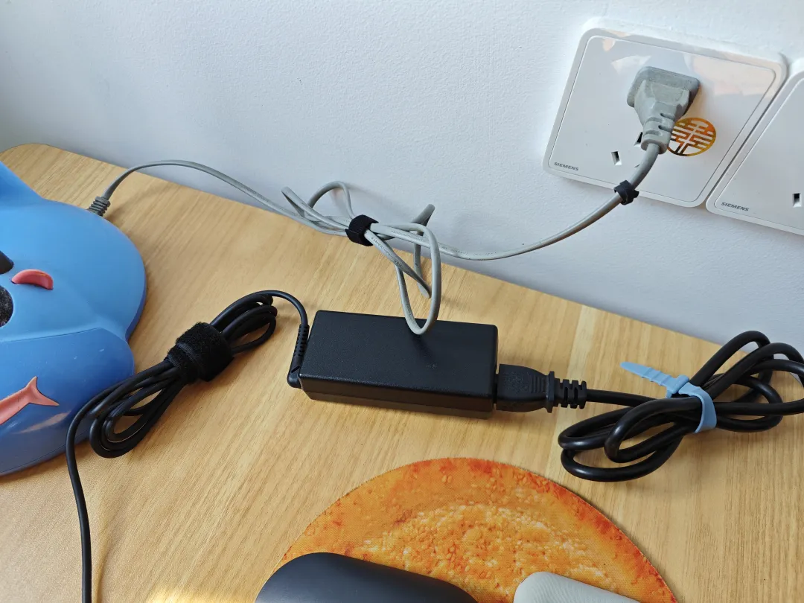
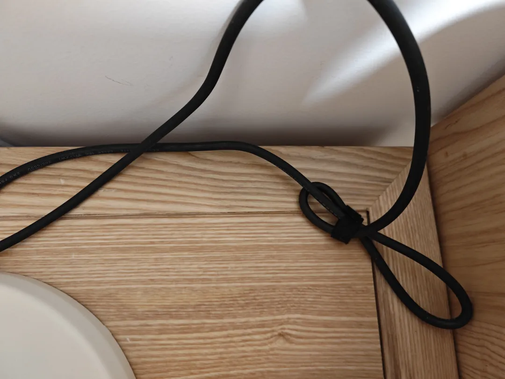
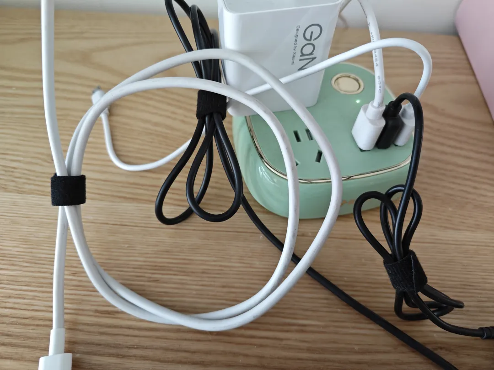

## 魔术贴替换扎带
魔术贴有着很多优势，比如柔软，不会割手，频繁使用也不会降低粘性，不像普通的外橡胶内金属丝扎带，存在金属疲劳的问题，橡胶也会老化，所以我产生了用魔术贴替换家里全部扎带的想法。

这里的核心在于不要刻意为了换而换，就是说不需要为了这个目的而专门花时间做这项更换工作，而是要把这个想法记在心里，然后每次遇见一次使用电器，就顺着自己内心的想法换掉一个扎带，然后久而久之，自然就会用魔术贴更换掉所有常用电器的扎带，而整个过程自己完全没有刻意的意识，等你完全忘记这件事情后，你会发现想法意外实现了，很多事情都是如此。

