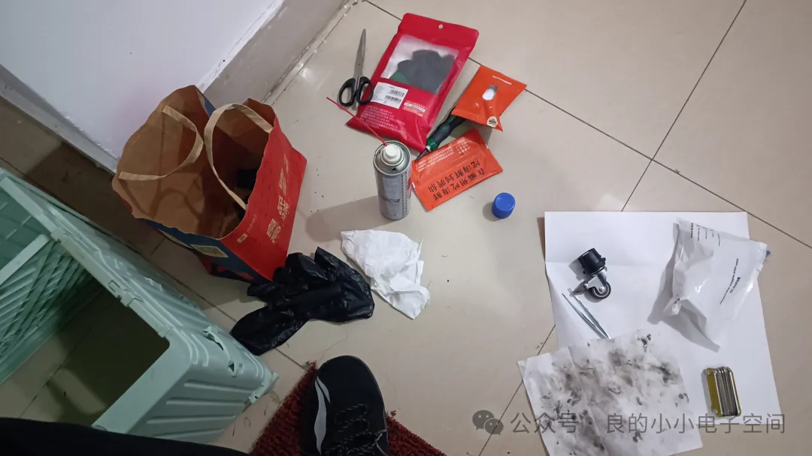
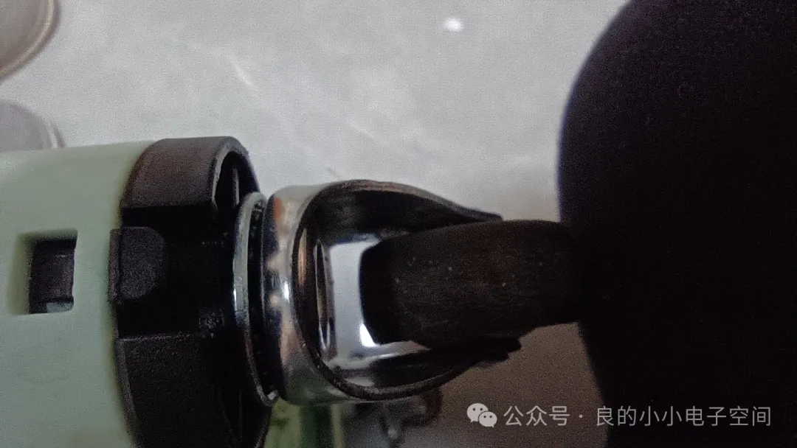
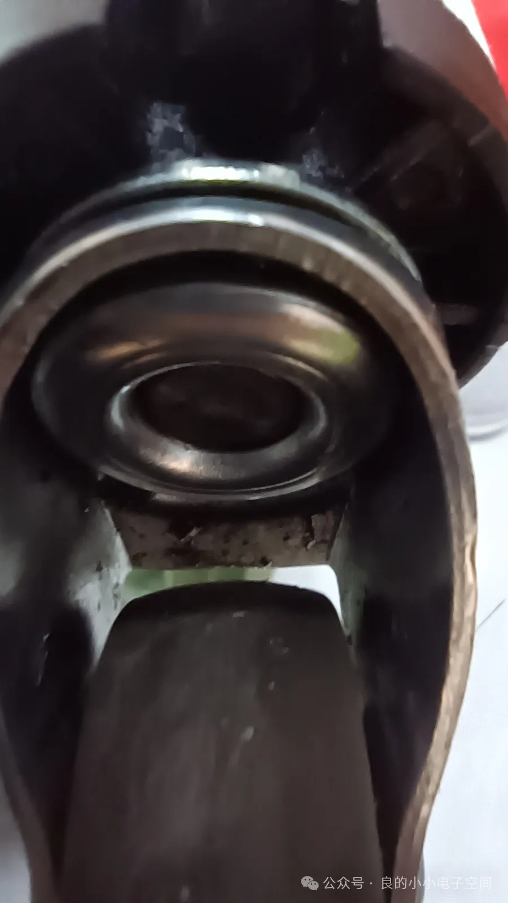
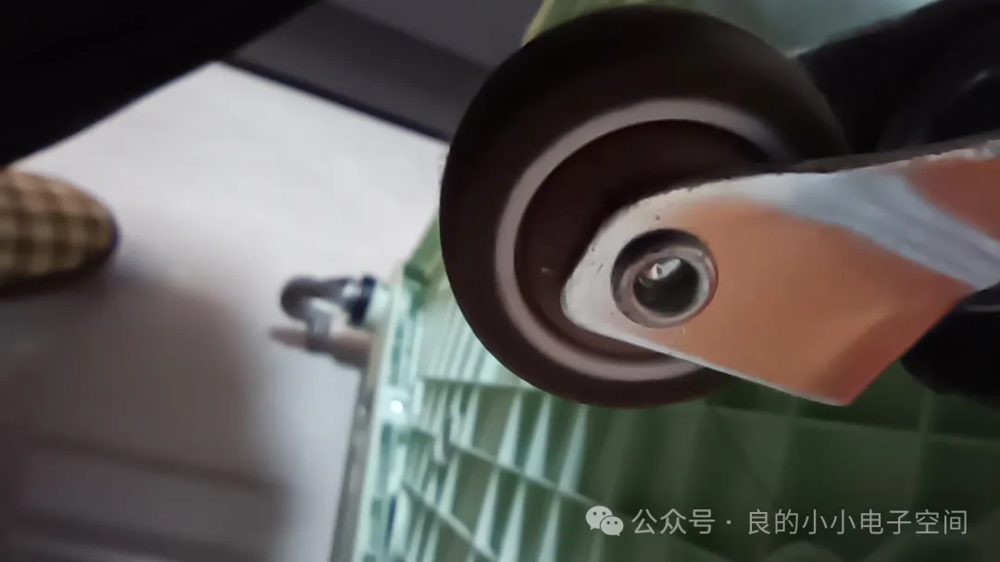
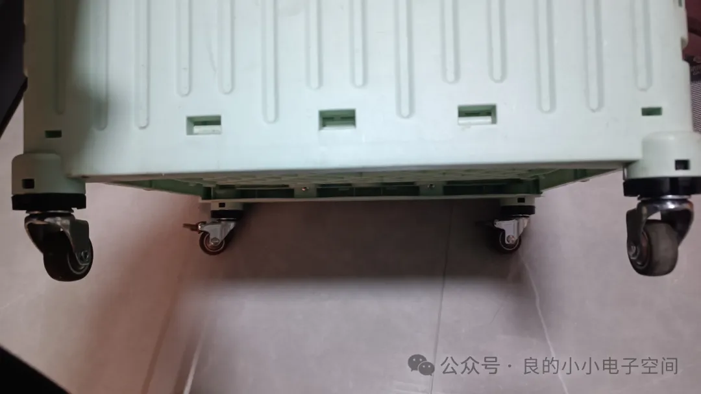

## 保养小拖车万向轮
家里的小拖车用太久了，小轮子全部都被脏脏的油脂和铁锈卡死了，非常卡顿，很早就想去油除锈，年后终于有空了，下午开始搞了一下，上图：

常用的工具还是自行车链条清洗剂之类的除油除锈剂。

带上晴纶手套​，避免清洗剂腐蚀皮肤，往以下几个部位喷清洗剂：

滚珠轴承内疯狂喷，待3分钟后油脂和铁锈就会全部溶解流出。

清洗完用多张湿纸巾仔细擦拭，完工图：

和新轮子一样的润滑度，可以再上点湿性润滑油，不要上润滑脂（上了润滑脂久了又是黑乎乎黏黏的不丝滑了）。放阳台吹2天，清洗剂易挥发，2天就不臭了。