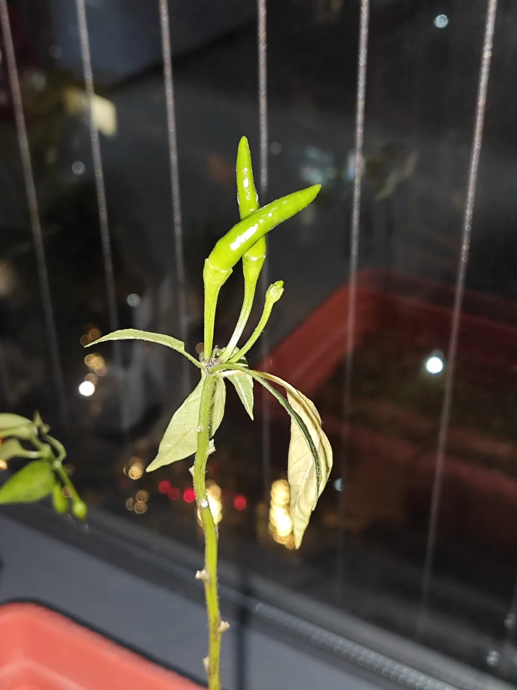
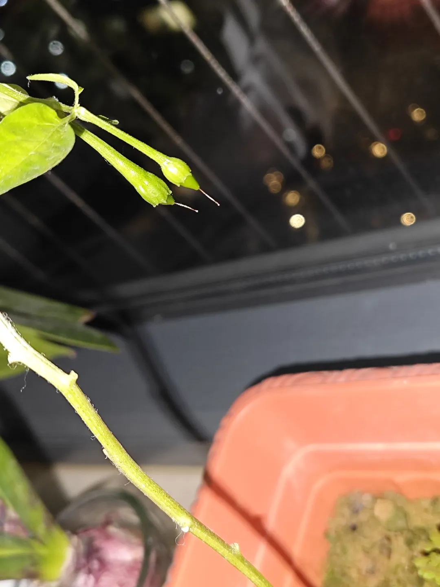
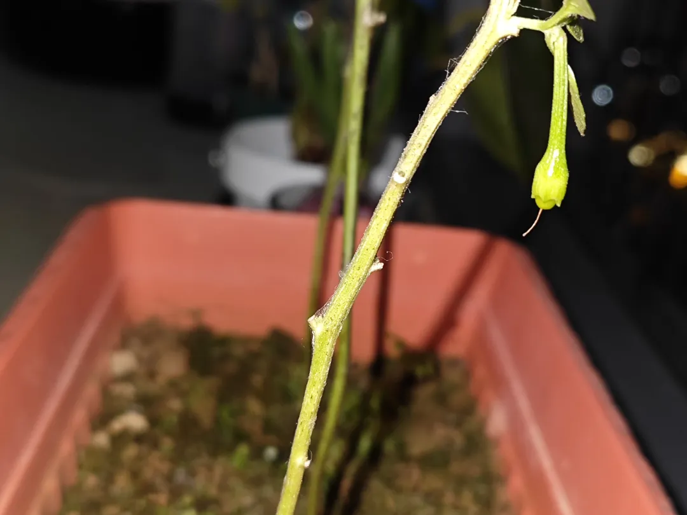
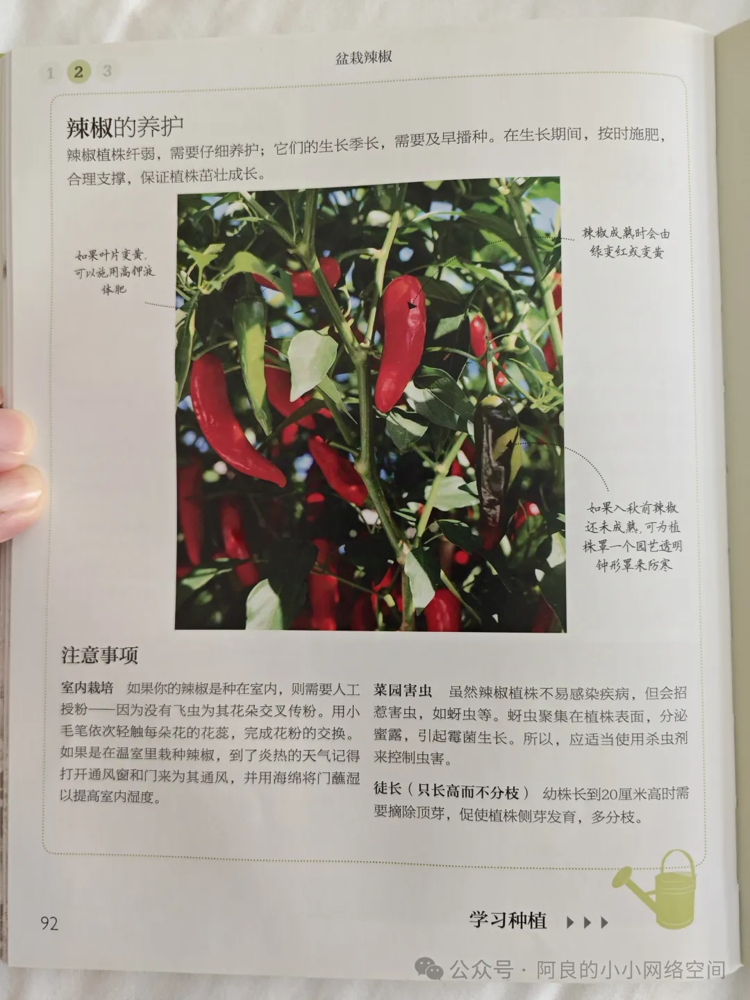
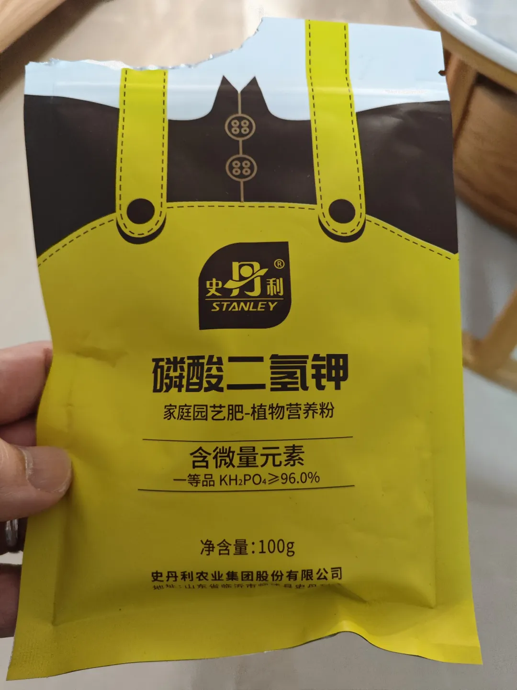

## 解决辣椒叶子发黄不结果问题
先上结果图：

如图中所示，最终是结了两枚辣椒（参考图1），还有4枚不知道是什么情况（参考图2、图3）。

期间我经历了多次授粉失败，辣椒还是不结果。于是，我先是去市图书馆借了专业的书籍：

书中有提及解决辣椒叶子发黄的办法就是施液态钾肥，那当然用固体肥料肯定也是可以，就是固体肥料施肥技术对花农会有一些更高的要求，液体肥料会简单很多。于是我就去买液体钾肥来施肥，那我就买了史丹利的磷酸二氢钾，单包买是9块9/100克，每次是1克兑2升水，那我种的不多，100克妥妥的够用了：

那后续的话，这个肥料顺利解决了叶子发黄的问题，再加上我还是继续有做人工授粉，然后的话，最后就是一开始图片展示的结果了，就是这样了。那还有4枚的话是那种结不了果，花蒂又不脱落的情况，这个也是不知道是什么情况，后续蛇年我会继续研究这个问题，争取能把结果率提高一些。