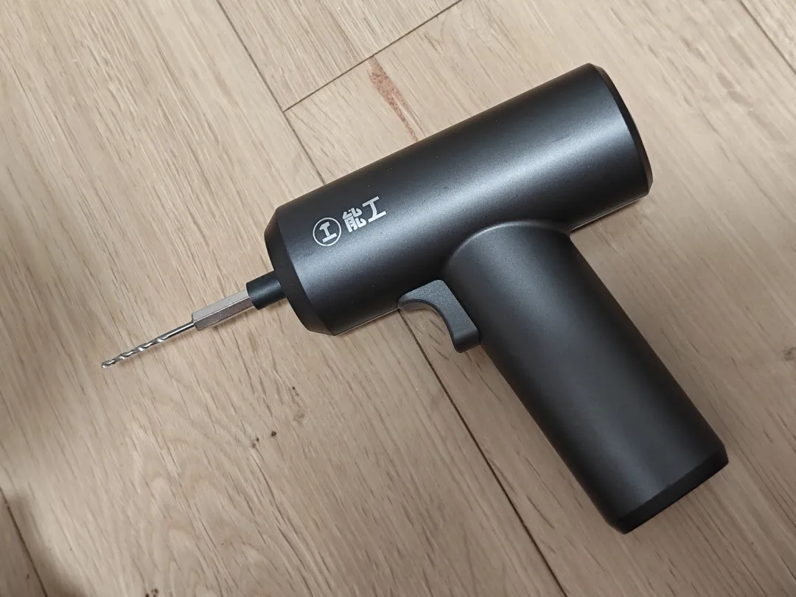
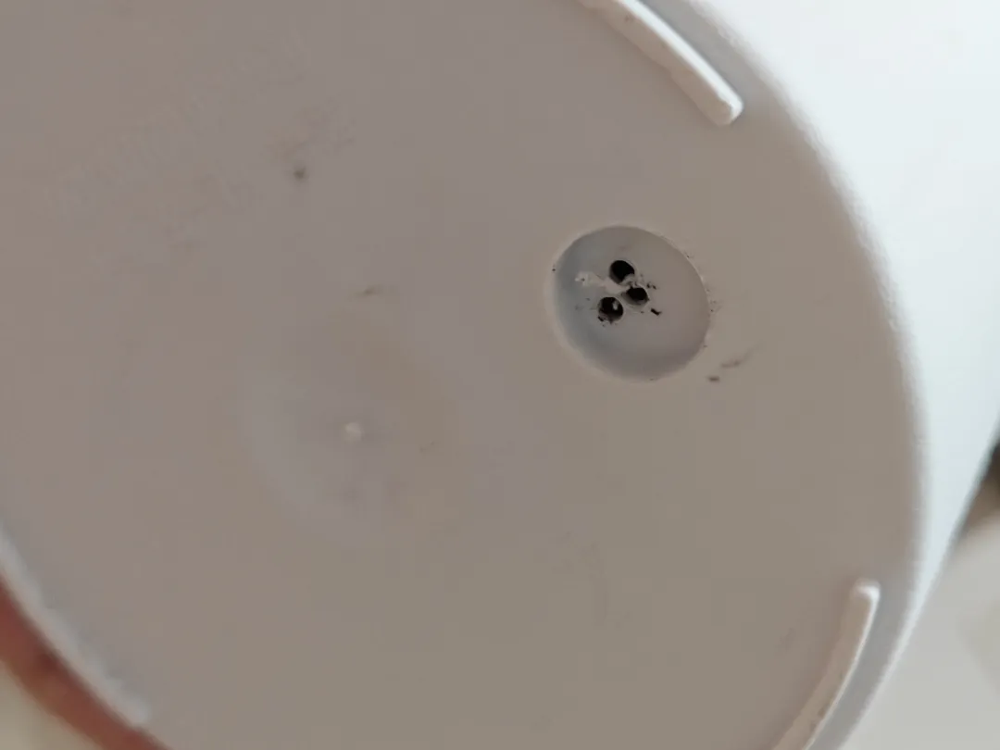
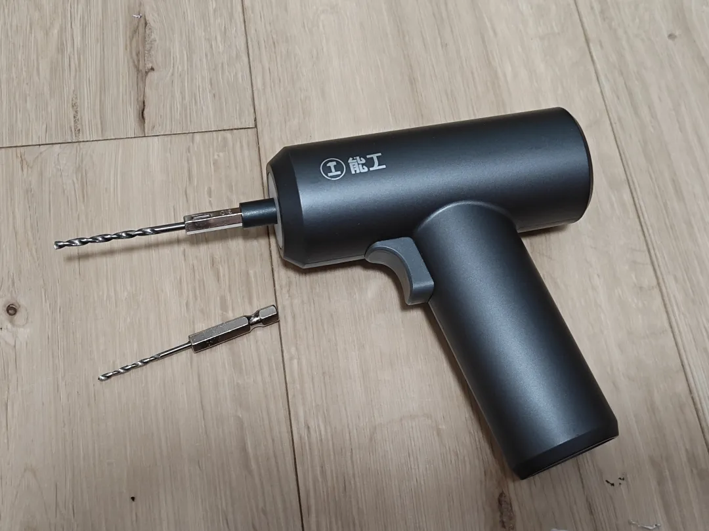
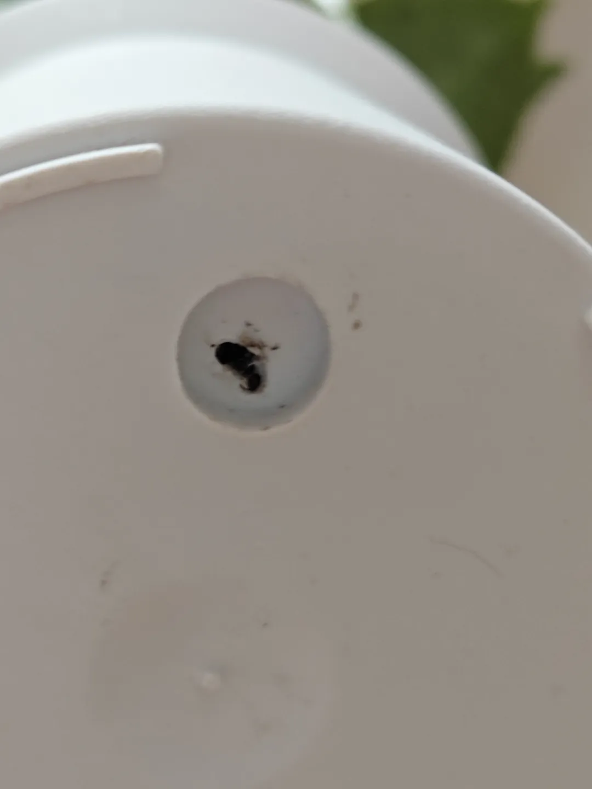
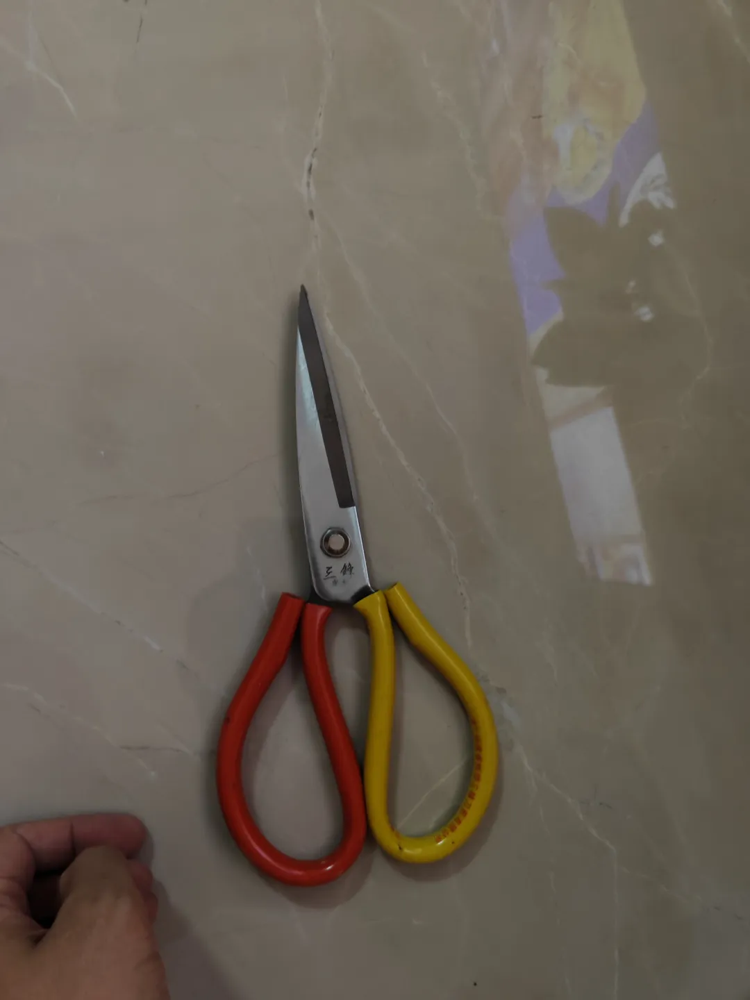
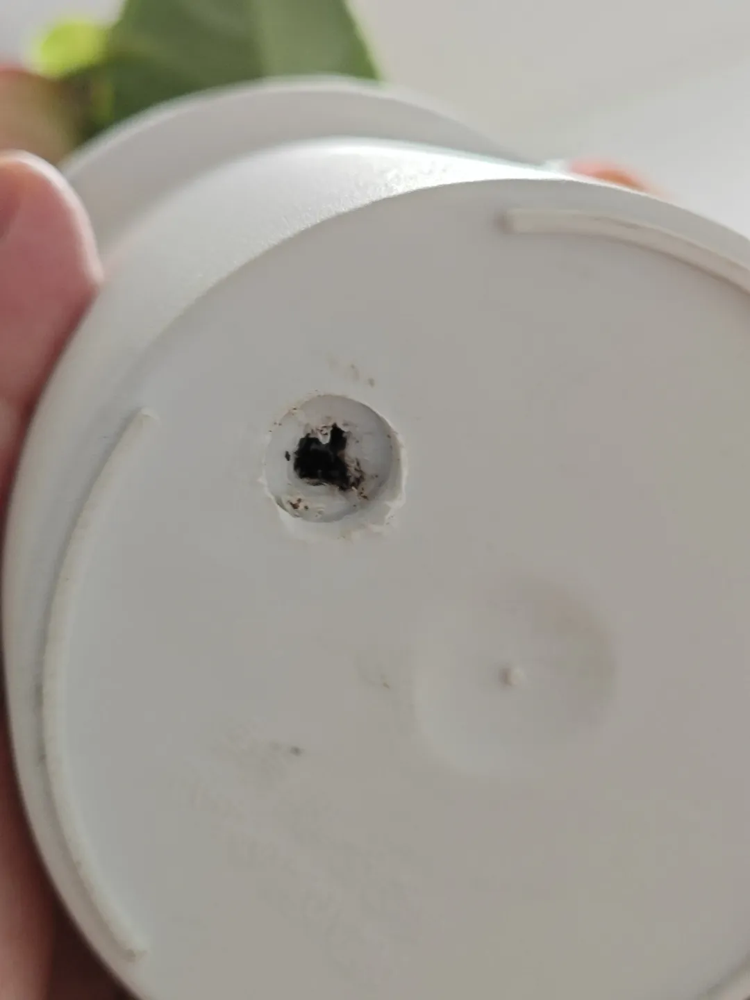
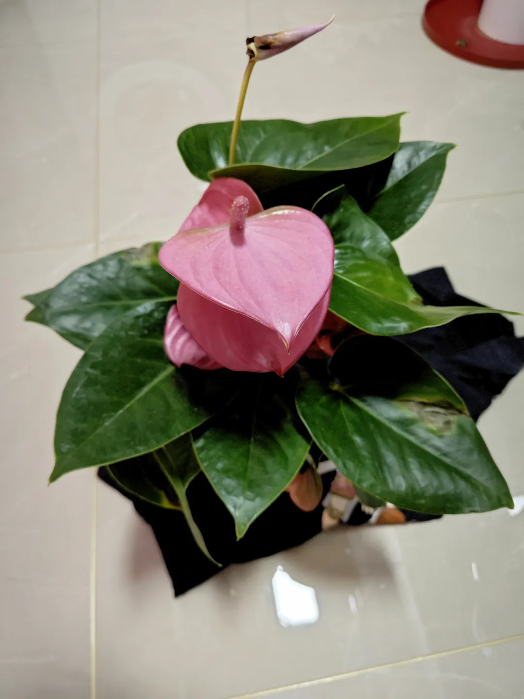

## 塑料花盆底部打孔
买的花，花盆底部没有孔，浇水浇不透，不舒服，难受，要打一个孔。因为是塑料的材质，电钻头是顶部是平的，很难抓着力点，最后发现要用小的钻头先打出孔，再用大钻头连通：

然后再上粗的钻头：

再用大剪子扩大孔径：

是一盆红掌，可以浇透啦（红掌不喜湿，喜阴）：

<!-- 以下是添加的封底 -->
 

谢谢观看^_^ 

<small>© 2025 家庭维修手册项目 | <a href="https://github.com/sapchen/home-repair-manual">GitHub 开源地址</a></small>

