## 扩充电动晾衣架空间
看了日本作家越智登代子写的《生活图鉴》，里面讲到如何扩充晾衣架的空间，非常有感触。

俺们家用的是电动晾衣架，自从多了小朋友之后，就有点不够用了，周末还要晒被单床单啥的，经常不够用，于是今天决定实践一下。

找到3根不太长的同款漂亮绳子：

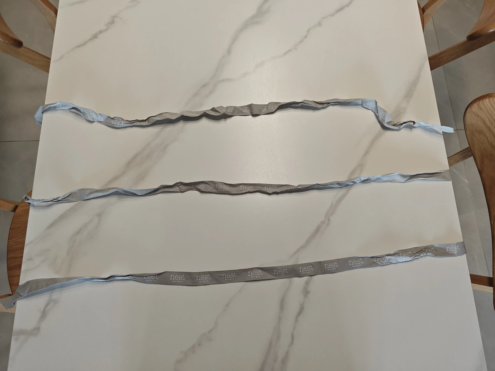

一端打结：

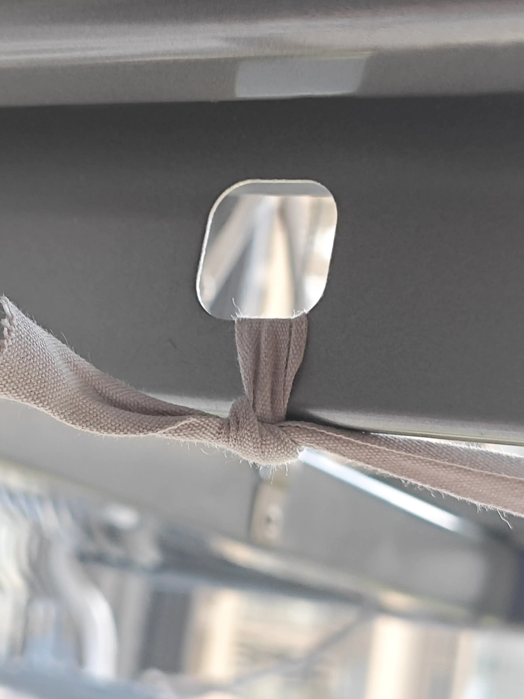

我发现其实只要两根就可以了：

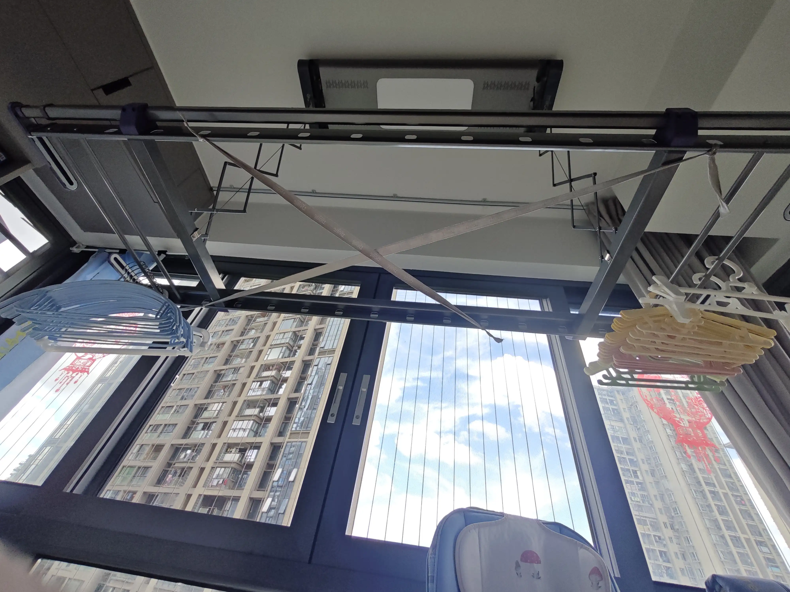

从侧面看一下：

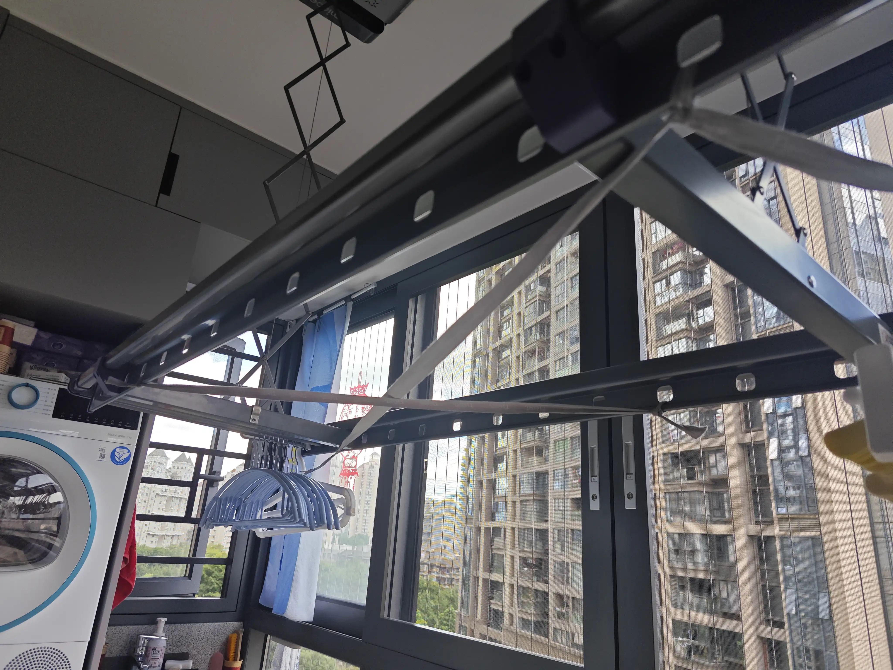

试着晒一下小朋友的衣服：

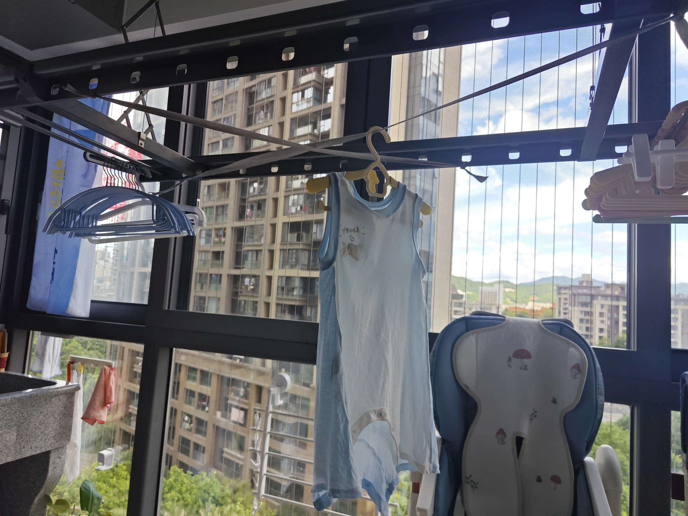

不知道大家发现没有，这种编法有问题，中间受力后会下沉得厉害，因为绳子拉得太长了，晚上我又撸了一遍书，我去，搞错了，应该是Z字型。

先拆掉早上编的绳：

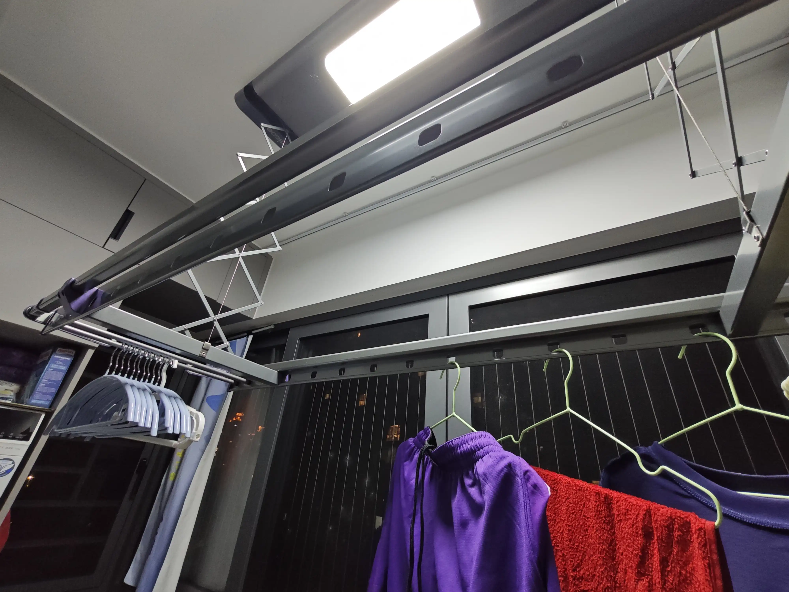

然后把3条绳子连在一起：

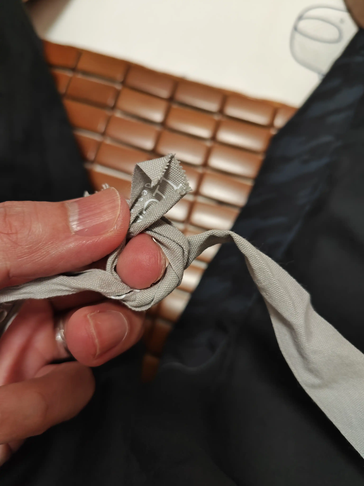
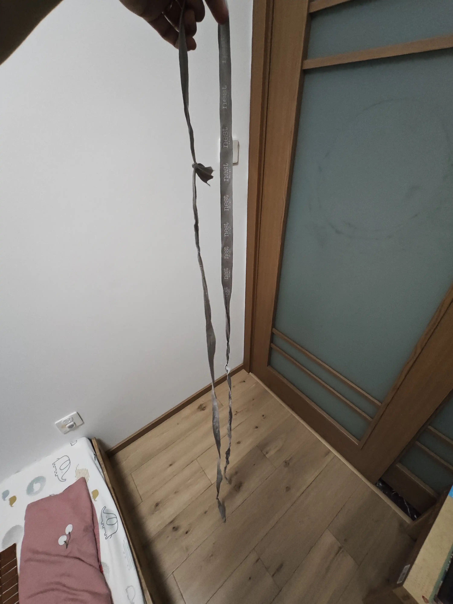
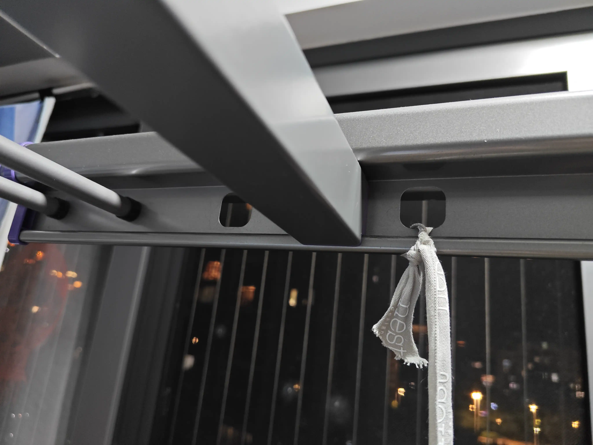
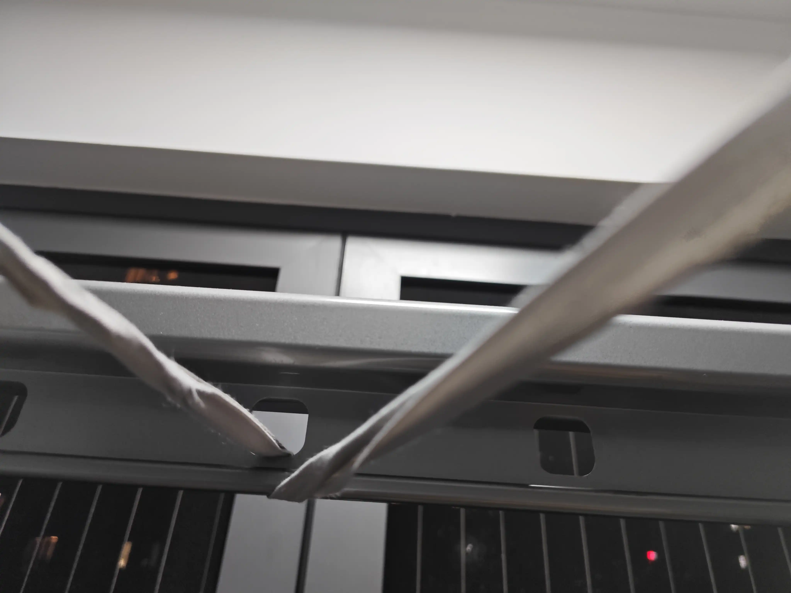
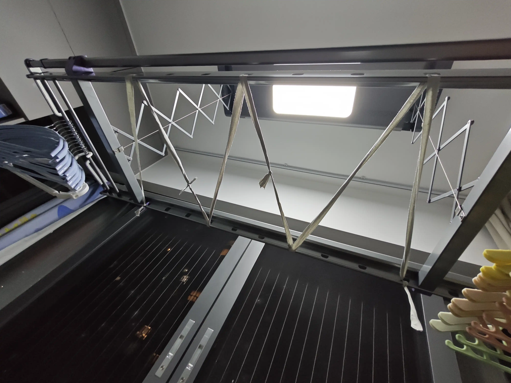
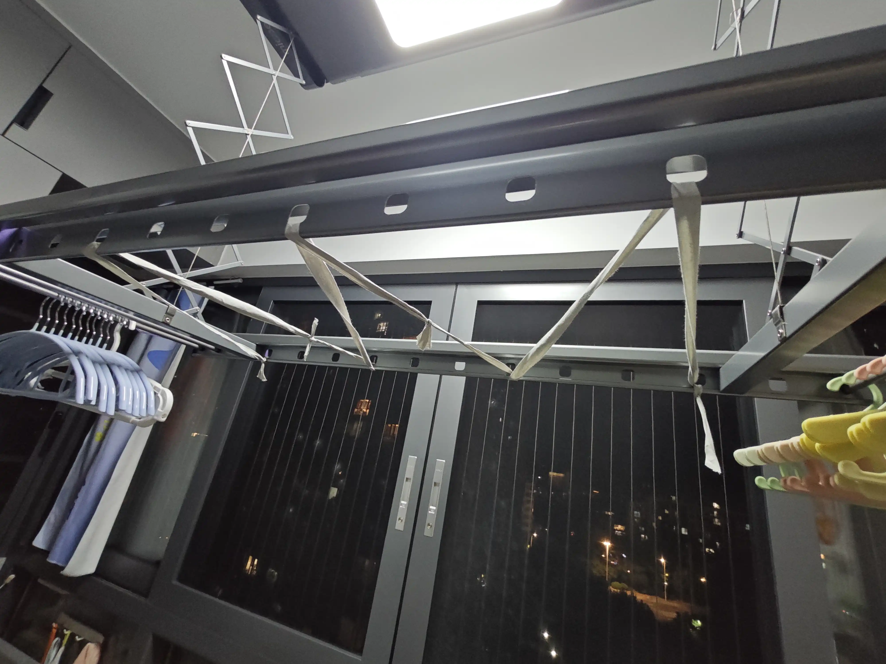

这下改成Z字型之后，两点之间距离非常短了，总长度也长了非常多，棒棒的！