## 自制厕所提示牌
上厕所遇到里面有人真是特别尴尬的事情，所以每次进去都要先敲一下门，特别是爸爸妈妈过来带小朋友之后，5个人在家里，上厕所变得心惊胆战。昨天，宸宸给我发了小红书上的一个DIY大佬，我发现他家厕所门上的那个计程车牌不错，于是我就想说淘宝一下，结果我发现淘宝上面都是用亚克力做的吊牌，都很丑。突然，我想到家里也有亚克力材质的摆件，那我不如试着做一做。

材料是这么个摆件：

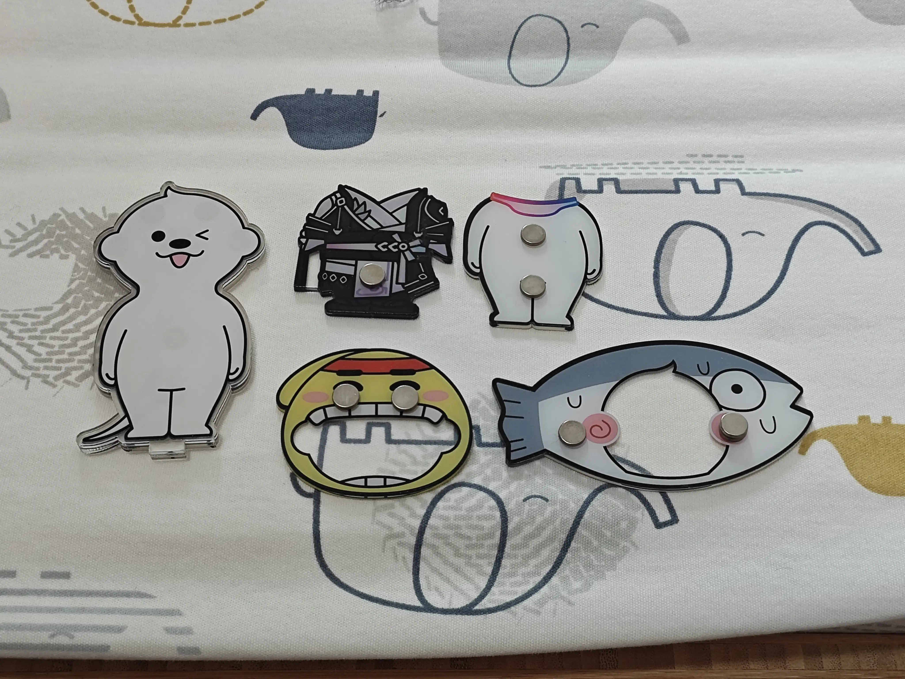

一开始我是想用那个带尾巴的小人的，但是我发现一个问题：

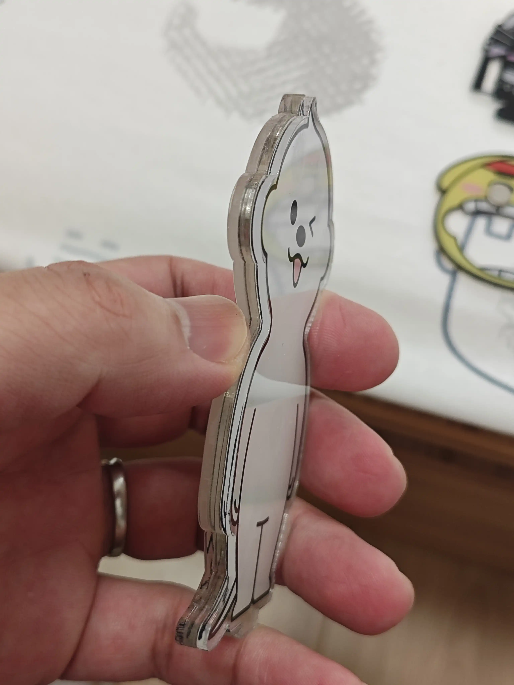

中间有一块金属片，这种情况就很难用钻头钻孔，那只能弃用这个小人，看看别的。

我发现这条小鱼不错，宽宽的，两头打两个孔还挺稳的：

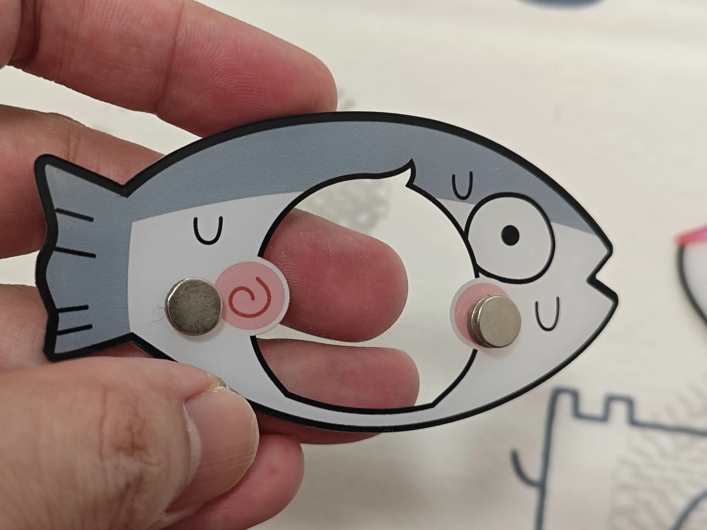

拿出批头：

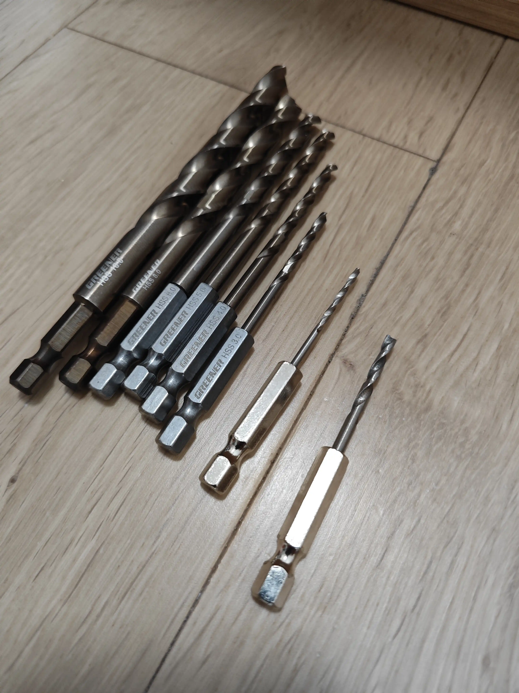

最右边那根之前被我干断了，于是我就买了全套S2钢材质的批头。我买的是绿林，支持国产。但是我发现新买的批头对于这只鱼而言都太粗了，那我还是选那根最细的。

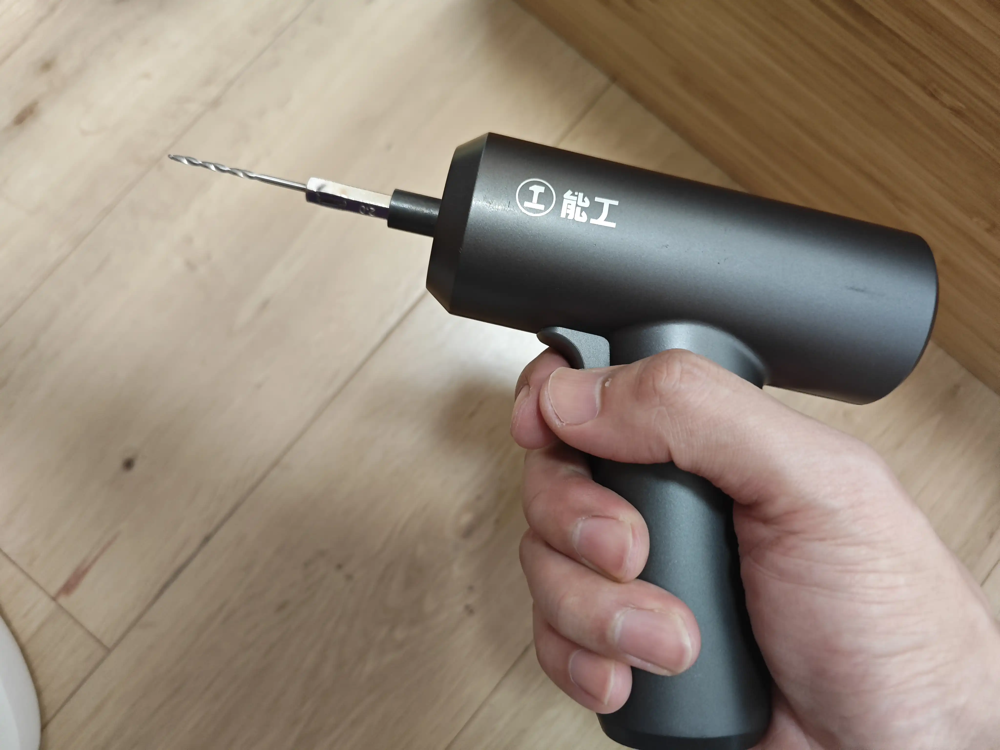
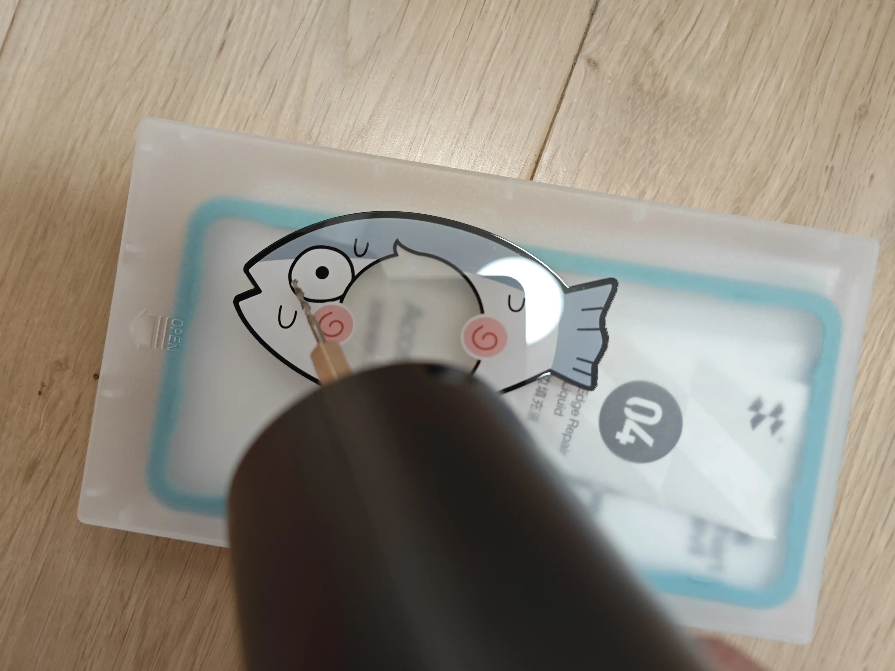
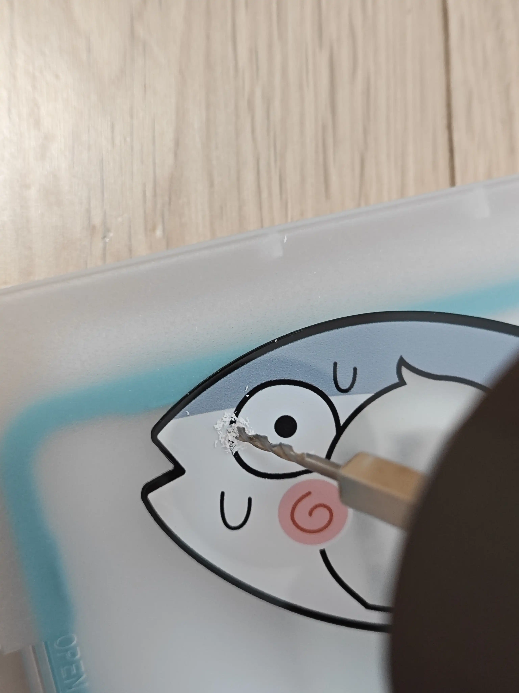
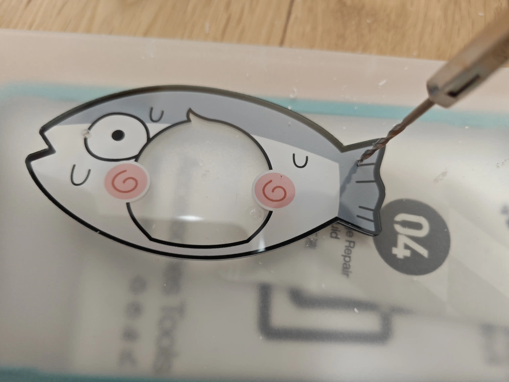
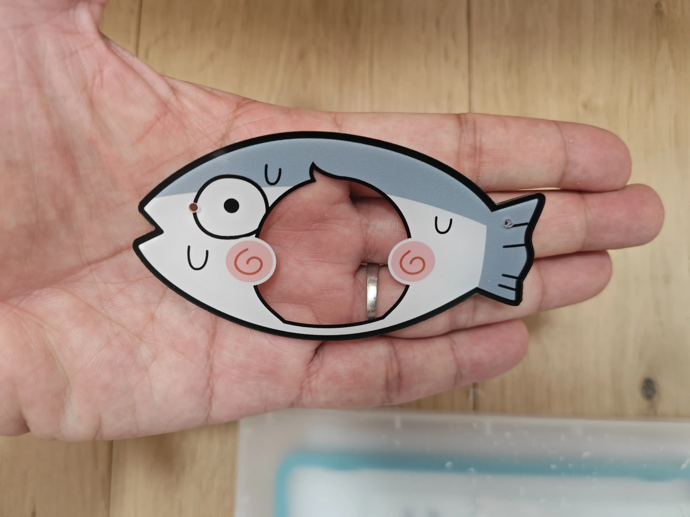

正反面各贴一个提示（我是打印签机打的，也可以自己写），找根细绳穿一下，拿一个吸盘一挂：

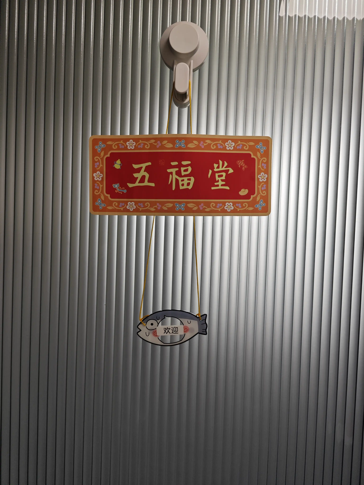
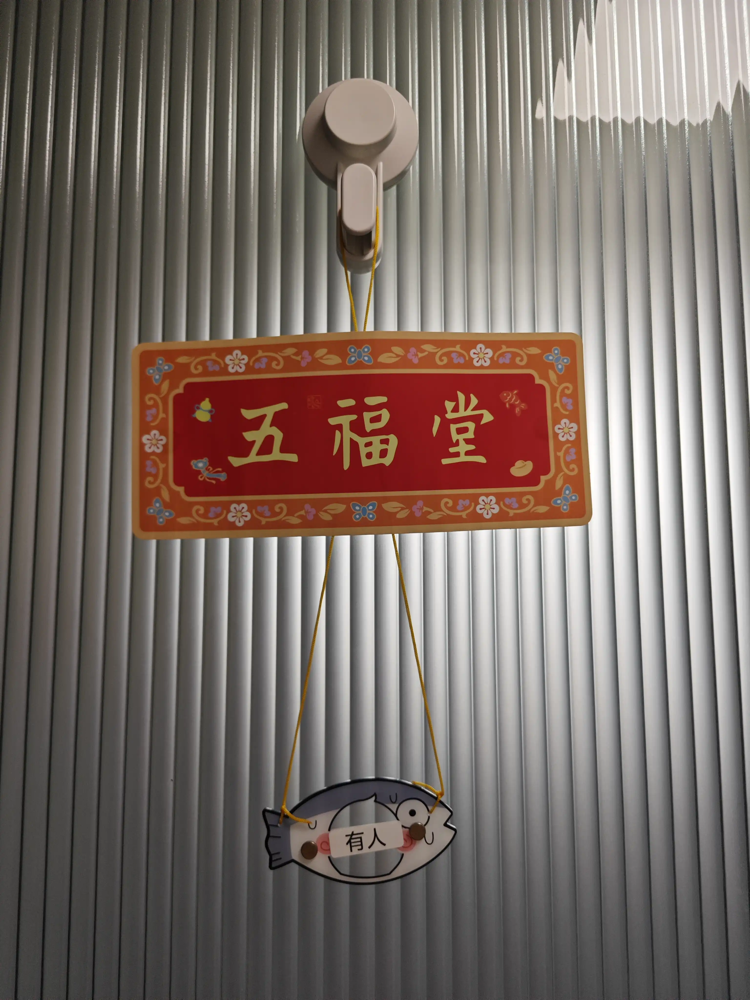

搞定，嘻嘻。
<!-- 以下是添加的封底 -->

谢谢观看^_^

<small>© 2025 家庭维修手册项目 | <a href="https://github.com/sapchen/home-repair-manual">GitHub 开源地址</a></small>

