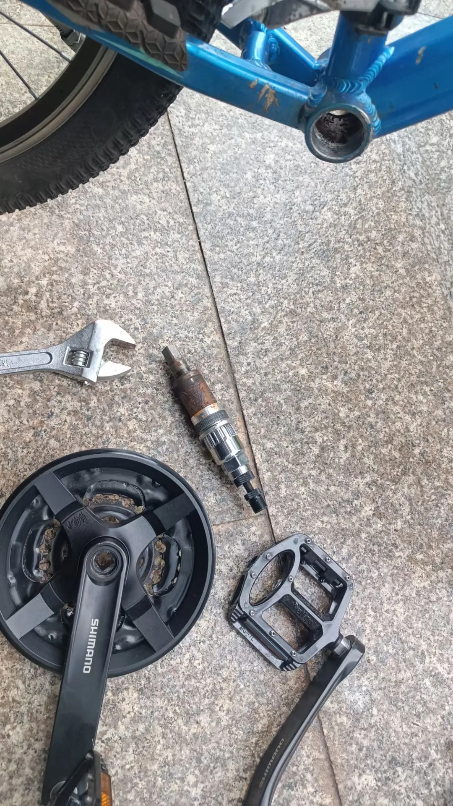
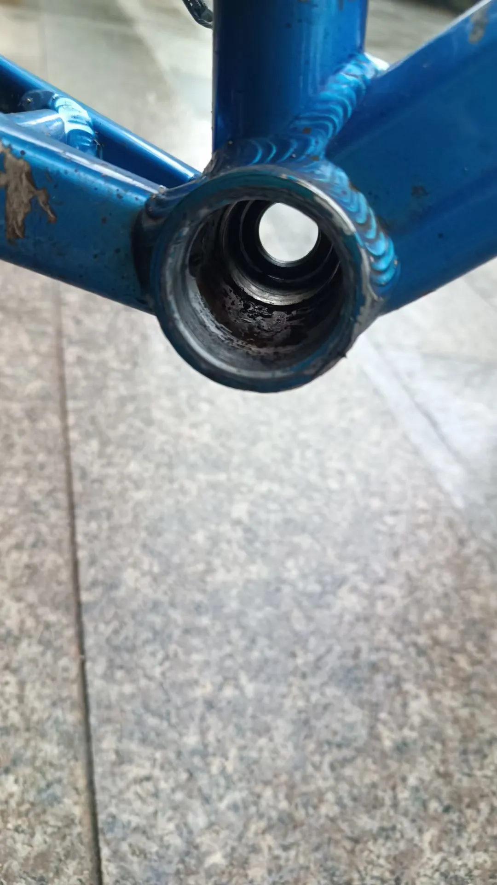
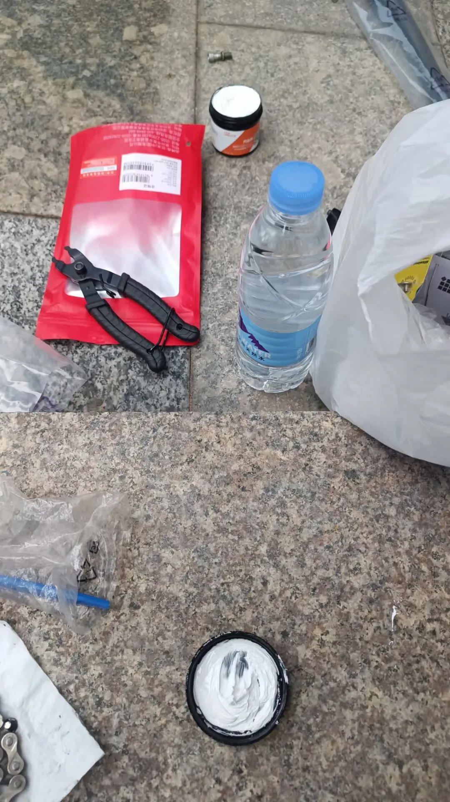

## 保养中轴
问题依旧是中轴处异响严重，所以决定拆下来看看是怎么回事。\

先用拉马、大活动扳手拆下来牙盘、曲柄，接着拆中轴，结果，发现中轴锈得透透的了。没办法，当时决定先用WD40应急搞一下，看一下会不会有效：\

五通里面也有很多残渣，先弄干净，我是用湿布擦干净，再喷WD40：\

这里五通和中轴的螺纹上涂抹的是上图白色的界面脂，我买的是乐佰客的，十多块钱吧，非常便宜，奥地利产的那款专业界面脂实在太贵了，就不考虑了：\

那这里为什么使用界面脂，而不使用润滑脂？这是因为界面脂是用于两个没有发生相对滑动的零件之间的防水，而润滑脂是用于两个相对之间发生滑动的零件之间的润滑防水。中轴和五通之间没有相对滑动，二者之间是固定死的，所以用界面脂可以填满空隙，达到防水的效果。按这个思路，所有螺丝和螺母之间，都适用界面脂。\