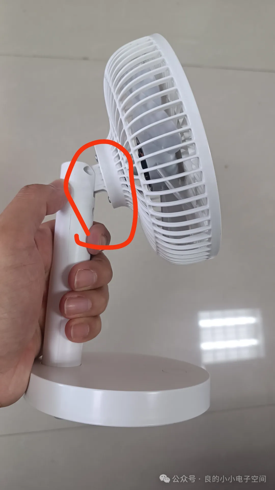
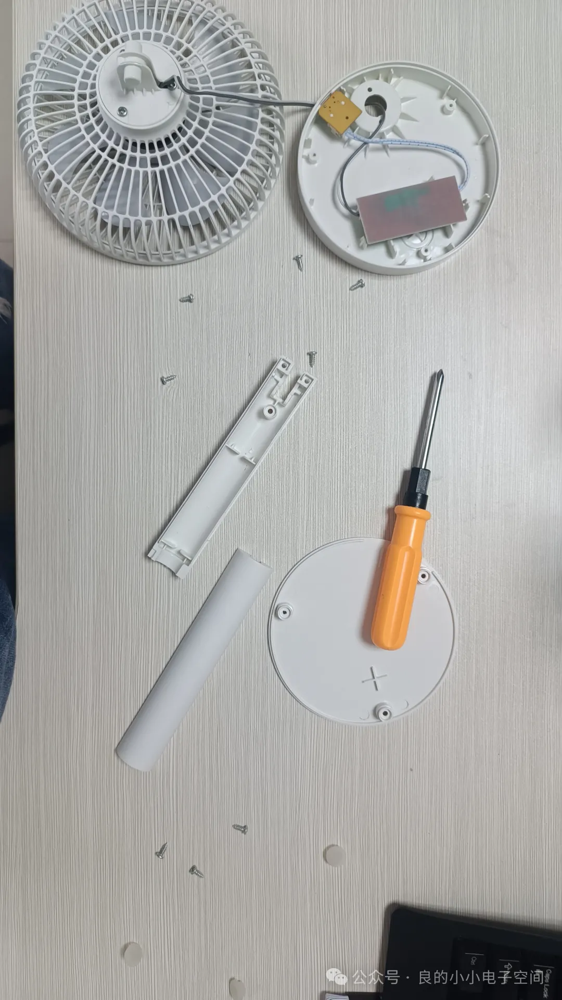
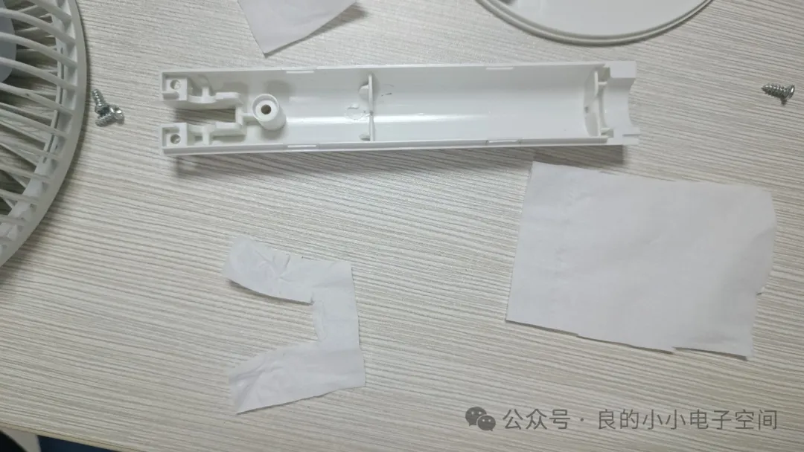
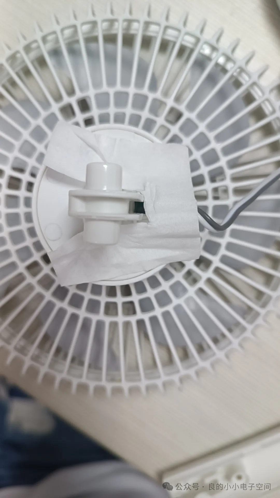
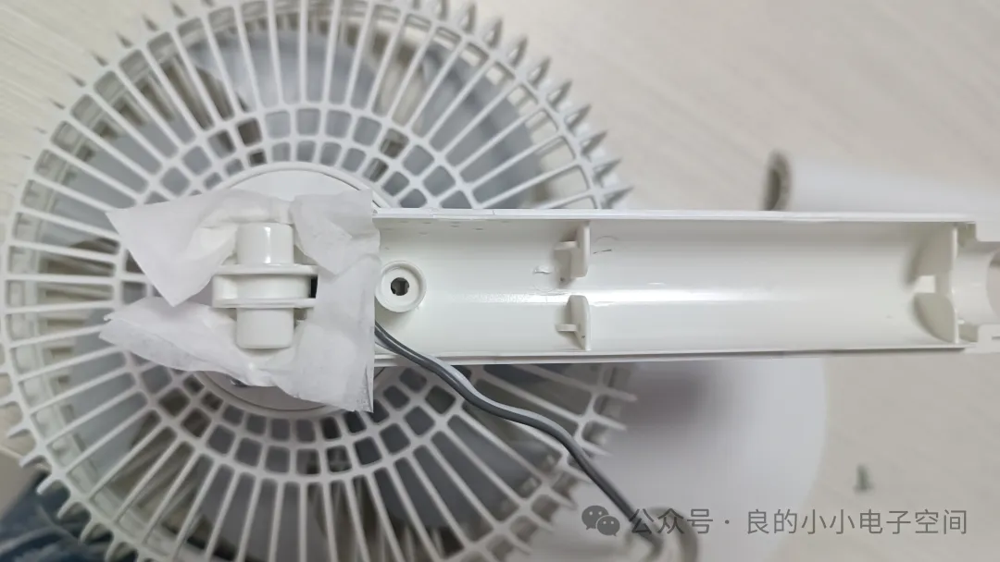
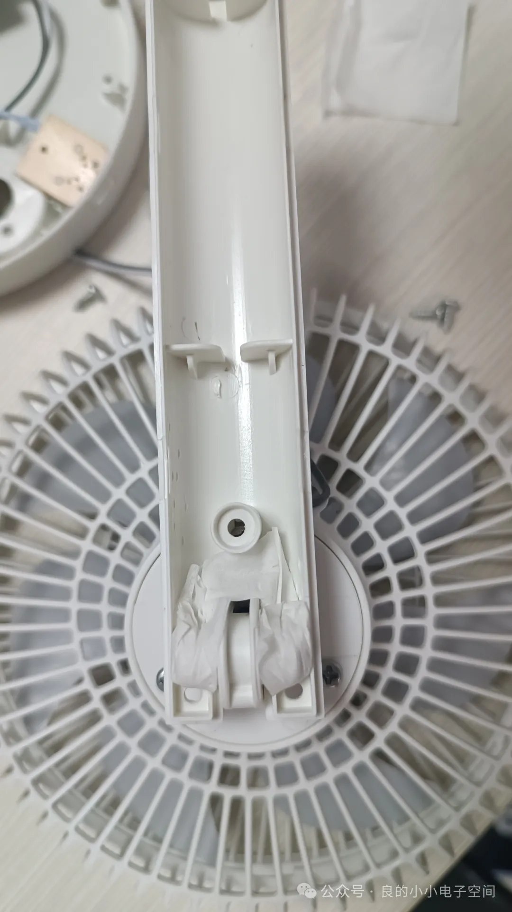
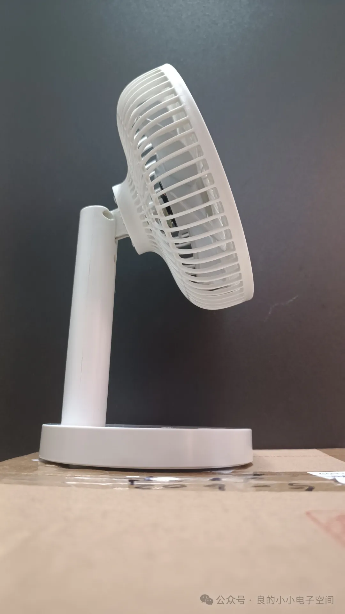

## 保养小风扇
一不小心福州的温度就超过了30度，小风扇又可以用起来了，这回这个小风扇有点问题，上下摇头的时候没法中途停止：\

说明红圈处摩擦力太小了，先拆开看一下结构：\

上下转动接触两个面都是塑料，摩擦力太小了，那怎么能增大摩擦力呢？纸巾是最简单的，不知道效果如何，只能先试一下，先剪一个凹字形的纸巾：\

把剪好的纸巾插到风扇上下摆动对应的位置​：\

给风扇安装座杆：\

纸巾剪好形状，垫进去就好了，大概是下图这样子，露出上方的螺丝孔方便安装螺丝：\​

保养完工，效果还不错，转动风扇盘中途可以悬停了：\
