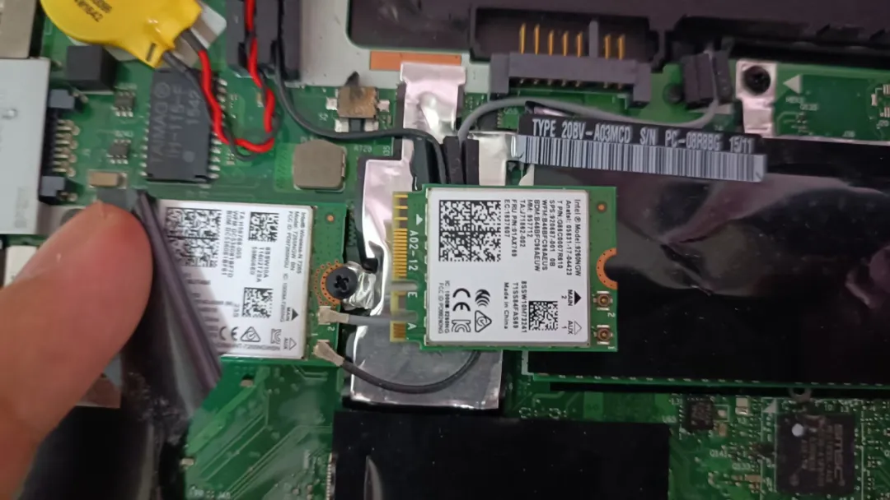
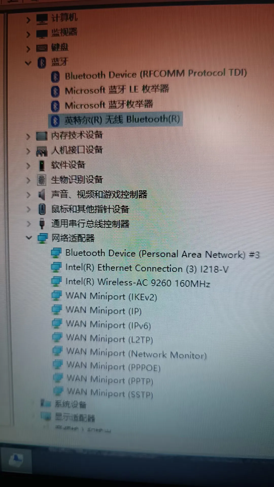
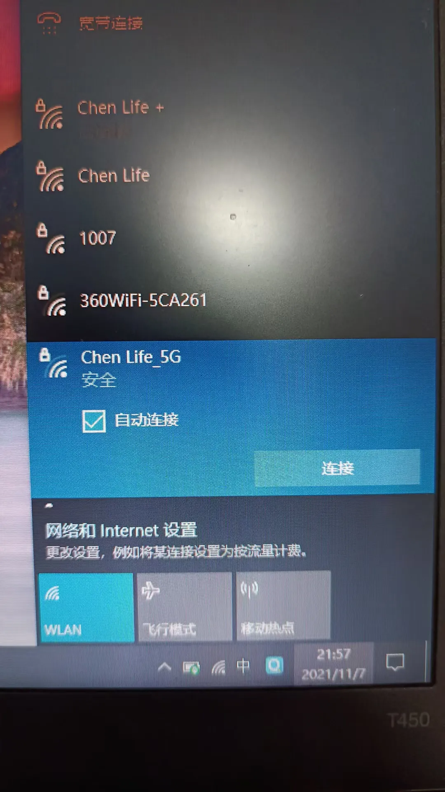
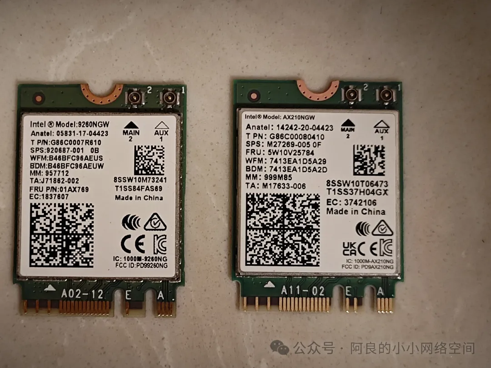
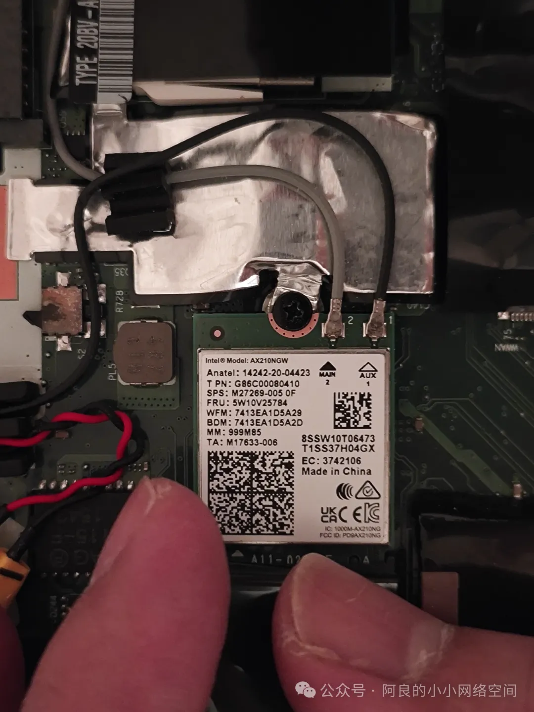
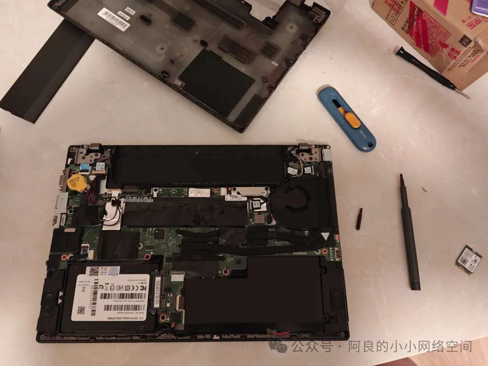
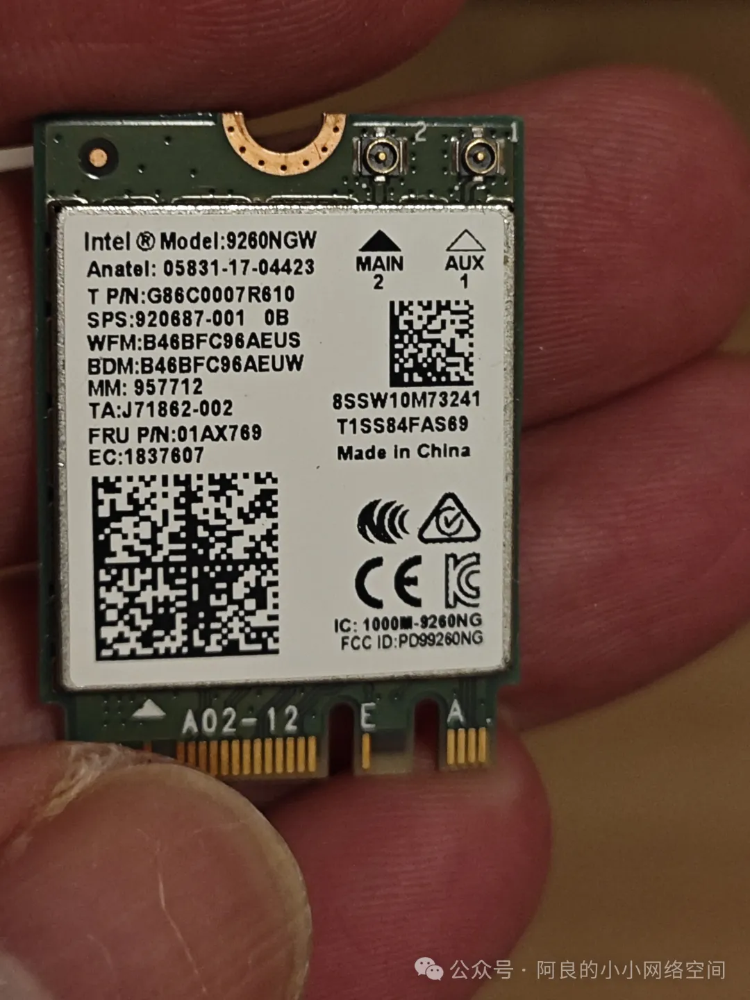
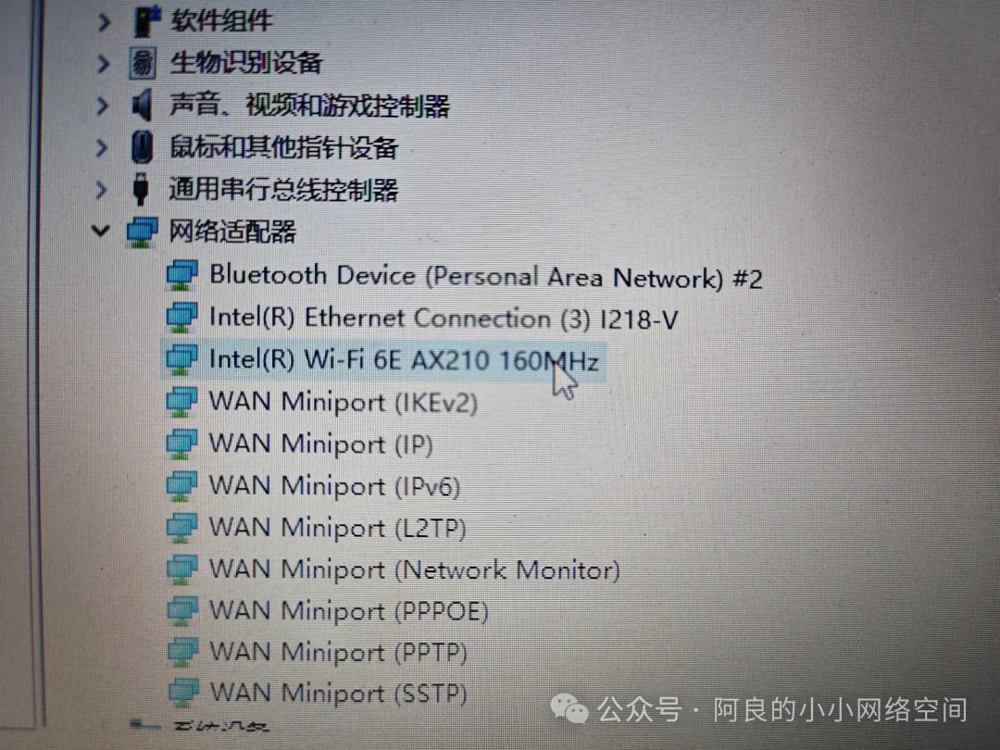
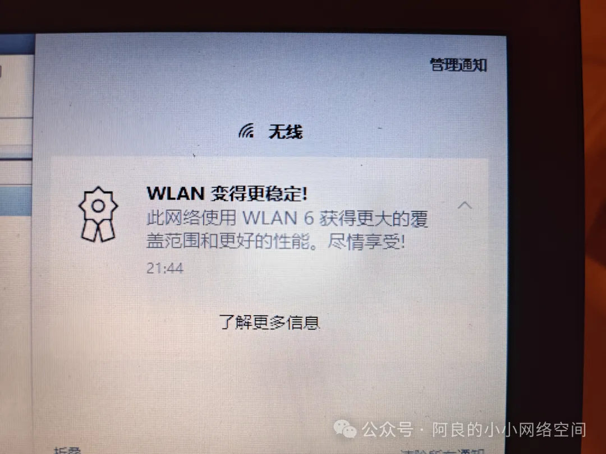

## 升级笔记本无线网卡
设备是2015年买的联想ThinkPad T450，原配的无线网卡是AC-7265，不支持5GHz的频段，于是网购了AC-9260可以用5G频段啦：

这是2021年的事情了，2024年，家里的无线路由器又升级了，为了能用上wifi6，我又继续升级了无线网卡。

型号：AX210。为什么21年的时候没有买AX系列呢？因为当时AX200（wifi 6）都要250块钱以上，现在AX210（wifi 6 加强版）才只要129（京东），一步一步升级就非常划算了。

开始升级：

