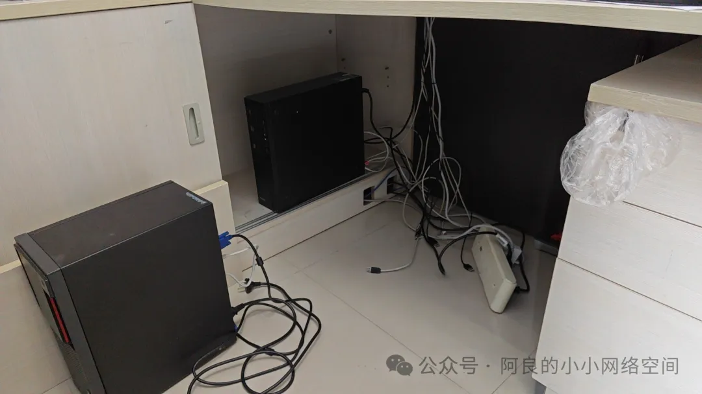
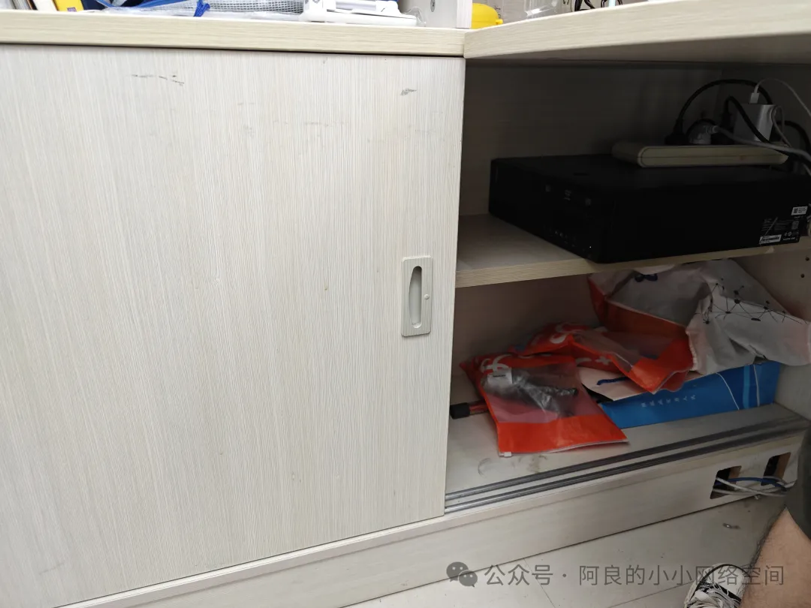
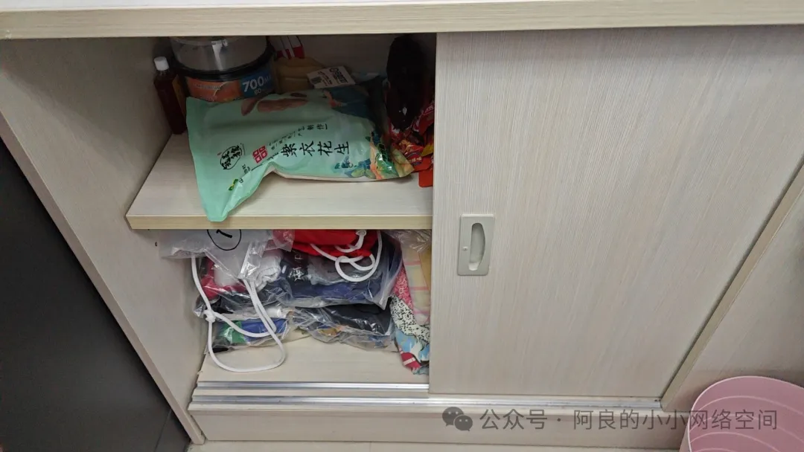
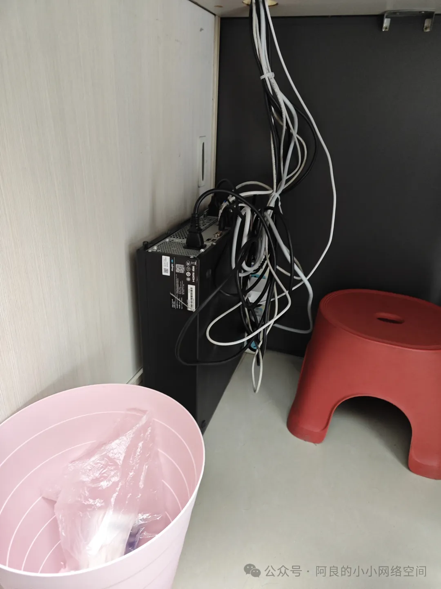
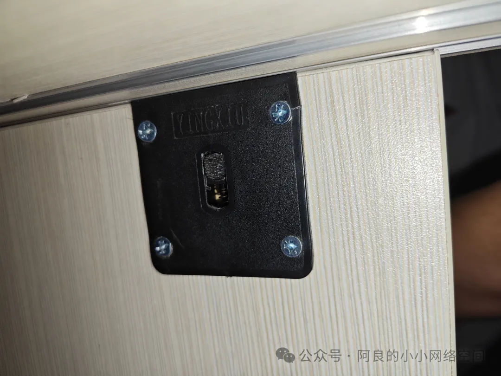
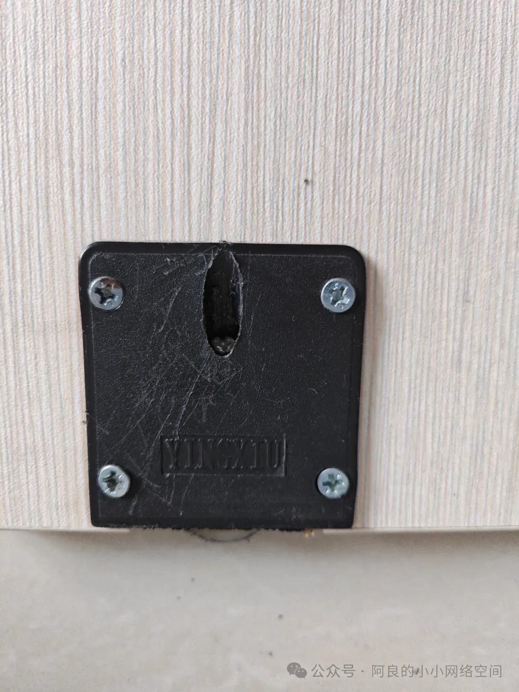
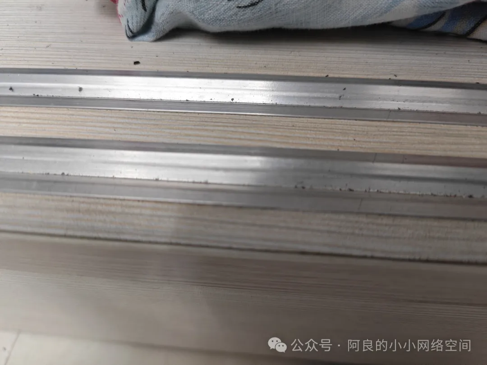
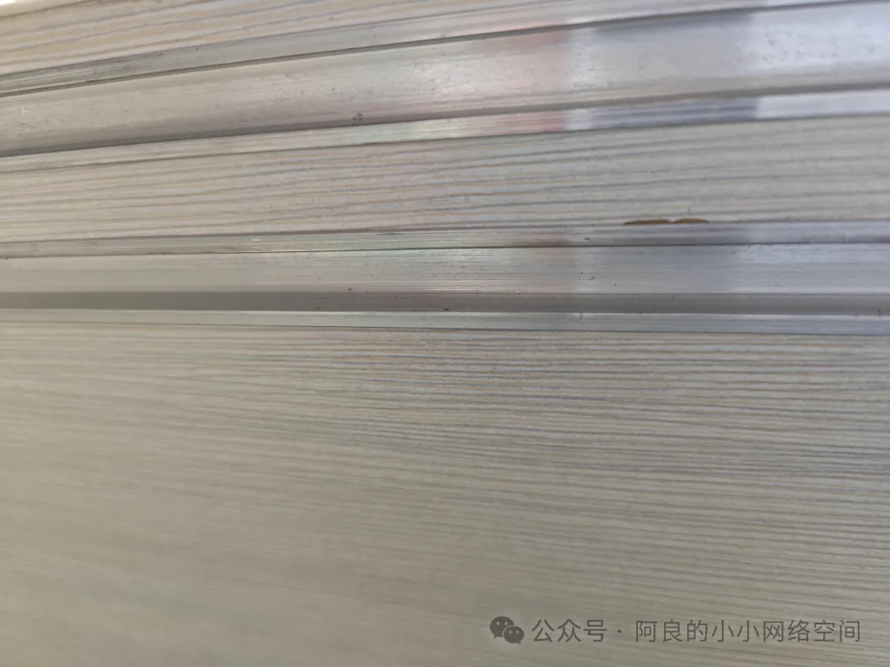
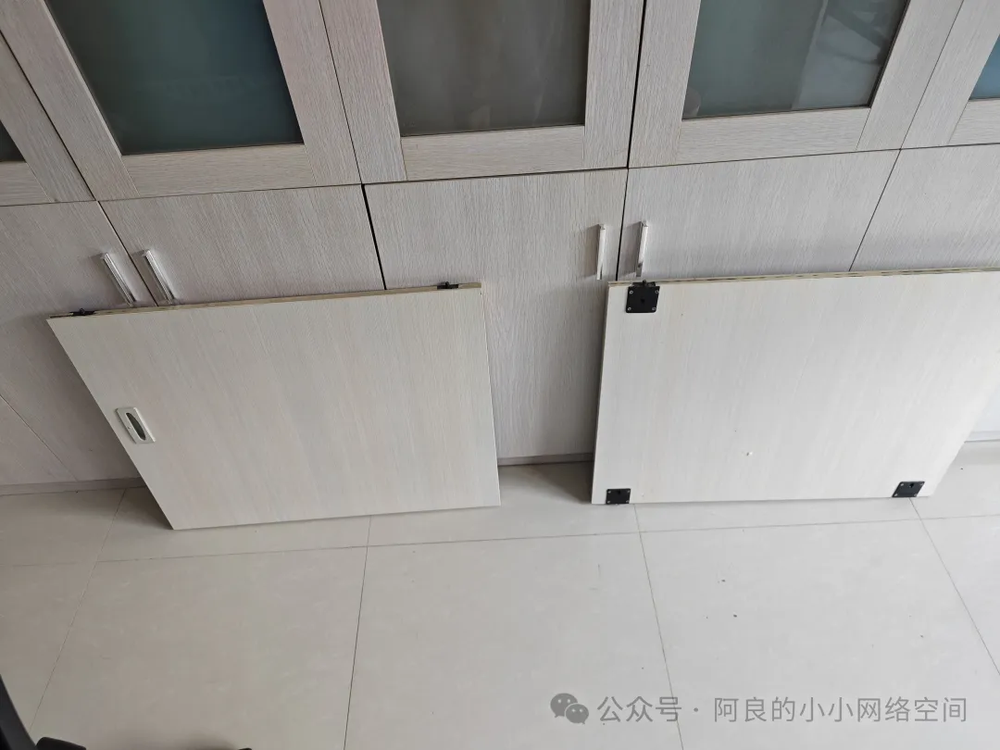

## 改造橱柜
改造的是办公室工位上的橱柜。

原来的机箱竖着放占了整半个橱柜：

现在想把机箱横着放：

结果内侧推拉门关不上了，因为机箱卡住了：

先临时这么放一下。

朋友建议拆掉一扇推拉门，把内侧那扇拆掉，那就开始吧：

这是上侧的卡槽器，带一个卡扣。

下侧的滚轮，是上螺丝的：

下侧的轮槽，很浅，边缘是斜的：

上侧的卡槽，很深的沟，上下是不一样的：

两扇都拆下来，然后装上外面那扇：

完工。